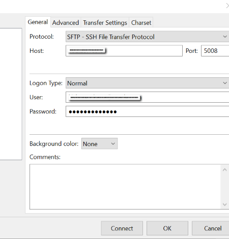

# Lab Configure OIC

## Introduction

This lab walks you through the enable and configuration required for the File Server

Estimated Time: 10 minutes

### Objectives

In this lab, you will:

- Enable File Server
- Configure File Server
- Connect to File Server using FTP Client

### Prerequisites

This lab assumes you have:

- Successfully provisioned Oracle Integration 3 Instance and able to access the home page.
- Completed all the previous labs.

## Task 1: Enable File Server

- An administrator must enable File Server before an organization can start using it with their Oracle Integration instance. Enabling File Server is a one-time action in the Oracle Cloud Infrastructure Console

    If your organization hasn't enabled File Server yet, and you select File Server from the navigation pane, the following message appears: *Start sharing files...*

    

    To enable File Server:

1. On the Oracle Cloud Get Started page, select the region in the upper right where you created your Oracle Integration 3 instance. Open the navigation menu in the upper left and click **Developer Services**. Under **Application Integration**, click **Integration**.
2. If needed, select the compartment where you created your Oracle Integration 3 instance. You should see your instance.

3. Select your instance.
   The Integration Instance Details page is displayed.
4. Click the Enable link for File Server on the Integration Instance Information tab.
5. When prompted to confirm enabling File Server, click ***Enable***. The OIC icon turns orange and its status changes to Updating. Enablement can take several minutes.

6. Once complete, the OIC icon changes back to green with an Active status, and File Server shows as Enabled. You may need to log out and log back in to Oracle Integration to access the newly activated File Server.

    

## Task 2: Configure File Server

Configure File Server settings. This is required as you are using Embedded File Serve of Oracle Integration and using File Server as a target application in your integration flow.

1. Starting at the Oracle Integration *Home* page, select **Settings**, then **File Server** from the left Navigation pane.
2. Select **Settings** from the left Navigation pane to open the File Server Settings page and review the File Server status and configurations. Make a note of IP and port number.
    
    > **Note:**  Ensure the *Authentication Type* is set to **Password or Key**.

3. Under SFTP Server Status, monitor the server's status, and stop or restart as needed
4. Select **Users** from left Navigation pane, search for your User Name and click on Configure.
    
5. Click on **Switch to enable** and click on **Save**.
    
    > **Note:** If you are a Bootcamp user then you would be using /upload/users/*your oic username* and it is configured for the bootcamp otherwise, you can can configure the appropriate directory and use it in the lab.

6. Select **Folders** from left Navigation pane.
    
7. Click on **home**, click on **users**, click on your username and from the top right click **Create** and create a Folder named **Output**.
8. Click on **Permissions** on the **Output** Folder
    
    > **Note:**  You will be using the above Folder structure in the lab.

9. Click **Add Permissions** and select your user. Click **Add**.
    
10. Select **All** and **Propagate to subfolders**. All of the permission checkboxes should be checked. Click **Save** and exit the Permissions page.
    

## Task 3: Connect to File Server with FTP Client

To access files on the File Server you will need to use an FTP Client. You will need to configure your FTP Client with the following:

- File Server IP Address.
- File Server Port.
- Your Oracle Integration username.
- Your Oracle Integration password.

1. To obtain the File Server IP Address and Port, select **Settings** from the left Navigation pane. The IP and Port are located in the *IP and Port Information* section of the *Settings* page.
2. Using your FTP Client choice, connect to the File Server using the SFTP - SSH File Transfer Protocol.  
    
An example configuration using FileZilla FTP Client.  
If the permissions are configured correctly, you should be able to list, read, and write files on the *Output* folder.

You may now **proceed to the next lab**.

## Learn More

- [Configuring File Server Settings](https://docs.oracle.com/en/cloud/paas/application-integration/file-server/configure-file-server-settings.html)

## Acknowledgements

* **Author** - Subhani Italapuram, Product Management, Oracle Integration
- **Last Updated By/Date** - Subhani Italapuram, November 2024
