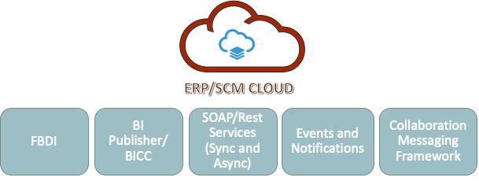
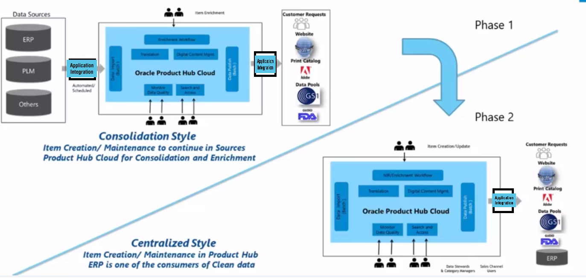
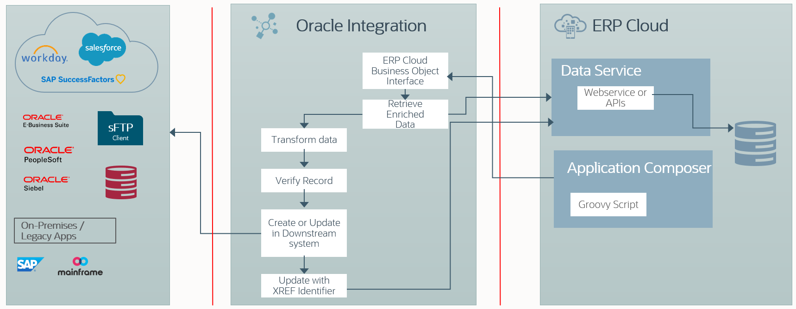

# Introduction to ERP Cloud Integration Design Patterns - Learning purpose only. No action needed

## Introduction

This section walks you through various design patterns and use cases integrating with Oracle ERP cloud & Oracle SCM Cloud

Estimated Time: 10 minutes

### Objectives

In this lab, you will:

* Understand the ERP Cloud Design Patterns & Usecases

### Prerequisites

##	Task 1: Understand ERP Cloud and SCM Cloud Connectivity Capabilities

Across virtually every industry for almost 30 years, ERP has been at the foundation of the business. ERPs act as the system of record or data master for most of an organization’s data and transactions, containing important customer and business information across most essential business functions in finance, human capital management, enterprise performance management, and supplier relationship management. With the explosion of best-of-breed solutions across every industry, today’s tech stacks expand far beyond ERP. Companies increasingly rely on modern CRM systems to act as a system of engagement.

Customers choose to have some modules running on-premise and many of them in the cloud. Integrating with best of breed applications is important to keep the end to end business process intact for a given organization. Let’s see some connectivity capabilities.

### *Inbound Connect Scenarios*

-	File-Based Data Import
    - Batch based
    -	Send file through MTOM or Stage in UCM
-	SOAP/Rest Web services
    -	Real-Time
-	Collaboration Messaging Framework (CMK) for B2B

### *Outbound Connect Scenarios*
- Events and Notification
    - Only Events published will need enrichment of data
-   BI Publisher / BICC
    - BI Publisher  and Business Intelligence Cloud Connect (BICC) used for SaaS extracts
-	Collaboration Messaging Framework (CMK) for B2B

| **Business Event Integration** | **Import Bulk Data to Fusion Applications** | **Callback Integration** | **Business Object Integration** | **Send Files to Fusion Applications ** |
|:---:|:---:|:---:|:---:|:---:|
| Subscribe to Business events from FA applications. | Import bulk data into the SaaS application using FBDI compliant bulk operations. | Receive callback from FA when bulk import/export operation completes. | Invoke business services using the Service Catalog WSDL (SOAP) or Interface Catalog (REST) using CRUD operations. | Upload files to Oracle WebCenterContent (UCM) when using ‘Import Bulk Data’ is not appropriate (non FBDI files)|
| Direction:  INBOUND | Direction: OUTBOUND | Direction:  INBOUND (using a business event) | Direction: INBOUND/OUTBOUND | Direction:  OUTBOUND |

##	Task 2: Real-Time Integration

There are several ways to Synchronize data between ERP Cloud and downstream applications
- Business Events - Oracle Integration subscribes to events from ERP Cloud
- Business Object – ERP Cloud invokes Oracle Integration Endpoints exposed using Business Object Interface
- Business Services (APIs) - ERP/SCM Cloud provides REST/SOAP APIs which includes how to create, update and fetch records in Real-Time Integration scenarios.

### *Business Events Integration*

### Usecase - Item Master Synchronization
As we move critical systems to the cloud, maintaining a true Item Master at the core becomes astronomically challenging without standardized controls. Whether just starting or well into the cloud, a simplified Item Master will drive business transformation no matter what the make-up of your world.

Irrespective of Consolidation or Centralized Style of implementation of Oracle Product Hub Cloud the Real-Time Synchronization of Item/Attributes/Item Categories/BOM and related information with Enterprise ERPs and Commerce ERPs is pretty much a necessity now.

### Usecase - Medical Invoice Compliance System

Acme Corp works with various Medical Providers wherein its employee's avail treatment. After the treatment is completed it is a standard process for  Medical Providers to send invoices to Acme Corp. As part of the Payables process when an Accounts Payable Invoice is created Acme Corp’s backend team verifies if the Medical Bill raised is per Usual Customary and Reasonable (UCR) and approves the invoice accordingly and a Credit Memo is applied. Oracle Integration orchestrates the whole process of capturing the AP Invoice event integrating with the ERP cloud which triggers a workflow process for an authority to approve and finally apply the credit memo into the ERP cloud. Eventually, payments to Medical Providers are handled. Real-Time capture of Financial events happens at the inception of record creation and wherein the whole process kicks off.

### *Business Objects Integration*
ERP Cloud does not support Business Events in every module/object under its umbrella. It is imperative that Real-Time Sync must be triggered, especially when the event is not available a groovy script can be coded using Application Composer Tool in Fusion Applications to call an external Service with an object interface.

### **Usecase - Custom Application pages trigger Integration Flow**
Let's say we are building a custom application which is designed in ERP Cloud using Application Composer. The data must be submitted to downstream systems with the click of a button which is backed by a groovy script.

In the above case, a Callable endpoint will be created in OIC by leveraging ERP Cloud Adapter Business Object functionality to expose an Interface.

### *Business Services Integration*
ERP Cloud supports REST/SOAP APIs in every module/object under its umbrella. Real-Time Sync of Inbound data must be needed in several use cases.

### **Usecase - Opportunity to Order Synchronization**
Let's say we want to create a new sales order and a customer (if new) in Oracle ERP Cloud, when an opportunity closes in Salesforce in Real-Time with the below requirements

-	When an opportunity closes in Salesforce, a new sales order is created in Oracle Enterprise Resource Planning Cloud. Sales representatives can see the order immediately.
-	If the customer is new, then a customer account is also created.
-	If the sales order reports an error, then the opportunity is reopened

In the above use case a Sales Order must be created in Real-Time when an Opportunity is closed in a CRM Application. The integration leverages ERP Cloud REST API to create a Customer and an Order.

### **Usecase - e-Invoice Sending and Receiving Invoice documents**
E-Invoicing solutions enable companies to easily and cost-effectively send and receive e-invoice with their trading partners globally. A common set of requirements could be to

- Accept invoices from suppliers without changes required at their end while getting completely rid of paper in accounts payable in Oracle ERP Cloud
- Receive invoices electronically from anywhere around the world through e-Invoice solution and push the invoice system of record and source attachments to ERP Cloud

In the above use case, an Invoice along with the source Invoice attachment must be created synchronously as and when Invoice is uploaded by Suppliers to consider for a quick Accounting process. ERP Cloud REST API can be leveraged to address the Real-Time Inbound Invoice creation to post it from Accounting.

##	Task	3: Bulk Import Integration

FBDI is one of the ways in Oracle ERP Cloud to import data in bulk. FBDI stands for File-Based Data Import. However, in some use cases, a non-FBDI Bulk Import mechanism exists, for example, Import of Accounting Transactions into Fusion Accounting Hub from third-party applications

### *Automation of FBDI Import Usecases*
There are several scenarios where data from on-premise or external business systems must be imported into Oracle ERP Cloud to consummate business transactions such as

- On-premise applications require importing recurring billing transactions into the ERP cloud in a co-existent scenario
- Import daily exchange rates must be implemented in Oracle General Ledger to make use of the currency exchange rate interface since it provides a convenient and automated way for multicurrency processing within the Oracle ERP Cloud Financials module. We can make use of this interface to report financials in a common currency as well as to perform intercompany transactions between companies that have 2 different functional currencies.
- Claims generated from on-premise insurance claim processing applications, which require the creation of Payables invoices for remitting payments
- Bulk import of suppliers from an EBS application or an external third-party enterprise application usually from an FTP server in to Oracle Procurement Cloud
- Importing Accounts Receivables Invoices

### **Usecase – General Ledger Import**
Acme Corp. has multiple business systems that they maintain for a variety of business activities each of which generates large volumes of financial transactions daily. The Requirement is to have these externally generated transactions be automatically integrated into Oracle Cloud ERP to post to General Ledger providing a single consolidated view. Acme Corp. wanted an interface designed to integrate the daily GL journal transactions from the external systems to Oracle Cloud ERP through, by using data files.  And these transactions should be processed every day scheduled at specific times and the whole integration process must be automated

### **Usecase – Import Supplier Bank Information**
Acme Corp needs to have Supplier banking information in the Oracle ERP cloud to do the payments for their invoices or bills. This banking information involved Supplier Bank, Branch, Bank Account, IFSC code, BIC code and much other banking-related important information. Acme Corp can maintain this information in Oracle ERP Cloud manually in the supplier master but if we are importing the supplier from an external application then we will have the mass banking data for the supplier and the manual job is very time-consuming. It is very much important to automate the import of mass banking information from the suppliers.

##	Task	4: Bulk Extract Integration

Oracle ERP Cloud has provided a very useful functionality which empowers business enterprises to extract financial data from Oracle Cloud ERP and integrate it with on-premise systems, legacy systems and other Cloud Applications.

One very common business scenario in an enterprise is to generate extracts of financial data like Journals, Payables Invoices, Payments, and Receivable and send them to a data warehouse or  legacy or third-party partner systems

Let's see the Outbound mechanisms and the purpose of each of them based on the volume of data that must be sent to downstream applications

### *BIP Extract - Large Data sets*
Designed to extract incremental data for scenarios example:
- Get the list of invoices that have been approved since the last execution
- Extract payment data since the last execution to update downstream or upstream applications to reflect payments

### *Invoke BIP Reports - Small Data sets*

Designed to extract lookup values/metadata/transaction details of a transaction example:

To automate an entire extraction process using Oracle Integration there are a couple of ways to do this. Automate the entire process of extraction per the below recommendations:

a.	When the report size is greater than 10 MB it is recommended to leverage the extract process which pushes the file to a Content Server (UCM) which can be fetched later for further processing. This is purely an asynchronous invocation.

b.	For smaller data sets less than 10 MB it is recommended to leverage synchronous Invocation of report service which produces the report response instantly. Ideally, client applications maybe wanted to show data set values instantly to the end-user to take a further course of action.

Irrespective of the method a BIP Report must exist in the ERP Cloud.

You may now **proceed to the next lab**.

## Learn More

* [Implement Common Patterns Using the ERP Cloud Adapter] (https://docs.oracle.com/en/cloud/paas/application-integration/erp-adapter/implement-common-patterns-using-oracle-erp-cloud-adapter.html)

## Acknowledgements

* **Author** - Kishore Katta, Product Management, Oracle Integration
* **Contributors** - Subhani Italapuram, Product Management, Oracle Integration
* **Last Updated By/Date** - Subhani Italapuram, Sep 2022
