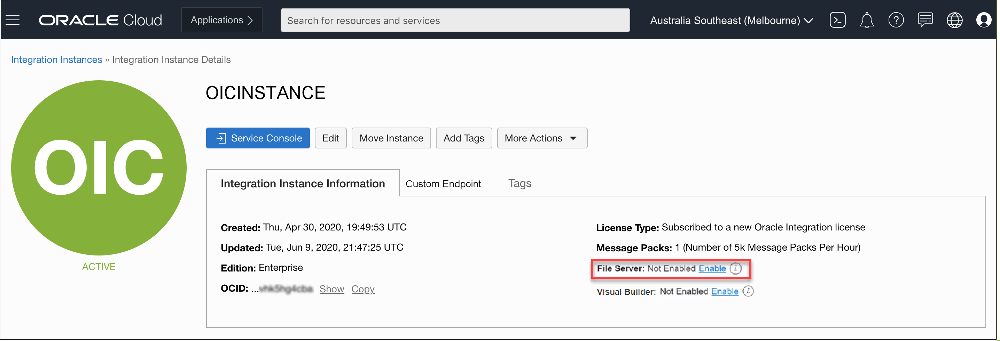
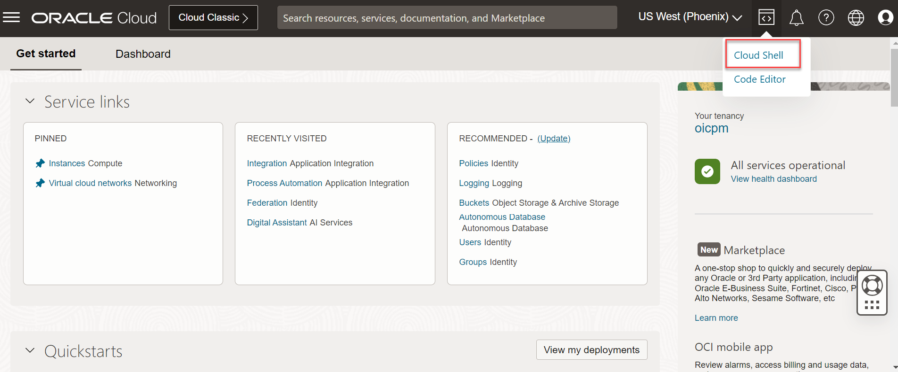
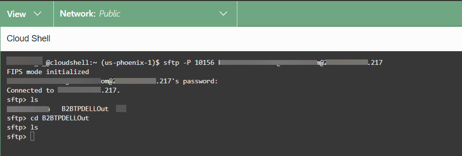
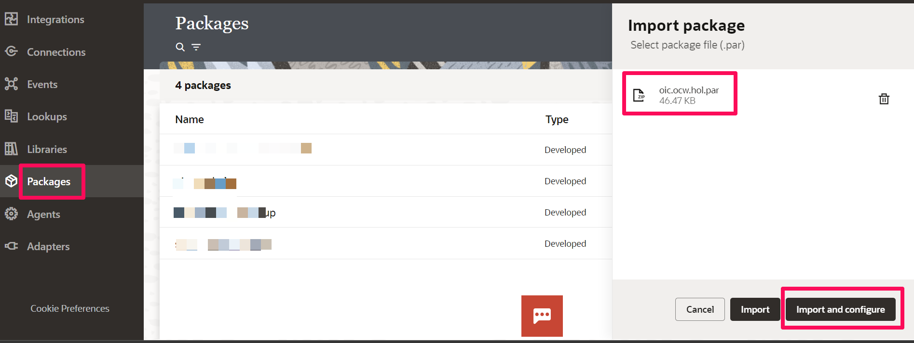
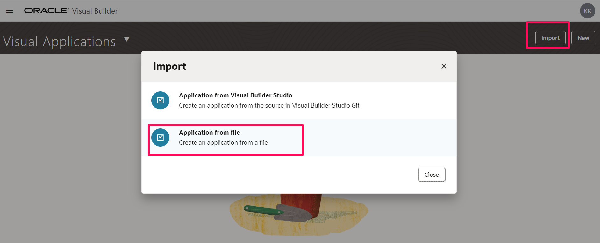
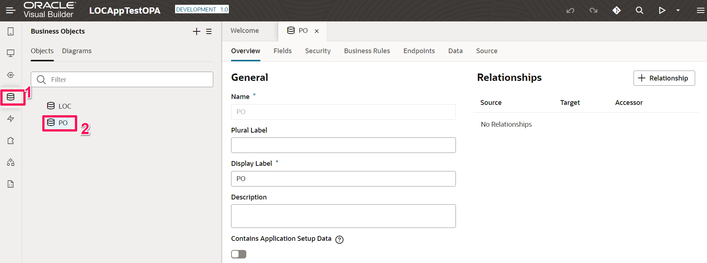

# Enable File Server and setup connections

## Introduction

This lab walks you through the process of enabling the Oracle Integration 3 File Server. By default, the File Server is not enabled, but is required for this workshop. Also, you will be setting up required connections for designing your integration flow in the later lab exercises.

Estimated Time: 15 minutes

### Objectives

In this lab, you will:

* Enable File Server.
* Configure FTP folders and permissions
* Connect to File Server using FTP Client
* Setup connections using adapters

### Prerequisites

This lab assumes you have:

* Successfully provisioned Oracle Integration 3 Instance and able to access the home page.

## Task 1: Enable File Server & Visual Builder

- An administrator must enable File Server before an organization can start using it with their Oracle Integration instance. Enabling File Server is a one-time action in the Oracle Cloud Infrastructure Console

    If your organization hasn't enabled File Server yet, and you select File Server from the navigation pane, the following message appears: *Start sharing files...*

    

    To enable File Server:

1. On the Oracle Cloud Get Started page, select the region in the upper right where you created your Oracle Integration 3 instance. Open the navigation menu in the upper left and click *Developer Services*. Under **Application Integration**, click *Integration*.
2. If needed, select the compartment where you created your Oracle Integration 3 instance. You should see your instance.

3. Select your instance.
   The Integration Instance Details page is displayed.
4. Click the *Enable* link for File Server on the Integration Instance Information tab.

    

5. When prompted to confirm enabling File Server, click *Enable*. The OIC icon turns orange and its status changes to Updating. Enablement can take several minutes.

    

6. Once complete, the OIC icon changes back to green with an Active status, and File Server shows as Enabled. You may need to log out and log back in to Oracle Integration to access the newly activated File Server.

    

7.  Similarly, Click the **Enable** link for Visual Builder on the Integration Instance Information tab
    

8.  When prompted, click *Enable* to confirm you want to enable Visual Builder. Once complete, the OIC instance status changes back to green with Active Status.

For additional Instructions please refer [Enabling Visual Builder](https://docs.oracle.com/en/cloud/paas/application-integration/visual-admin/administering-visual-builder1.html)

## Task 2: Configure File Server

Configure File Server settings. This is required as you are using Embedded File Server of Oracle Integration and using File Server as a target application in your integration flow.

1. Starting at the Oracle Integration **Home** page, select *Settings*, then *File Server* from the left Navigation pane.

2. Select *Settings* from the left Navigation pane to open the File Server Settings page and review the File Server status and configurations. Make a note of IP and port number by expanding the **General** tab.
    
    > **Note:**  Expand the *Security* tab and ensure the *Authentication Type* is set to **Password or Key**.

3. Select *Users* from left Navigation pane, search for your User Name and click on Configure.
    

4. Click on *Switch to enable* and click on *Save*.
    

5. Select *Folders* from left Navigation pane.
    

6. Click *Create* and create a Folder named **upload**. Create a folder structure as follows **upload &gt; users &gt; B2BTPDELLOut**

6.  Click *Create* to create a folder named **upload** and then click on upload folder and again click on Create button to create a new folder named **users**, then enter into the users folder and hit the create button to create the folder named **B2BTPDELLOut**. Your final folder structure should look as follows **upload &gt; users &gt; B2BTPDELLOut**

7. Click on *Permissions* as highlighted below on the **B2BTPDELLOut** Folder
    
    > **Note:**  You will be using the above Folder structure in the lab.

8. Click *Add Permissions* and select your user. Click *Add*.
    

9. Select *All* and *Propagate to subfolders*. All of the permission checkboxes should be checked. Click *Save* and exit the Permissions page.

10. Select *Users* from left Navigation pane. Click on *Edit*.In the Configure property page select **Home Folder Type** as *Custom*. Select **/upload/users** and *Save* the configuration
    

## Task 3: Connect to File Server with FTP Client

To access files on the File Server you will need to use an FTP Client. You will need to configure your FTP Client with the following:

* File Server IP Address.
* File Server Port.
* Your Oracle Integration username.
* Your Oracle Integration password.

1.  Alternatively, you can use the OCI console *Cloud Shell* to download the file from the embedded file server.

2.  Navigate to OCI console and click on *Cloud Shell* from the drop-down menu. Note that the OCI CLI running in the Cloud Shell will execute commands against the region selected in the Console's Region selection menu when the Cloud Shell was started.

This displays the Cloud Shell in a "drawer" at the bottom of the console

3.  Enter the below command to connect with the file server
    **sftp -P sftp-port oic-username@sftp-host**

    When prompted for adding the fingerprint to the host list enter *yes*.

    Replace the sftp-port, oic-username and sftp-host with the information noted in the previous lab (Lab 2- Task 2). When prompted for the password provide your oic credentials.

4.  At the SFTP prompt provide **ls** to list all files and directories. Provide command **cd B2BTPDELLOut** and the provide command **ls** again. Currently, no files are listed.

## Task 4: Import supporting lab artifacts

There are some artifacts which are made available so that you can focus on the core part of the usecase. [Download](../files/oic-ocw-artifacts.zip?download=1) the lab artifacts and unzip in any local directory.

1.  Navigate to **OIC console** and from the left corner Hamburger Menu Select *Design* &gt; *Packages*. Select *Import* action and browse for the *oic.ocw.hol.par* package under **Import** folder.
    
Select *Import and Configure*. This will open the *Configuration Editor*
    
    The package consists of 2 Connections and Integration flows
    **Connections**
    - REST Interface
    - ERP Cloud
    **Integrations**
    - Change Order ERP PO Proxy - Integration updates PO information
    - Purchase Order Details Proxy - Integration gets PO details given an Order Number and Legal Entity

2.  *Edit* the **REST Interface** connection and click on *Test*. No other changes required.

3.  Similarly, *Edit* the **ERP Cloud** connection and provide the following information and click on *Test* and wait until you receive a confirmation box that the test was successful.

    | **Field**  | **Values** |
    |---|---|
    |ERP Cloud Host | `<your-erp-host-url>` |
    |Security Policy | **Username Password Token**|
    |Username | `<erp-username>`|
    |Password | `<erp-password>`|
    {: title="ERP Cloud Connection Properties"}

    Finally,*Save* the connection

4.  In the **Configuration Editor**, Select *Activation* in the title bar which brings up the **Review and Activate** section. Hover on the **Change Order ERP PO Proxy** Integration and Select *Activate*. Click **Refresh** icon periodically and confirm the status is changed to **Active**
.
    Select the *Tracing* level as **Debug** and click on *Activate*.
    Similarly, activate the **Purchase Order Details Proxy** Integration. Both Integration status turns to **Active** status, which indicates the integration is ready to accept requests.

## Task 5: Create Connection with File Server

To access the File Server from an Integration, you will need to create an FTP Connection.  

1. In the left Navigation pane, click ***Projects***, click on the project which you have created.
    You can please skip this step if you are already in the project.
2. In the **Connections** section, click ***Add*** to create a new connection.

3. Select the **FTP** Adapter.
4. From the *Create Connection* dialog, *Name* your connection as **File Server** and select *Role* as **Invoke** and leave the rest of the configurations as default. Click **Create**
    > **Note:** If you are a Bootcamp user then execute step 5 only and skip other steps.
    If you are a non Bootcamp user then skip step 5 and continue with other steps..

5. Search for **File**, Please note that the connection with the name **File Server** is already created by the instructors, configured and shared with other projects.
Do not get confused with the same name, both the connections are in the different projects so, we are good with it. And click on **File Server** and click on **Save**. Exit the connection canvas by clicking the back button on the top left side of the screen.

    .

6. Enter the following configurations in the *FTP Connection* with the information you previously gathered from the File Server Settings page.  

    | Field                   | Value                                                 |
    |-------------------------|-------------------------------------------------------|
    | FTP Server Host Address | From File Server Settings - IP and Port Information   |
    | FPT Server Port         | From File Server Settings - IP and Port Information   |
    | SFTP Connection         | Yes                                                   |
    | Security                | FTP Server Access Policy                              |
    | Username                | Your Oracle Integration username                      |
    | Password                | Your Oracle Integration password                      |

7. Confirm your Connection by clicking **Test**, then **Diagnose & Test**. You should see the *Connection File Server was tested successfully* confirmation message. Click **Save** and exit the Connection editor.

## Task 6: Create Connection with Visual Builder

### Import Visual Builder Application

1. In OIC Console Home page, on the left Navigation pane Select *Visual Builder* (VB). This will navigate to the VB console.

2. Select *Import* Action
   

3. In the Import page, Click *Drag and Drop* and browse  **LOCAppTestOPA.zip** application from the downloaded artifacts available under **Import** folder. Leave the values of **Application ID** and **Application Name** to default.
   Click on *Import*.
   Select the imported VB application. This will open the VB designer console.

4. From the left side Menu select *Business Objects*. Click on *PO* Business object from the list objects.
    

5.  On the Right side page, Select *Endpoints* tab. Click on **create\_po** endpoint.
    

6.  In the **Endpoints** tab select *Test* tab. Copy the endpoint url and make a note of it. We will use this url when creating a REST connection.
    

### Create REST Adapter Connection in OIC pointing to VB endpoint

1.  Navigate back to OIC Console and Projects. Create a connection using **REST Adapter** and name it as *Visual Builder*. Select role as *Invoke*.

2.  Configure the connection properties and security auth scheme per below

    | Field                   | Value                                                 |
    |-------------------------|-------------------------------------------------------|
    | Connection Type         | REST API Base URL    |
    | Connection URL         | Visual builder host url noted earlier from PO endpoint (ex: (https://oic-vbcs-xxx-vb-xxx.builder.us-phoenix-1.ocp.oraclecloud.com))   |
    | Security Policy         | Basic Authentication                             |
    | Username                | Your Oracle Integration username                      |
    | Password                | Your Oracle Integration password                      |
    | Access Type            | Public Gateway |
    {: title="Visual Builder Rest connection properties"}

3.  Click on *Test* connection and wait for the confirmation message.

**Congratulations!** You have completed most of the prerequisites setup and configuration to get started with the design phase of the usecase.

You may now **proceed to the next lab**.

## Learn More

* [Using the FTP Adapter with Oracle Integration](https://docs.oracle.com/en/cloud/paas/application-integration/ftp-adapter/ftp-adapter-capabilities.html)
* [Using the REST Adapter with Oracle Integration](https://docs.oracle.com/en/cloud/paas/application-integration/rest-adapter/index.html)
* [Using the Oracle ERP Cloud Adapter with Oracle Integration](https://docs.oracle.com/en/cloud/paas/application-integration/erp-adapter/oracle-erp-cloud-adapter-capabilities.html)

## Acknowledgements

* **Author** - Kishore Katta, Oracle Integration Product Management
* **Contributors** - Subhani Italapuram, Oracle Integration Product Management
* **Last Updated By/Date** - Subhani Italapuram, July 2025
