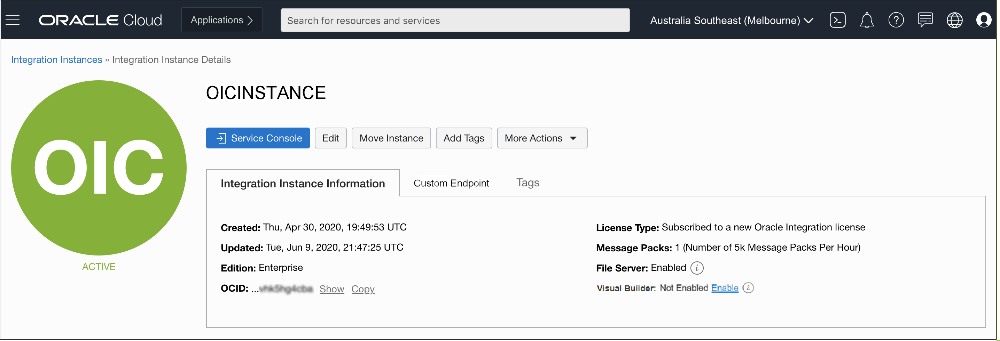
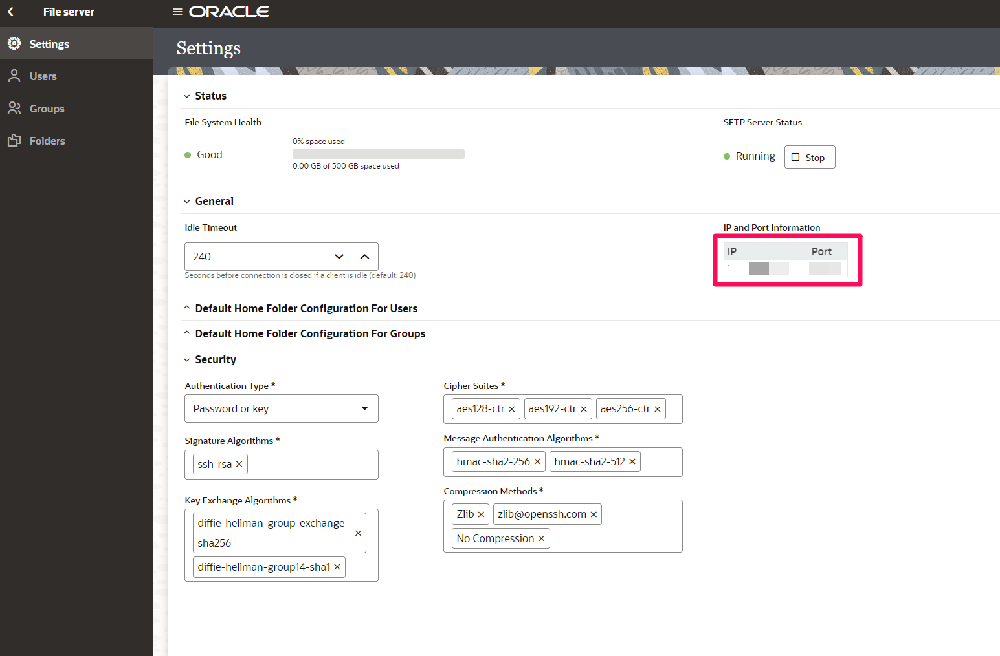
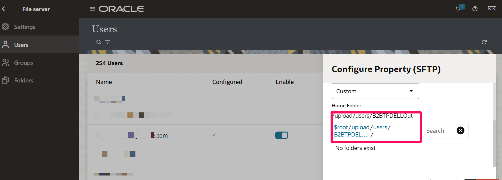
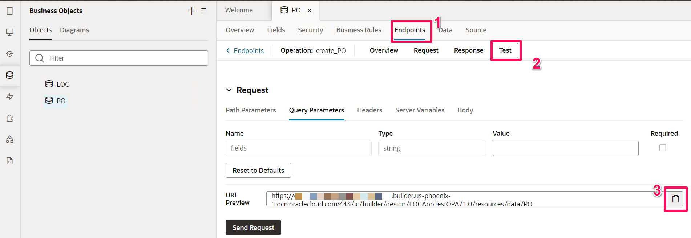

# Enable File Server and setup connections

## Introduction

This lab walks you through the process of enabling the Oracle Integration 3 File Server. By default, the File Server is not enabled, but is required for this workshop. Also, you will be setting up required connections for designing your integration flow in the later lab exercises.

Estimated Time: 5 minutes

### Objectives

In this lab, you will:

* Enable File Server.
* Configure FTP folders and permissions
* Connect to File Server using FTP Client
* Setup connections using adapters

### Prerequisites

This lab assumes you have:

* Successfully provisioned Oracle Integration 3 Instance and able to access the home page.

## Task 1: Enable File Server

- An administrator must enable File Server before an organization can start using it with their Oracle Integration instance. Enabling File Server is a one-time action in the Oracle Cloud Infrastructure Console

    If your organization hasn't enabled File Server yet, and you select File Server from the navigation pane, the following message appears: *Start sharing files...*

    

    To enable File Server:

1. On the Oracle Cloud Get Started page, select the region in the upper right where you created your Oracle Integration 3 instance. Open the navigation menu in the upper left and click *Developer Services*. Under **Application Integration**, click *Integration*.
2. If needed, select the compartment where you created your Oracle Integration 3 instance. You should see your instance.

3. Select your instance.
   The Integration Instance Details page is displayed.
4. Click the *Enable* link for File Server on the Integration Instance Information tab.

    

5. When prompted to confirm enabling File Server, click *Enable*. The OIC icon turns orange and its status changes to Updating. Enablement can take several minutes.

    

6. Once complete, the OIC icon changes back to green with an Active status, and File Server shows as Enabled. You may need to log out and log back in to Oracle Integration to access the newly activated File Server.

    

## Task 2: Configure File Server

Configure File Server settings. This is required as you are using Embedded File Serve of Oracle Integration and using File Server as a target application in your integration flow.

1. Starting at the Oracle Integration **Home** page, select *Settings*, then *File Server* from the left Navigation pane.

2. Select *Settings* from the left Navigation pane to open the File Server Settings page and review the File Server status and configurations. Make a note of IP and port number.
    
    > **Note:**  Ensure the *Authentication Type* is set to **Password or Key**.

3. Select *Users* from left Navigation pane, search for your User Name and click on Configure.
    

4. Click on *Switch to enable* and click on *Save*.
    

5. Select *Folders* from left Navigation pane.
    

6. Click *Create* and create a Folder named **upload**. Create a folder structure as follows **upload &gt; users &gt; B2BTPDELLOut**

7. Click on *Permissions* on the **B2BTPDELLOut** Folder
    
    > **Note:**  You will be using the above Folder structure in the lab.

8. Click *Add Permissions* and select your user. Click *Add*.
    

9. Select *All* and *Propagate to subfolders*. All of the permission checkboxes should be checked. Click *Save* and exit the Permissions page.

10. Select *Users* from left Navigation pane. Click on *Edit*.In the Configure property page select **Home Folder Type** as *Custom*. Select **/upload/users** and *Save* the configuration
    

## Task 3: Connect to File Server with FTP Client

To access files on the File Server you will need to use an FTP Client. You will need to configure your FTP Client with the following:

* File Server IP Address.
* File Server Port.
* Your Oracle Integration username.
* Your Oracle Integration password.

1. To obtain the File Server IP Address and Port, select **Settings** from the left Navigation pane. The IP and Port are located in the *IP and Port Information* section of the *Settings* page.

2. Using your FTP Client choice, connect to the File Server using the SFTP - SSH File Transfer Protocol.  
If the permissions are configured correctly, you should be able to list, read, and write files on the *B2BTPDELLOut* folder.

## Task 4: Import supporting lab artifacts

There are some artifacts which are made available so that you can focus on the core part of the usecase. [Download](https://objectstorage.us-phoenix-1.oraclecloud.com/p/ErOK2_XFjuwyvJYosDbgtXTBTwPUDCvDzr-iaG6-3aw_KSHxZrWTq5LjiYsNA3-v/n/oicpm/b/oiclivelabs/o/oic3/erp-cloud-b2b/oic-ocw-artifacts.zip) the lab artifacts and unzip in any local directory.

1.  Navigate to **OIC console** and Select *Design* &gt; *Packages*. Select *Import* action and browse for the *oic.ocw.hol.par* package under **Import** folder.
    
Select *Import and Configure*. This will open the *Configuration Editor*
    
    The package consists of 2 Connections and Integration flows
    **Connections**
    - REST Interface
    - ERP Cloud
    **Integrations**
    - Change Order ERP PO Proxy - Integration updates PO information
    - Purchase Order Details Proxy - Integration gets PO details given an Order Number and Legal Entity

2.  *Edit* the **REST Interface** connection and click on *Test*.

3.  Similarly, *Edit* the **ERP Cloud** connection and provide the following information and click on *Test* and wait until you receive a confirmation box that the test was successful.

    | **Field**  | **Values** |
    |---|---|
    |ERP Cloud Host | `<your-erp-host-name>` |
    |Security Policy | **Username Password Token**|
    |Username | `<erp-username>`|
    |Password | `<erp-password>`|

    Finally,*Save* the connection

4.  In the **Configuration Editor**, Select *Activation* in the title bar which brings up the **Review and Activate** section. Hover on the **Change Order Proxy Integration** and Select *Activate*.
.
    Select the *Tracing* level as **Debug** and click on *Activate*.
    Similarly, activate the **Purchase Order Details Proxy** Integration. Both Integration status turns to **Active** status, which indicates the integration is ready to accept requests.

## Task 5: Create Connection with File Server

To access the File Server from an Integration, you will need to create an FTP Connection.  

1. In the left Navigation pane, click *Design* &gt; *Connections* &gt; click *Create*
2. In the *Create Connection* dialog, select the **FTP** adapter to use for this connection. To find the adapter, enter FTP in the search field. Click on the highlighted adapter
3. From the **Create Connection** dialog, *Name* your connection as **File Server** and leave the rest of the configurations as default. Click *Create*.  
    > **Note:**  If you get an error that the identifier already exists, enter unique connection name and remember this name for use later in the workshop.

4. Enter the following configurations in the *FTP Connection* with the information you previously gathered from the File Server Settings page.  
  | Field                   | Value                                                 |
  |-------------------------|-------------------------------------------------------|
  | FTP Server Host Address | From File Server Settings - IP and Port Information   |
  | FPT Server Port         | From File Server Settings - IP and Port Information   |
  | SFTP Connection         | Yes                                                   |
  | Security                | FTP Server Access Policy                              |
  | Username                | Your Oracle Integration username                      |
  | Password                | Your Oracle Integration password                      |

5. Confirm your Connection by clicking *Test*. You should see a confirmation message. Click *Save* and exit the Connection editor.

## Task 6: Create Connection with Visual Builder

### Import Visual Builder Application

1. In OIC Console Home page, on the left Navigation pane Select *Visual Builder* (VB). This will navigate to the VB console.

2. Select *Import* Action
   

3. In the Import page, Click *Drag and Drop* and browse  **LOCAppTestOPA.zip** application from the downloaded artifacts available under **Import** folder. Leave the values of **Application ID** and **Application Name** to default.
   Click on *Import*.
   Select the imported VB application. This will open the VB designer console.

4. From the left side Menu select *Business Objects*. Click on *PO* Business object from the list objects.
    

5.  On the Right side page, Select *Endpoints* tab. Click on **create\_po** endpoint.
    

6.  In the **Endpoints** page select *Test* tab. Copy the endpoint url and make a note of it. We will use this url when creating a REST connection.
    

### Create REST Adapter Connection in OIC pointing to VB endpoint

1.  Navigate back to OIC Console. Create a connection using **REST Adapter** and name it as *Visual Builder*

2.  Configure the connection properties and security auth scheme per below

    | Field                   | Value                                                 |
    |-------------------------|-------------------------------------------------------|
    | Connection Type         | REST API Base URL   |
    | Connection Type         | Visual builder hostname noted earlier from PO endpoint (only host information)   |
    | Security Policy         | Basic Authentication                             |
    | Username                | Your Oracle Integration username                      |
    | Password                | Your Oracle Integration password                      |
    | Access Type            | Public Gateway |

3.  Click on *Test* connection and wait for the confirmation message.

**Congratulations!** You have completed most of the prerequisites setup and configuration to get started with the design phase of the usecase.

You may now **proceed to the next lab**.

## Learn More

* [Using the FTP Adapter with Oracle Integration](https://docs.oracle.com/en/cloud/paas/application-integration/ftp-adapter/ftp-adapter-capabilities.html)
* [Using the REST Adapter with Oracle Integration](https://docs.oracle.com/en/cloud/paas/application-integration/rest-adapter/index.html)
* [Using the Oracle ERP Cloud Adapter with Oracle Integration](https://docs.oracle.com/en/cloud/paas/application-integration/erp-adapter/oracle-erp-cloud-adapter-capabilities.html)

## Acknowledgements

* **Author** - Kishore Katta, Oracle Integration Product Management
* **Contributors** - Subhani Italapuram, Oracle Integration Product Management
* **Last Updated By/Date** - Kishore Katta, July 2023
