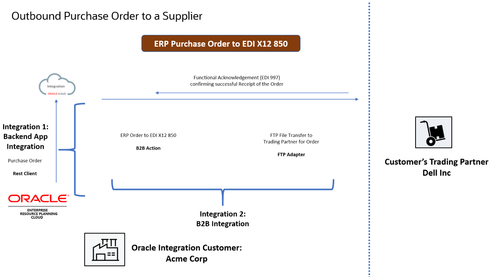
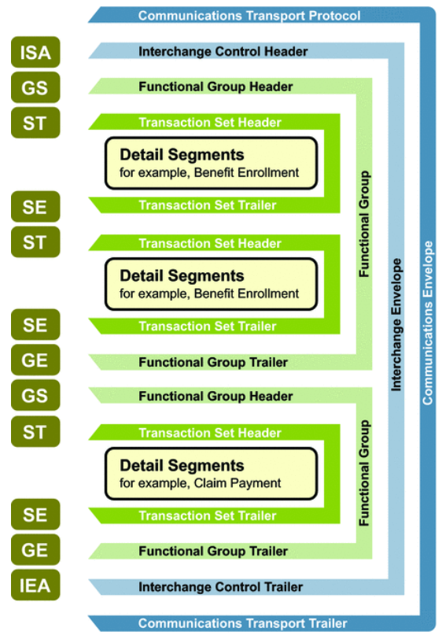
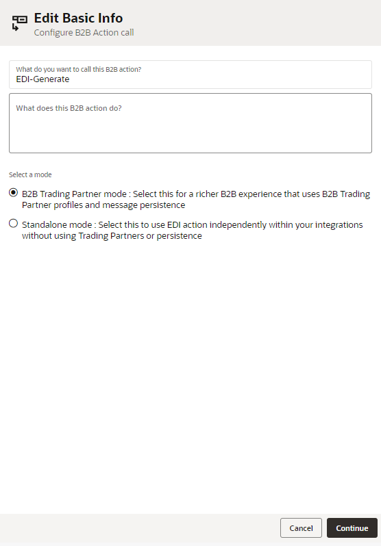
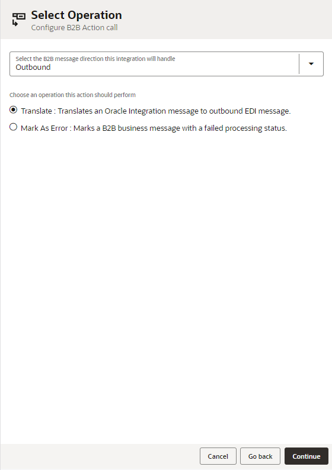
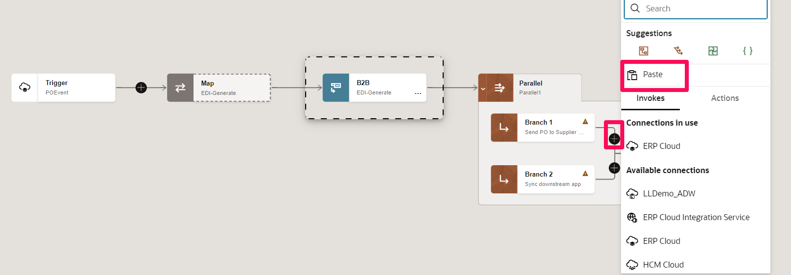
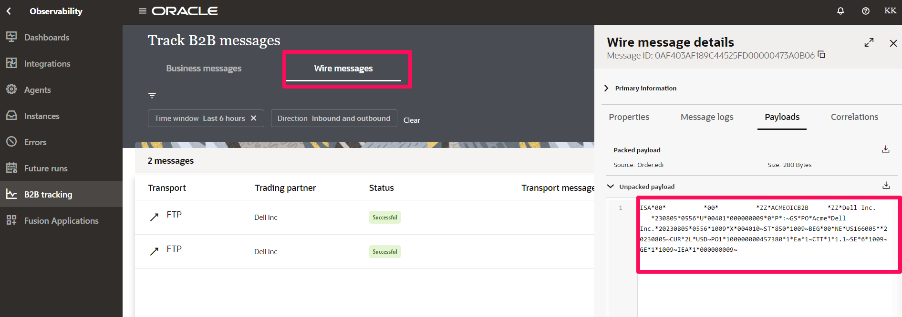
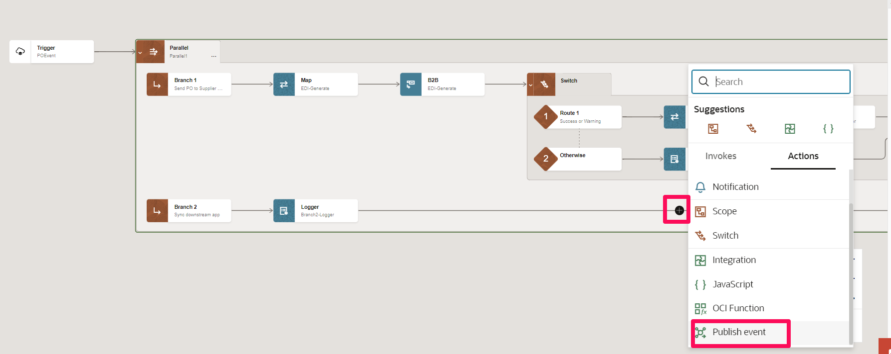
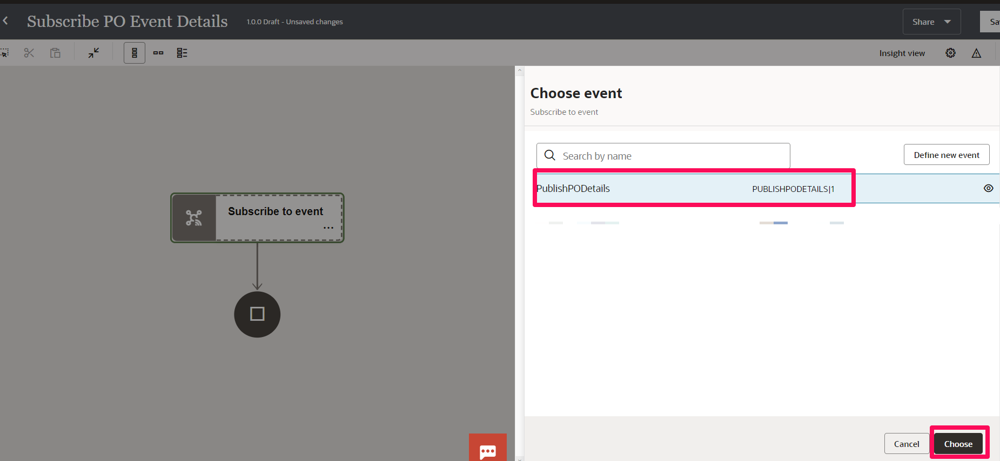

# Create Integration Flow

## Introduction

This lab walks you through the steps to create an integration flow which subscribes to a ERP Cloud Purchase Order(PO) business event. The payload of the purchase order is translated to EDI X12 850 document and will be sent over to a Trading Partner. You will also create extended logic to synchronize the PO to a Visual Builder application.

Estimated Time: 45 minutes

### Objectives

In this lab, you will learn to integrate with ERP Cloud and explore several B2B concepts to build the heart of the usecase.

* B2B Documents and Schemas.
* Host and Trading Partner Configuration.
* Integrations used for Message processing.
* Agreements & Transports for Communication.
* EDI translation
* Subscribe to ERP Cloud Business Events
* Parallel action
* Invoke local integration
* Create pub/sub integrations using Events service

### Prerequisites

This lab assumes you have:

* All Pre-requisite setup is done and the previous tasks completed successfully.

##  Task 1: Learn B2B Concepts and Understand Navigation

This is an optional learning task. You may skip this Task if you are aware of the B2B concepts.

*Host Company*

There are two parties involved in any exchange - your company and an external trading partner.

**Host Profile** is where you configure information about your company.

The Host Profile has only B2B Identifiers for you to enter. This is where you will enter your company's identity information such as EDI Interchange ID and AS2 Identifier. Certain other types of configuration, such as Signing Certificates for your company, etc. are entered in Connections, explained later.

When you send electronic documents to an external trading partner, some B2B Identifiers you enter in the Host Profile are inserted into the message so that the recipient party can identify the sender of the message as being your company.

*Trading Partners*

A Trading Partner is an external business entity that your company interacts with, and sends or receives business transactions, such as orders and invoices, in electronic form.

**Trading Partners** is the where you register your external trading partners and enter information on their behalf. Note that your trading partners cannot access these pages in your Oracle Integration instance. Therefore, as the B2B system administrator, you gather information from your external trading partners, and enter that information in Trading Partner configurations.

Similar to Oracle Integration B2B, your external trading partner will have a B2B application of their own, and they will collect some information about your company, and enter that information into their B2B application.

Once the setup is completed on both the ends (and tested), then the two parties - your company and the external trading partner, are ready to send and receive documents.


*VAN Providers*

In some cases, you don't directly communicate with your external trading partners; instead, you go through an intermediary service, called a VAN provider, who routes your business transactions to the final trading partner recipient. VAN, an abbreviation for Value Added Network, are third party service providers that facilitate communication with multiple trading partners. When you use such a service, you only send business documents to the VAN provider's network endpoint, and they will route it for you to the actual trading partner, eliminating the need to set up one-to-one communication with each trading partner separately.

*Integrations Used For B2B Processing*

The processing of B2B messages happens through Integrations. Oracle Integration B2B uses a two-integration design pattern for better modularity, described below.

**Inbound**

Let us walk through a typical B2B message received from an external trading partner, called an Inbound Message.

The picture below shows how an Inbound message is processed through two integrations.


In the two-integration flow patterns, the **B2B Integration for Receiving Messages** performs these steps:

1. Receive the message from the trading partner and perform various validity checks, for example:
    * Is the message received from a known (that is registered) trading partner? Verify this based on authentication credentials, SSL certificates, HTTP headers, etc.
    * Is the message signed or encrypted? If so, verify the signature and decrypt the message. This step is called Un-packaging akin to taking an object out of its packaging.
2. Send a transport level acknowledgment back to the trading partner, if asked by the trading partner.
3. Detect the type of payload. If it is a payload that requires translation (for example, such as an EDI message), parse and translate the message.
4. Send a translator level acknowledgment, if configured.

The **Backend Integration** performs these steps:

1. Convert the message into a format that a backend application, such as ERP, can directly consume (for example, such as XML, JSON, CSV, etc.) and forward the message to a backend system for further processing.

**Outbound**

Let us walk through a typical B2B message being sent to an external trading partner, called an Outbound Message.

The picture below shows how an Outbound message is processed through two integrations.


In the two-integration flow patterns, the **Backend Integration** performs these steps:

1. Receive an event from a backend application such as ERP for a business document that must be sent out to an external trading partner.
2. Translate the message to an industry-standard B2B format, for example EDI (Electronic Data Interchange) format.

The **B2B Integration for Sending Messages** performs these steps:

1. Add headers, encrypt, sign, and compress the payload, per your desired configuration. This step is called Packaging akin to wrapping an object into an envelope, putting it in a box, and making it ready for delivery.
2. Transmits the message to the external trading partner's endpoint.
3. If the trading partner responds with a transport level acknowledgment, update the status of the transmitted message accordingly.

*Transports for Communication*

Transports are configuration objects that represent a concrete communication channel to a trading partner, using a specific protocol such as AS2 or FTP. You add one or more transports to a trading partner in order to send or receive business documents from them.

Currently, AS2 and FTP (includes SFTP) are supported protocols for B2B Trading Partner mode. If you wish to use another protocol adapter in Oracle Integration with B2B, you can do so only using the Standalone mode.

You define a Transport for a B2B trading partner from the **Trading Partner** **Transports and Agreements** configuration. Here's a sample screenshot for a trading partner with one AS2 and one FTP transport.


**FTP**

File Transfer Protocol and Secure File Transfer Protocol (SFTP) are very commonly used for B2B communications. An FTP transport also works in conjunction with an FTP Connection.

In an FTP Connection you specify the hostname, port, credentials and other security configuration. In the FTP transport, you enter the Input and Output Directory, File name pattern and other details.

One important aspect of an FTP transport is that the receiving side polls the Input Directory on a time-based schedule. You can set up the schedule by clicking on the Receive Schedule action for an FTP transport.

**AS2**

AS2, an abbreviation for Applicability Statement 2, is an HTTP based protocol designed for B2B by adding a comprehensive set of data security features around data confidentiality, data integrity/authenticity, and non-repudiation. The AS2 specification is covered by [RFC 4130](https://datatracker.ietf.org/doc/html/rfc4130). Oracle Integration B2B supports AS2 1.0 and 1.1 versions.

An AS2 transport offers configuration options specific to AS2 that work in conjunction with the AS2 Connection and the Certificate management.

For example, if you wish to sign and encrypt the outbound messages:

1. You use Oracle Integration Certificate management, accessed from the **Home** page and clicking *Settings*, then *Certificates*, to upload your certificates.
2. You enter the signing and encryption certificate alias in the AS2 Connection selected in the AS2 Transport.
3. You select an encryption and signing algorithms in the AS2 Transport configuration.

The simplest AS2 communication uses no encryption, no signing, and no compression. If you are learning about AS2, you can start simple and add the security layers later.

In AS2 there is a concept of an electronic read receipt, officially termed as MDN (Message Disposition Notification). It is a transport level acknowledgment used as a confirmation that the other party has received your message intact. Oracle Integration B2B generates and consumes MDN messages (when enabled), and correlates them to the original transmissions. A B2B Message Tracking page, described later, allows you to view the AS2 messages and the MDN acknowledgments.

*Agreements*

You define one or more Agreements for a B2B trading partner with an intent to send or receive only certain types of business documents to or from that trading partner. An Agreement literally means that your company and the external trading partner have formally agreed upon the terms for the exchange of specific business documents.

An Agreement has the following purposes:

1. Armed with the knowledge of which documents to expect for a given trading partner, B2B will only accept any of the agreed-upon documents. Any unexpected document type is rejected, both, while receiving or sending to that trading partner.
2. Defines the data format for the documents exchanged. For example, for an EDI document, syntax validations and parsing is done based on the B2B Document selected in an Agreement. Both parties, your company and the external trading partner, must decide in advance, the data format to be used for interoperability to work. Typically, one of the parties shares an Implementation Guide containing the data format definition, and the other party complies with it and creates an equivalent data format definition on their side.
3. Specifies behavior for message processing. For example, syntax validations on the data format can be turned on or off in an Agreement, among other settings.
4. Define rules for routing of documents - for example, when receiving documents, an Inbound Agreement defines which Backend Integration to route a document to, based on its type. While sending documents, an Outbound Agreement defines which B2B Sending Integration to hand-over a specific document to for delivery to a trading partner.

Below are example screenshots of two Inbound and two Outbound Agreements defined for a trading partner:


*B2B Documents and Schemas*

A B2B Document is a mandatory object required by an Agreement, and specifies a data format and some additional configuration about the data format.

A data format is specified using these properties:

- Document Standard - presently the EDI standards X12 and EDIFACT are supported.
- Document Version - a version as defined by the standards body.
- Document Type - a type as defined by the standards body.
- Document Schema - Standard or a customized variant defined in a B2B Schema object. Standard means the pristine schema defined in the data dictionary published by the Standards body.

Additional configuration means one or more Business Identifiers that the B2B runtime should extract and display in B2B Message Tracking.

A B2B Schema is an optional object that represents a customized variant of one of the Standard schemas.

*Message Persistence and Tracking*

As messages flow through the B2B Integrations for Receiving and Sending, each Inbound and Outbound message is persisted separately, in addition to the usual integration instance tracking.

The persisted B2B messages can be accessed from the **Home** page and clicking *Monitoring*, then *B2B Tracking*.

The sample screenshot below shows the B2B Tracking page.


**Business Messages**

In this view, you see B2B messages as individual business transactions. Rows marked **FA** denote functional acknowledgments.

Let's say you receive an inbound message containing batched transactions. Then in this view you will see individual rows for each of the single transactions within that batch.

**Wire Messages**

An alternate low-level technical view of B2B messages is the Wire Messages. In this view, you will see messages in the form they are actually transmitted to, or received from a trading partner. This view is useful for troubleshooting, in case the message failed to be delivered to a trading partner, or if a message that was received failed the signature verification step. Rows marked **MDN** denote AS2 MDNs (electronic return receipts).

In the case where you receive an inbound message containing batched transaction, in this view, you will only see one row corresponding to the actual batch message that was received.


*Demystify the Concepts*

**Use Case**

ACME Corp sends an X12 850 Purchase Order EDI document to Trading Partner Dell Inc through, by using FTP. ACME Corp had configured Oracle Integration B2B message exchange agreement to send Purchase Order EDI document to External Trading Partner.



* Acme Corp (Manufacturer of goods) an Oracle Integration Customer is the Host company.
* Dell Inc (Supplier of goods) is the Trading Partner.
* Host Company ERP Cloud Application Creates a purchase order. A Backend Integration in OIC translates the Purchase order to EDI X12 Structure.
*	Oracle Integration B2B transports the Purchase Order to Trading Partner through, by using agreed upon Communication Protocol which is FTP.
* Acme Corp Sends the Purchase Order and Receives an 997 Acknowledgement from Trading Partner which is the Agreement configured for Outbound processing.

**Relationship between Trading Partner and Agreements**


##  Task 2: Create a new B2B Schema and Document

*Create B2B schema*
You can create a new B2B Schema based on a standard Document type.

1. Starting at the Oracle Integration **Home** page, select *B2B* from the left Navigation pane.
2. Select *Schemas*.
3. On the **Schemas** page, click *Create*.
4. Enter the following details:  
| Element           | Description                                           |
| ----------------- | ----------------------------------------------------- |
| Name              | PurchaseOrderSchema                                   |
| Identifier        | This field is automatically populated with a unique Schema identifier. |
| Description       | Purchase Order Schema                                 |
| Document Standard | X12 (Select the document standard X12. The document standard identifies the business protocol to follow when exchanging business documents between partners. Supported document standards are EDIFACT and X12) |
| Document Version  | 4010                                                  |
| Document Type     | 850 (Purchase Order)                                  |

5. Click *Create*, then *Save*, then exit the PurchaseOrderSchema page.  


The following diagram shows a schematic structure of X12 envelopes.


Refer to the [EDI X12 Documentation](https://docs.oracle.com/en/cloud/paas/application-integration/integration-b2b/edi-x12.html) to understand more details about the X12 structure.

*Create a new B2B Document*

You can create a new B2B Document based on a standard document type.

1. In the left navigation pane, click *Documents*.
2. On the **Documents** page, click *Create*.
3. Enter the following details:  
| Element           | Description               |
| ------------------| ------------------------- |
| Name              | PurchaseOrder4010Document |
| Identifier        | This field is automatically populated with a unique Document identifier. |
| Description       | Purchase Order Document     |
| Document Standard | X12 (Select the document standard X12. The document standard identifies the business protocol to follow when exchanging business documents between partners. Supported document standards are EDIFACT and X12 ) |
| Document Version  | 4010                      |
| Document Type     | 850 (Purchase Order)      |

4. Click *Create*.  

5. The Document page for your new B2B Document is displayed. The **Document Schema** field is set to **Standard** by default. Change the **Document Schema** to *PurchaseOrderSchema* which you created in the last task.  

6. Click *Save* and exit the PurchaseOrder4010Document page.

##  Task 3: Configure the Host Profile

Configuring the Host Profile requires:

* Enter your Company Name.
* Add the required Identifiers.

For this lab you will add the following Identifiers.

*Host Profile Identifiers*

| Identifier Type | Purpose |
| --- | --- |
| EDI Interchange ID           | Mandatory for all EDI data formats. This identifier is used as the Interchange Sender ID field of the interchange envelope (ISA segment for X12 and UNB segment for EDIFACT).For an outbound message, this value is inserted as the Interchange Sender ID. For an inbound message, this identifier (from the host profile) is not used. |
| EDI Interchange ID Qualifier | Mandatory for X12 and optional for EDIFACT. This identifier is used as the Interchange Sender ID Qualifier field of the interchange envelope of the EDI payload. It's a code to indicate the category of the value specified in the EDI Interchange ID (for example, DUNS number, IATA number, and so on).For an outbound message, this value is inserted as the Interchange Sender ID Qualifier. For an inbound message, the value (from the host profile) is not used. |
| EDI Group ID                 | Mandatory for X12 and optional for EDIFACT. For an outbound X12 message, this value is inserted in the GS segment as the Application Sender's Code. For an inbound message, the value from the host profile is not used. |
| EDI Group ID Qualifier       | Only used for EDIFACT. In that, it is also optional. It's a code to indicate the category of the value specified in the EDI Group ID (for example, DUNS number, IATA number, and so on). |

*Create the Host Profile*

1. In the B2B Menu, from the left navigation pane, click *Host Profile*
2. In the **Host Company Name** field, enter *Acme* as your company name.  
The name is currently only for reference and not used elsewhere.
3. Select an Identifier or, if none are defined, click **Add Identifiers** *+*. You add Identifiers to the Host Profile on behalf of your company.  
Note: This is typically a one-time activity that you perform before adding your first trading partner. Host Identifiers define your company when acting as the host interacting with other trading partners. They identify and validate the source of the document when sent by the host. Identifiers defined here are used in two places:  
    * Transports.
    * Outbound Agreements.
4. Create the following Identifiers:  
| Identifier Type              | Value      |
| ---                          | ---        |
| EDI Interchange ID           | ACMEOICB2B |
| EDI Interchange ID Qualifier | ZZ         |
| EDI Group ID                 | Acme       |
| EDI Group ID Qualifier       | 01         |

5. Click *Save*.

Note: If you change the Host Identifier value used in a deployed Agreement, the changes only take effect after you explicitly redeploy the Agreement between the Host and the Trading Partner.
##  Task 4: Create Trading Partners
You can create and manage Trading Partners. A Trading Partner is the external business entity with which your company interacts to send or receive business documents, such as orders and invoices, in electronic form.

1. In the left navigation pane, click *Trading Partners*
2. Click *Create*. Enter the Trading Partner **Name** as *Dell Inc* and an optional description. The **Identifier** field is automatically populated with a unique Trading Partner identifier. Click *Create*.

*Define Contacts*

You can add ways to contact the trading partner, such as their name, email, phone number, or short message service (SMS) number. You can select from the predefined Contact Types or enter your own custom Contact Type. Use this information to contact individuals offline, as needed. Contacts are currently provided only for reference and are not used in Oracle Integration B2B.

1. Click the *Contacts* tab. Select **Contact Type** as *Email*. Enter your email id in the **Value** column and click *Save*  


*Define B2B Identifiers*

You collect identifying information from your external trading partner and enter it on their behalf in the B2B Identifiers section. This is very similar, in concept, to the identifiers specified under Host Profile Identifiers. In a message exchange, the Host Identifiers and Trading Partner Identifiers are used in the role of a sender or receiver, depending on the message direction.

Understand the Identifiers that we will use.

| Identifier Type              | Purpose |
| ---                          | --- |
| EDI Interchange ID           | Mandatory for all EDI data formats. This identifier is used as either the Interchange Sender or Receiver ID field of the interchange envelope. For an outbound message, this value is inserted as the Interchange Receiver ID. <ul><li>For an inbound message, this identifier is used as the Interchange Sender ID to identity a trading partner as a sender of a message</li><li>For an inbound message, this identifier is used as the Interchange Sender ID to identity a trading partner as a sender of a message.</li></ul> |
| EDI Interchange ID Qualifier | Mandatory for X12 and optional for EDIFACT. It is a code to indicate the category of the value specified in the EDI Interchange ID (for example, DUNS number, IATA number, and so on). For an outbound message, this value is inserted as the Interchange Receiver ID Qualifier.|
|EDI Group ID                 | This is mandatory for X12 and optional for EDIFACT. <ul><li>For an outbound X12 message, this value is inserted in the GS segment as the Application Receiver's Code</li><li>For an inbound message, this value is used only in case the EDI Interchange ID, on its own, is not enough to uniquely identify a trading partner</li></ul> |
| EDI Group ID Qualifier       | It is a code to indicate the category of the value specified in the EDI Group ID (for example, DUNS number, IATA number, and so on).Only used for an outbound message, to insert as EDI Group ID Qualifier, if specified|01|
|Application Partner ID|Optionally used as an alternate way to specify which trading partner to which to route an outbound message. |

1. Click the *B2B Identifiers* tab.

2. Select an Identifier or, if none are defined, click **Add Identifiers** *+*.

3. Create the following Identifiers:  
| Identifier Type              | Value     |
| ---                          | ---       |
| EDI Interchange ID           | Dell Inc. |
| EDI Interchange ID Qualifier | ZZ        |
| EDI Group ID                 | Dell Inc. |
| EDI Group ID Qualifier       | 01        |
| Application Partner ID       | Dell Inc. |

4. Click *Save* after every addition.  


*Define Transports*

A Transport maps to a technical communication protocol. In most cases, you add one transport per trading partner to send or receive messages to and from the partner.

Each Transport is listed with its Name, Direction/Type, Status, and Last Updated time. The Direction is an indicator of whether it is configured to receive (down arrow), send (up arrow), or both. Status can be:

- Not deployed.
- Deploying.
- Deployed.
- Failed.

1. Click the *Transports & Agreements* tab. In the **Transports** section, click *+* to add a new Transport. Enter the details as per the below and click *Add*.

| Field                        | Description                  |
|------------------------------|------------------------------|
| Name                         | FTP                          |
| Type                         | FTP                          |
| Trading Partner's Connection | Select the FTP Connection you previously created (File Server). Refer to [Creating Connection with File Server](../workshops/tenancy/?lab=enable-file-server) for more information.|
| Output Directory             | Any FTP directory ex: /upload/users/B2BTPDELLOut|
| Output File Name             | Order-%SEQ%.edi|
| Integration Name Prefix      | Dell |

*B2B Integrations*

You will notice two Integrations are created automatically when a Transport is created. These Integrations are the heart of the Transport for its runtime functioning. The two Integrations process the runtime messages that pass through the Transport.

- B2B Integration for receiving messages (Dell FTP Receive).
- B2B Integration for sending messages (Dell FTP Send).


Deploy the Transport Integrations.

1.  Click the *Actions* menu on the **FTP** Transport to view available actions. Select *Deploy*, then *Deploy* again to confirm the deployment.  


2.  Starting at the Oracle Integration **Home** page, select *Design*, then *Integrations* again from the left Navigation pane and note the activated **Dell FTP Receive** and **Dell FTP Send** integrations.  


##  Task 5: Create Agreements

This section describes creating and managing Agreements. You define one or more Agreements for a B2B Trading Partner with an intent to send or receive only certain types of business documents to or from that Trading Partner.

*Define Outbound Agreement*

1.  Starting at the Oracle Integration **Home** page, select *B2B*, then *Trading Partners*.

2.  Select the *Dell Inc* Trading Partner you created, then click *Transports & Agreements*.

3.  In the **Outbound Agreements** section, click *+* to add a new Agreement. Enter the details as per the below and click *Add*.  

| Field                              | Value                       |
|------------------------------------|-----------------------------|
| Name                               | OutAgreement                |
| Select a Document                  | PurchaseOrder4010Document   |
| Select Trading Partner Identifiers | <ul><li>Application Partner ID</li><li>EDI Group ID Qualifier</li><li>EDI Group ID</li><li>EDI Interchange ID Qualifier</li><li>EDI Interchange ID</li></ul> |
| Select Host Identifiers            | <ul><li>EDI Interchange ID </li><li>EDI Interchange ID Qualifier</li><li>EDI Group ID Qualifier</li><li>EDI Group ID</li></ul> |
| Select a Transport                 | FTP                         |
| Configure Agreement Settings       | Uncheck Enable Validations    |
| Configure Agreement Settings       | Uncheck Functional Ack Required |


4.  Click the *Action* menu on the **OutAgreement** Outbound Agreement to view available actions. Select *Deploy*, then *Deploy* again to confirm the deployment. Exit the Dell Inc Trading Partner page.

Note: Deploy Transport and Transport Agreements. You can deploy in any sequence and if you modify anything, you can just deploy the corresponding section. For example, if you modify Outbound Transport Agreement then you can deploy (or redeploy) only Outbound Transport Agreement.

##  Task 6: Create an Integration

Let's create a basic, outbound integration flow that subscribes to PO event, converts it to EDI X12 format, and invokes corresponding trading partner.

1. In the **Navigation pane**, click *Design* and *Integrations*

2. On the **Integrations page**, click *Create*

3. Select **Application** as the style to use. The **Create Integration** dialog is displayed.

    Enter the Name of the integration per the value given below and then click on ***Create***
    ```
    <copy>LL ERPPO Backend B2B</copy>
    ```

4. Change Layout to **Horizontal**

##  Task 7:  Define ERP Purchase Order (PO) Event trigger

Add ERP PO Event trigger to the empty integration canvas.

1. Click the *+* sign in the integration canvas.

2. Select the *ERP Cloud* connection which you have created in the previous labs. This invokes the Oracle ERP Cloud Endpoint Configuration Wizard.

3. On the **Basic Info** page,
     - for the **What do you want to call your endpoint?** element, enter *POEvent*
     - Click *&gt; (Next step)*.

4. On the **Request** page, select the following values:

    | **Element**        | **Value**          |       
    | --- | ----------- |
    | Define the purpose of the trigger         | Receive Business Events raised within ERP Cloud       |
    | Business Event for Subscription  | **Purchase Order Event** |
    | Filter Expr for Purchase Order Event | [see code snippet below] |
    |

    ```
    <copy>
    <xpathExpr xmlns:ns0="http://xmlns.oracle.com/apps/prc/po/editDocument/purchaseOrderServiceV2/" xmlns:ns2="http://xmlns.oracle.com/apps/prc/po/editDocument/purchaseOrderServiceV2/types/" xmlns:ns6="http://xmlns.oracle.com/apps/prc/po/viewDocument/publicFlex/purchasingDocumentHeader/">$eventPayload/ns2:result/ns0:Value/ns0:HeaderFlexfield/ns6:locId="null"</xpathExpr>
    </copy>
    ```

    > **Tip:**
    Please note that the filter is not mandatory, however, in the later part of the scenario we would be updating the PO. PO Business Event fires for create and update scenarios. Hence, by providing some control value we can avoid the integration to be triggered for second time which is not required in our usecase.

6. Click *&gt; (Next step)*.
7. On the **Summary** page, click *Done*.
8. Click *Save* to persist changes.
9. Optional, Select Layout to *Horizontal* and click *Save* to apply changes.
    

##  Task 8: Construct 850 EDI Document and send to Trading Partner

1.  On the designer after the **POEvent** element click on *+* sign. A list of actions and invokes are available for adding to your integration is displayed. Under the actions Select *B2B* action. The **Configure B2B Action** wizard opens
    - On the **Basic Info** page, enter the **name** per the value given below for the action and select a mode as *B2B Trading Partner mode*, and click **Next**

    ```
    <copy>EDI-Generate</copy>
    ```
    
    - Select *Operation* as **Outbound** and option *Translate* (Translates OIC message to EDI message)
    
    - Select *Document Definition* as **Purchase Order** (You must have created this as part of previous lab) and click on *Next*
    
    - Review the *Summary page*, click on *Done* to complete the configuration and click on *Save* to save your integration flow. Click on ***RESET*** if required for a better view of your integration flow.
    Note that the corresponding mapping element is automatically added to the integration flow
    

2.  On the designer canvas, hover your cursor after the *B2B* activity and click on *+* sign. Select *Parallel action* from **Actions**. A Parallel action is added to the canvas.

**Knowledge Point:** The Parallel action in OIC allows you to define branches to run two or more actions in parallel. This can be useful when you need to perform several time-consuming and independent tasks at the same time. For example, you could use a Parallel action to:

- Subscribe to an event from a source system and then send the event to multiple downstream systems in parallel.
- Process a batch of records in parallel, using different processing logic for each record.
- Invoke multiple web services in parallel, to improve performance.

3.  *Edit* **Branch 1**. Provide a name **Send PO to Supplier Trading Partner**. Similarly, name the **Branch 2** as **Sync downstream app**.

4.  Select the  *...* on **B2B** activity and Click on *Cut*. Notice the activity is highlighted with dotted line graphic. Click on *+* sign after **Branch 1** and select *Paste*.
    
    Similarly select *Cut* action in **Map: EDI-Generate** activity and place after **Branch 1** element.
    
    Save your integration flow.
    You can easily cut and paste activities to redesign your integration flow logic.

5.  Configure data mappings for the EDI-Generate action and PO event action in order to successfully parse the incoming XML message and translate it to EDI message.
- Click the *Map to EDI-Generate* activity and select *Edit*
- From Source, expand the *POEvent Request* element. On the Target side, expand the *EDI-Generate Request* > *TranslateInput* > *Edi XML Document* > *Transaction Data* > *BEG: Beginning Segment for Purchase Order*. **Map** all the mandatory elements per below. Search for the element on the source and target structure to find it easily.

| Source | Target |
| --- | --- |
| "00" | BEG01: Transaciton Set Purpose Code|
| "NE" | BEG02: Purchase Order Type Code |
| Order Number | BEG03: Purchase Order Number |
| drag and drop format-DateTime function from the Components>Functions>String onto the BEG05 and create an expression as below: xp20:format-dateTime (/nssrcmpr:onEvent/inp1:getPurchaseOrderResponse/inp1:result/ns25:Value/ns25:OrderDate,"[Y0001][M01][D01]") Validate you expression by clicking on the **Tick** mark in the expression editor| BEG05: Date |
|  count of po line items count(/nssrcmpr:onEvent/inp1:getPurchaseOrderResponse/inp1:result/ns25:Value/ns25:PurchaseOrderLine)  | Loop-CTT > CTT: Transaction Totals > CTT01: Number of Line Items |
| Total Amount | CTT02: Hash Total |
| "2L" | CUR01:Entity Identifier Code |
| Currency Code | CUR02: Currency Code |
| Conversion Rate | CUR03: Exchange Rate |
| Purchase Order Line | Loop-PO1: Baseline Item Data |
| Purchase Order Line > Item Id | PO101: Assigned Identification |
| Purchase Order Line > Quantity | PO102: Quantity Ordered |
| Purchase Order Line > Unit of Measure Code | PO103: Unit or Basis for Measurement Code  |
| Purchase Order Line > Price | PO104: Unit Price |
| Supplier | EDI-Generate Request > Translate Input > Application Partner ID |

6. Add a *Switch* action after the **B2B EDI-Generate** activity
    - For the **Route1** branch, Enter the Expression Name as **Success or Warning**
    - Configure the following expression under Expression section. Expand *EDI-Generate* > *executeResponse* > *TranslateOutput* > *translation-status*.
    - Drag and drop into the element *translation-status* into the **Value** box.
    - Select Operator as **=**
    - In the second **Value** provide a static Value **"Success"**
      
    - This expression indicates that if **TranslateOutput > translation-status** has a value of **Success**, then take this route. This is referred to as the success route
    - Click on *Validate* and Click on *Close* and Save your integration flow
    - In the success route: Add *Integration* Action. Enter name as **callTradingPartner** and select **DELL FTP Send** Integration and click on *Next*. Select **POST** operation and click *Next*. Finally, Select *Done* and *Save* your integration flow
    - *Edit* the **Map to callTradingPartner**. From Source, expand **EDI-Generate Response > executeResponse > TranslateOutput**

    | Source | Target |
    | --- | --- |
    | "/upload/users/B2BTPDELLOut" | Component Schema Request Wrapper > Directory |
    | "Order.edi" | Component Schema Request Wrapper > Filename |
    | B2B Message Reference | Component Schema Request Wrapper > Messages > B2B Message Reference |
    | Trading Partner Name | Component Schema Request Wrapper > Trading Parnter |
    | Connectivity Properties Code | Connectivity Properties > Localintegration > code |
    | Connectivity Properties Version | Connectivity Properties > Localintegration > version |

    - Click on *Validate* and Click on *Close* and *Save* your Integration flow
    - In Otherwise route: Add *Logger* Activity. Enter name as **Log-Error**. Provide logger message by concatenating **Translation Status** and **Validation Error Report** values from **$EDI-Generate > Translate Output** variables. Note that the namespaces may vary if you copy paste the below expression. Below is just for your reference.
    concat("Translation Error::",$EDI-Generate/ns31:executeResponse/ns33:TranslateOutput/ns33:translation-status,$EDI-Generate/ns31:executeResponse/ns33:TranslateOutput/ns33:validation-error-report)
    - *Validate* and Close. *Save* your integration flow.
    
    - After **Branch 2** add a *logger* action and add any log message.

Congratulations! You have reached a significant milestone in this design. You may test the partial flow to check if everything works fine and resume the design in further tasks.

##  Task 9: Define Business Identifiers & Activate the Integration

1. Manage business identifiers that enable you to track fields in messages during runtime.

2. Click on the *(I) Business Identifiers* menu on the top right.
   

3. From the **Source** section, expand *getPurchaseOrderResponse* &gt; *result*, click on 2nd sequence, expand *Value*. Drag the *PO Header Id* and *Order Number*  fields to the right side section:
   

4. Click on the *(I) Business Identifiers* menu on the top right and Click *Save* and Click on *&lt;* *(Go back)* button.

5. On the **Integrations** page, click on the *Activate* sign.


6. On the **Activate Integration** dialog, select *Debug* as tracing level and click *Activate*

The activation will complete in a few seconds. If activation is successful, the status of the integration changes to **Active**.

## Task 10: Create Purchase Order in ERP Cloud
Access your ERP Cloud environment.

1. Login with a user may.gee or equivalent having the correct roles and privileges to create a PO.

2. Navigate to the *Procurement* Tab.

3. Click *Purchase Orders*.

4. In the **Overview** section, click the ***Tasks*** button on the right.
   
This opens the Tasks menu.

5. Under the **Orders** section, select ***Create Order***.
   
The **Create Order** dialog is displayed.

6. Select **Requisitioning BU** as **Procurement BU** and Enter *Dell Inc.* in the **Supplier** field and select the corresponding supplier in the dropdown.

> **Tip:** You can also search for valid suppliers using the **Search** icon.

7. Click ***Create***.
The **Edit Document (Purchase Order)** page is displayed. In the **Additional Information** section provide value *null* for **Letter of Credit ID**

8. In the **Lines** Tab, click ***+*** to add a Purchase Order line row.
   

9. Enter values in the below fields (sample values provided) and click on ***Save***
  | **Field**        | **Value**          |       
  | --- | ----------- |
  | Type | *Goods* |
  | Description | Enter the description value which you have entered as a filter expression at the time of creating an  integration flow. For example: *Lan Cable <your-initials>*|
  | Category Name | search for *Computer Supplies* and then select it |
  | Quantity | Enter a valid number, eg. *1* |
  | UOM | *Ea* (Default) |
  | Base Price | Enter a valid number, eg. *1.0*|

10. Click ***Submit*** to initiate the Purchase Order processing.
After submitting the Purchase Order, a confirmation message will appear with the PO number. Make a note of the **PO Number**

##  Task 11: Validate Purchase Order status
After the PO is submitted, the initial status becomes **Pending Approval**. The PO Create event will occur once the status changes to **Open**.

1. In the **Overview** section, click *Tasks* button on the right.
   This opens the **Tasks** menu.

2. Under the **Orders** section, click on *Manage Orders*.

3. Click *Search*. You should see the Purchase Orders for the current user OR enter the PO number to search for the purchase order which you have created.

4. Look for your Purchase Order in the list with the PO number displayed in the previous task.
> **Tip:** The last created PO should generally be the top one in the list.

5. Validate the PO Status. If it's **Open** then the Business Event has occurred.

> **Note:** If PO has another Status, such as *Pending Approval*, then wait a couple of minutes and refresh the page to until the status changes to **Open**.

##  Task 12: Monitor the integration

Use the Oracle Integration dashboard to see the data flow resulting from the create Purchase Order event in ERP Cloud.

1.  In the Integration navigation pane, Go back to the *Home* page &gt; click on *Observability* &gt; *Instances*

2.  Find the corresponding Integration Instance, by matching the *PO Header Id* or *Order Number* from the Purchase Order in ERP Cloud. This should be under the columns *Primary Identifier* or *Business Identifiers*.

3. Click on your ***POHeaderId*** link to open the corresponding integration instance.
The flow ran successfully if it is displayed with a green line.


4.  In the Activity Steam window, click on the different *Message* links to review the flow of request and response messages.

6.  Click ***&lt; (Go back)*** button after reviewing the Activity Stream.

7.  Navigate to **Observability > B2B Tracking** page. You should see Business Messages under the Business Messages Tab for your specific Trading Partner.

8.  Click on the *View* icon and inspect **Message Logs, Payload**

9.  Similarly, Navigate to **Wire Messages** tab and inspect the Payloads. Expand the unpacked payload and observe the EDI message which is constructed.


10.  If you have FTP Client installed on your machine, you can login using the FTP details provided to you and cross check your EDI file created under folder **/upload/users/B2BTPDELLOut**

In conclusion, you can use Oracle Integration to accept XML message and convert it into EDI format and send it to the trading partners dynamically.

##  Task 13: Extend the PO Backend Integration flow
In the upcoming tasks, you will design extension logic to synchronize the purchase order (PO) with a downstream application created in VBCS (Visual Builder Cloud Service) using Events. You can create and select events for publishing and subscribing to in integrations. The events will be defined in JSON format. The publish and subscribe feature allows you to decouple producers and subscribers, ensuring a more flexible and efficient system. The events design life cycle involves three main steps
- Crate an Event
- Create an event publishing integration
- Create an event subscription integration

1.  Navigate to the **Integrations** page. By selecting the *...* next to your **LL ERPPO BACKEND B2B** integration. From the list of actions select *Create New Version*. Leave the defaults and Click on *Create*. This will create a minor version change of the integration.

2.  *Edit* the new version of Integration. In **Branch 2**, Click on *+* sign next to Logger activity and add an Action *Publish Event*.


3.  Click on **Define new event**. Provide a name **PublishPODetails**. Select *Continue*

4.  In the **Define Event Structure** page paste the below JSON and click *Create* and *Finish* the wizard
```
<copy>
{
  "pOHeaderId" : "300000074157551",
  "orderNumber" : "US163521",
  "procurementBUId" : "300000046987012",
  "procurementBusinessUnit" : "US1 Business Unit",
  "supplierId" : "300000047414679",
  "supplier" : "Dell Inc.",
  "soldToLegalEntity" : "US1 Legal Entity",
  "orderAmount" : 10.0
}
</copy>
```
5.  *Edit* the  **Map PUBLISHPODETAILS** activity and define mapping per below.
Expand the ***Source*** node:

```
POEvent Request > Get Purchase Order Response > Result > 2nd <sequence> > Value
```

Expand the ***Target*** node:

```
PUBLISHPODETAILS > Request Wrapper
```

| **Source** *(POEvent Request)*        | **Target** *(PUBLISHPODETAILS)* |
| --- | ----------- |
| PO Header Id | PO Header Id |
| Order Number | Order Number |
| Procurement BU Id | Procurement BU Id |
| Procurement Business Unit | Procurement Business Unit |
| Sold To Legal Entity Id | Sold To Legal Entity |
| Supplier Id | Supplier Id |
| Supplier | Supplier |
| Ordered Amount | Order Amount |

*Validate* and *Save* your Integration.

6.  *Activate* your Integration and select tracing level as *Debug*. Notice that earlier version is automatically deactivated, since both the Integrations have same Major version.

## Task 14: Create Subscribe Event Integration

1.  On **Integrations** page click on *Create*.

2.  In the **Create integration**page select the design pattern *Event* and provide name *Subscribe PO Event Details*. Click on *Create*

3.  In the integration canvas **Choose Event** page select the publisher Event and select *Choose* and *Finish*. Save your integration.


4.  Hover cursor next to **Subscribe to event** activity and Click on *+* sign. From the list of **Invoke** connections choose *Visual Builder*
- In the **Basic Info** page, configure the endpoint per below and click *Next*

| **Field Name** | **Value** |
|----------------|-----------|
| What do you want to call your endpoint? | syncPO |
| What is the endpoint's relative resource URI? | /ic/builder/design/LOCAppTestOPA/1.0/resources/data/PO |
| What action do you want to perform on the endpoint? | POST |
| Configure a request payload for this endpoint | Select the check box |
| Configure this endpoint to receive the response | Select the check box |

5.  On the **Request** page configure the following values:
- From the **Select the request payload format** list, select JSON Sample.
- *Click* the &lt;&lt;&lt;inline&gt;&gt;&gt; link
- Enter the following JSON Sample and click *OK*
```
<copy>
{
  "pOHeaderId" : "300000074157551",
  "orderNumber" : "US163521",
  "procurementBUId" : "300000046987012",
  "procurementBusinessUnit" : "US1 Business Unit",
  "supplierId" : "300000047414679",
  "supplier" : "Dell Inc.",
  "soldToLegalEntity" : "US1 Legal Entity",
  "orderAmount" : 10.0
}
</copy>
```
6.  On the **Response** page, configure the following values:
- From the **Select the response payload format** list, select JSON Sample.
- *Click* the &lt;&lt;&lt;inline&gt;&gt;&gt; link
- Enter the following JSON Sample and click *OK*
```
<copy>
{
  "id" : 448,
  "creationDate" : "2023-07-17T12:23:50+00:00",
  "lastUpdateDate" : "2023-07-17T12:23:50.074+00:00",
  "createdBy" : "john.doe@example.com",
  "lastUpdatedBy" : "john.doe@example.com",
  "pOHeaderId" : "300000074157551",
  "orderNumber" : "US163521",
  "procurementBUId" : "300000046987012",
  "procurementBusinessUnit" : "US1 Business Unit",
  "supplierId" : "300000047414679",
  "supplier" : "Dell Inc.",
  "soldToLegalEntity" : "US1 Legal Entity",
  "lOCId" : "1",
  "orderAmount" : 10.0
}
</copy>
```

7.  Click *Next* and finish the wizard.

8.  Define the data mapping between Source (PUBLISHPODETAILS) AND Target (syncPO Request). All the mappings are self explanatory and one to one mapping per below.

   *Validate* the mapping and *Save* your Integration flow.

9.  Define Business Identifiers **poHeaderId** and **orderNumber**

10. *Save* and *Activate* your Integration Flow.

## Task 15: Test the Complete Integration flow

1. Login with a user may.gee or equivalent having the correct roles and privileges to create a PO.

2. Navigate to the *Procurement* Tab.

3. Click *Purchase Orders*.

4. In the **Overview** section, click the ***Tasks*** button on the right.
   
This opens the Tasks menu.

5. Under the **Orders** section, select ***Manage Order***.

6. Search for the **Purchase Order Number** that was noted earlier. Select the Order. From **Actions** select *Edit*.

7. Provide some description in the **Description** field. Its a mandatory field for change order. Leave the default and click *Submit*. Select *OK* on the confirmation dialog. Click *Done*.

8. Navigate to *Manage Orders* tab and wait for the status to be *Open*. A small **Information** icon appears next to the status, which indicates its in process. Wait for the icon to disappear.


9. Navigate to OIC console Observability and verify that the 3 integrations are successfully Completed.
- LL ERPPO Backend B2B integrations
- Dell FTP Send integration
- Subscriber Integration

**Congratulations!** You have achieved a key milestone in this usecase design.

In conclusion, this tutorial has taken you through a comprehensive journey into the world of OIC (Oracle Integration Cloud) integration, focusing on several crucial aspects that ensure successful B2B communication and streamlined business processes. Let's recap the key points we've covered:

**B2B Documents and Schemas:**
Understanding B2B documents and schemas forms the foundation of your integration efforts. We delved into the importance of standardized document structures and how schemas ensure consistency and accurate data interpretation between trading partners.

**Host and Trading Partner Configuration:**
Configuring host and trading partner profiles is a pivotal step in establishing secure and reliable communication. We explored how to set up these profiles, enabling seamless data exchange while adhering to security protocols and authentication mechanisms.

**Integrations used for Message Processing:**
Integrations play a vital role in message processing. We discussed the various integration patterns and strategies you can employ to efficiently transform, route, and orchestrate messages between different systems, optimizing business workflows.

**Agreements & Transports for Communication:**
Agreements and transports form the bridge connecting your systems and partners. By understanding how to create and manage these agreements, you can ensure effective communication through established protocols and channels.

**EDI Translation:**
EDI translation is a critical step in making sure that data is accurately interpreted and transformed between disparate systems. We delved into the process of EDI translation, converting structured EDI messages into a format that internal systems can easily understand.

**Subscribe to Business Events:**
Subscribing to business events empowers you with real-time insights into your integration processes. We covered how to set up event subscriptions, enabling you to proactively respond to changes and exceptions.

**Parallel Action:**
In scenarios requiring simultaneous execution of tasks, parallel actions offer an efficient solution. We explored how to implement parallel processing, enhancing the performance and responsiveness of your integrations.

**Call Local Integration:**
Local integrations facilitate the reusability of integration logic. We discussed how to create and invoke local integrations within your larger integration flows, promoting modular design and easier maintenance.

By mastering these aspects of OIC integration, you're equipped to create robust, efficient, and scalable integration solutions that foster collaborative relationships with your trading partners. Remember that successful integration is an ongoing process, and staying updated with the latest industry standards and best practices will ensure your integration efforts remain effective and future-proof. As you embark on your integration journey, continue to explore, experiment, and innovate to meet the ever-evolving demands of the business landscape.

You may now **proceed to the next lab**.

## Learn More

* [Oracle Integration B2B](https://docs.oracle.com/en/cloud/paas/application-integration/btob.html)

## Acknowledgements

* **Author** - Kishore Katta, Technical Director, Oracle Integration Product Management
* **Contributors**
* **Last Updated By/Date** - Kishore Katta, July 2023
