# Create OPA Flow

## Introduction

This lab shows you how to create a process application from scratch in Process Automation using a Structured Process.

Estimated Time: 90 minutes


### Background

Process applications that you create from scratch in Designer can consist of one or more of the following application components:

-	Processes are a sequence of tasks or activities that result in a well-defined outcome. Business Process Model and Notation (BPMN) elements within the process define the flow and behavior of the application.

- Web Forms define the interface that your application users see in Workspace. You can create web forms from the ground up or you can base them on an existing data structure.

- Business Types represent real-world concepts or objects, such as a ticket, a request, or an employee. You use business types to create the data structures that are required in your application.

- Decisions are containers for if/then rules and decision tables that use the same input and output data objects. A decision exposes these data objects as a reusable service that multiple business processes can invoke.

- Connectors define how a business process connects to external REST services.

### Objectives

In this workshop, you will learn how to:
* Create a process Application
* Create roles
* Create a connector to an Integration and also to the VBCS application using REST service.
* Create a web form, design the form, add dynamic controls.
* Create Structured Process.
* Activate the process application.
* Test and run the application in Workspace.

### Prerequisites

1.	Integration flow called *Change Order ERP PO Proxy* and should be active and running.

2.	VBCS application called *LOCAppTestOPA* and should be active and running.

The main page for Process Designer appears, listing any existing process applications.

## Task 1: Create a Process Application in Designer

A process application is a container for key components: processes, forms, connectors, and roles.

1.	Click *Create*. The **Create Application** side pane opens.

2.	In the Title field, enter *Attach LOC Application*. The title can have spaces
		and special characters.
> **Note:** By default the Identifier Name field gets auto-populated with the title you enter.

Tip: You can modify the default identifier to a name of your choice. For example: Attach LOC Application\_1. But keep in mind that it has more restrictions than the title. For example, it supports hyphen (-) and under score (_) but does not support space, and it always begins with an alphabet (A-Z) but supports alphanumeric values also.

3.	Enter a meaningful description in the **Description** field.

4.	Leave the Version Tag field as 1.0.
		It will help you identify the application version when you activate it.
		

5.	Click *Create*.
		A message indicates that it’s being created, and then shows a link.

6.	Click the *Open now* link in the message.

If the link disappeared, select the My Applications tab to filter the list to show only those you created. Click the Search icon and enter the first few characters of the application’s name (travel). Once you locate the application, select it to open it.

## Task 2: Explore Components Tab and Navigation

Opening a process application displays its components page. Components are design elements of your application, and they’re listed as tabs near the top of the components page.

1.	From the **Components** tabs, click *UIs*.
    

Notice that a 0 appears for each component, since you haven’t created any yet.

For example, when you click *UIs*, the UIs page appears, offering you two ways to create a form or select a linked UI. Forms and linked UIs will be listed on this page after you create them.

2.	Click the *Process Applications* breadcrumb at the top.

You return to the Process Applications page. As you design components in your application, the breadcrumbs at the top get updated. You can easily navigate between components using the breadcrumbs.

3.	Open your process application again.

## Task 3: Create Roles

In Process Automation, you define roles to grant users or groups access to activated applications and specify what they can do.

-	Permissions provide increasingly greater access to an application’s resources: Inspect, Read, Use, and Administer.
-	A role can be either local (to the application) or global (can be used in multiple applications). Note that permissions are specific to an application.
-	You don’t need to assign permissions to users who are assigned tasks. They inherit permissions from the task itself.

In this example, we’ll create two roles:
- *Process User* - who starts the process and is assigned the use permission
- *Process Approver* - who approves or rejects a request and is also assigned the use permission

Let’s create the two roles.

1.	From the top of the page, click *Add.*

2.	In the **Add component pane**, expand *Roles*, and click *New*.

3.	In the **Title** field, enter *Process User*, and click *Create*.
		Notice how the role is now listed on the page and the Roles tab shows.

4.	Click the *Open now* link or select the role from the Roles page to open it.

5.	Let’s assign a user and review permissions for the role. In the **Search by** fields:

-	Leave **Users** selected in the drop-down field.
-	In the Search **Search** icon field, enter the first few characters of the user name you signed in with.
-	Select the user. The user gets listed on the page.

6.	In the **Application Permission Level** options, leave *Use* selected.

    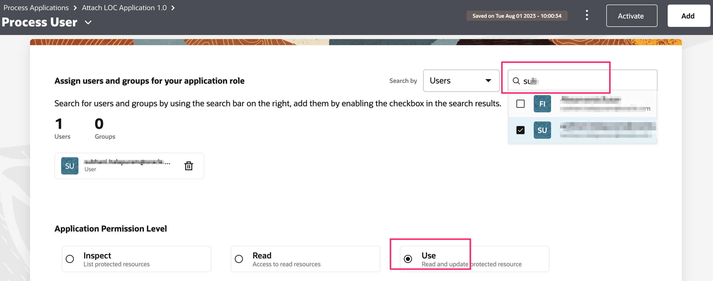

This allows your user to start an application request in Workspace.

7.	Repeat steps 1 - 4 to create the second role, only this time enter its name as *Process Approver* in the **Title** field

8.	Repeat step 5 to assign a user for the **Process Approver** role.
		In a real life scenario, multiple users are selected to complete different tasks in an application. But to keep this example simple, we’ll use the same user.

9.	In the **Application Permission Level** options, leave *Use* selected. This allows your user to update (in this case, Approve or Reject) a task in Workspace.

Now that we have created the two roles - User and Approver, let’s create a process where we implement the roles to specific user tasks.

## Task 4: Create a Connector to an Integration

1.	From the top of the page, click *Add.*

2.	In the **Add component pane**, expand *Connectors*, and click *Integration*.

3. Select the *Change Order ERP PO Proxy* from the list and click on *Create*. If you don't see the integration listed, then please create the integration first and activate it and come back here.

## Task 5: Create a Connector to the VBCS Application

1.	From the top of the page, click *Add.*

2.	In the **Add component pane**, expand *Connectors*, and click *REST API*.

3. Enter the name as *LOCAppConnector* and Base URL as *You should have copied the URL from the Lab2 > Task 6 > Step 6* and remove */PO* from the URL  and click on *Create*.
> **Note:**Here is the Sample URL https://oic-vbcs-host/ic/builder/design/LOCAppTestOPA/1.0/resources/data

4. Click the *Open now* link OR click on the connector to open it.
5. Click on *+* icon to add a new resource.
   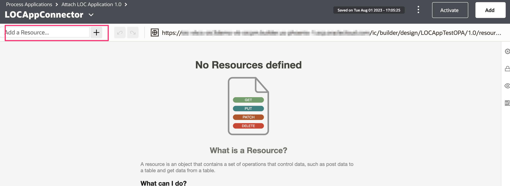
6. Enter *PO* as a name and enter *PO* under resource Path
7. Add an **operation** by clicking the *+ Operation* on the right, for your resource. Make it a 	
		*GET*, with the name **getPO**
     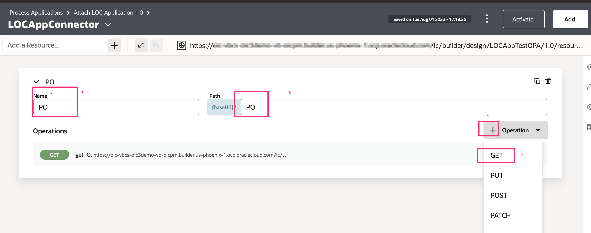
8.	Select the operation created which will transition to the operation specific configuration. You
		will configure Request and Response message

9. Click on the *Response* (there is nothing to add to the request, as we have no
    parameters to pass). In the **Body Definition** section, Click the *JSON Sample* sign to define the response.
    Select *From Sample*, Enter Type Name as *POResponseType* and and copy paste the below json in the Sample section. Please remove the existing content if any.

    ```
    <copy>{
    "items": [{
        "lastUpdatedBy": "john.doe@example.com",
        "orderNumber": "US165561",
        "supplierId": "300000047414679",
        "lastUpdateDate": "2023-02-23T04:21:31+00:00",
        "pOHeaderId": "300000249610613",
        "creationDate": "2023-02-23T04:17:07+00:00",
        "lOCId": 3,
        "soldToLegalEntity": "US1 Legal Entity",
        "orderAmount": 1.1,
        "createdBy": "john.doe@example.com",
        "procurementBUId": "300000046987012",
        "supplier": "Dell Inc.",
        "procurementBusinessUnit": "US1 Business Unit",
        "id": 447
    }]
}</copy>
    ```
10. Select *Next*. A JSON Schema is created based on the structure provided. Finally, Click *Create*
		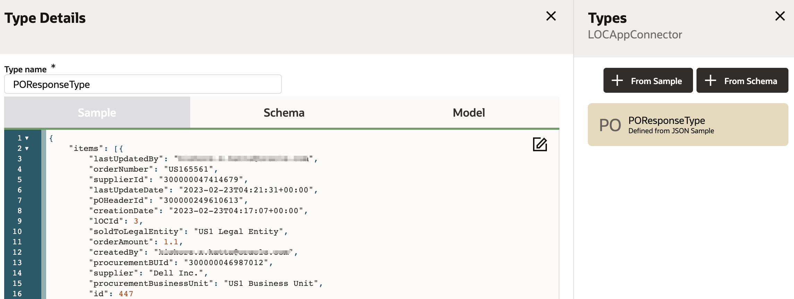

11.	Close the child windows if, any and In the Response Body Definition select Business Type as **POResponseType** which was created in the previous step
		Select *Apply*. Your **GET** operation is now configured to get POs from an external REST API    
12. Again, add one more **operation** by clicking the *+ Operation* on the right, for your resource. Make it a *GET*

13. Select the operation created which will transition to the operation specific configuration. You
    		will configure all the parameters.
14. Enter the name as **getPOById** and enter *{PO_ID}* under Path,
    Click on the *Response*. In the **Body Definition** section, Click the *JSON Sample* sign to define the response.
    Select *From Sample*, Enter Type Name as *POType* and and copy paste the below json in the Sample section. Please remove the existing content if any.

    ```
    <copy>{
    "lastUpdatedBy": "john.doe@example.com",
    "orderNumber": "US165094",
    "supplierId": "300000047414679",
    "lastUpdateDate": "2022-07-03T13:41:00+00:00",
    "pOHeaderId": "300000245979619",
    "creationDate": "2022-07-03T13:35:52+00:00",
    "lOCId": 5,
    "soldToLegalEntity": "US1 Legal Entity",
    "orderAmount": 1.1,
    "createdBy": "john.doe@example.com",
    "procurementBUId": "300000046987012",
    "supplier": "Dell Inc.",
    "procurementBusinessUnit": "US1 Business Unit",
    "id": 286
    }</copy>
    ```
15. Select *Next*. A JSON Schema is created based on the structure provided. Finally, Click *Create*

16.	Close the child windows if, any and In the Response Body Definition select Business Type as **POType** which was created in the previous step
    Select *Apply*. Your **GET** operation is now configured to get POs from an external REST API
      

17. Click on *+* icon to add a new resource.

18. Enter *LOCS* as a name and enter *LOC* under resource Path
19. Add an **operation** by clicking the *+ Operation* on the right, for your resource. Make it a *GET*
20.	Select the operation created which will transition to the operation specific configuration. You
        		will configure Request and Response message

21. Enter the name as **getLOCS** and Click on the *Response*. In the **Body Definition** section, Click the *JSON Sample* sign to define the response.
            Select *From Sample*, Enter Type Name as *LOCSType* and and copy paste the below json in the Sample section. Please remove the existing content if any.

    ```
    <copy>{
    "items": [{
        "lastUpdatedBy": "john.doe@example.com",
        "lOCType": "Type1",
        "lOCBank": "ABC Bank",
        "lOCAmount": 10000,
        "createdBy": "john.doe@example.com",
        "lOCOpeningDate": "2019-01-01",
        "lastUpdateDate": "2022-04-29T08:26:12+00:00",
        "lOCExpiry": "2023-02-01",
        "id": 1,
        "creationDate": "2019-01-12T11:55:39+00:00",
        "lOCStatus": "Active"
    }, {
        "lastUpdatedBy": "john.doe@example.com",
        "lOCType": "Type2",
        "lOCBank": "XYZ Bank",
        "lOCAmount": 20000,
        "createdBy": "john.doe@example.com",
        "lOCOpeningDate": "2019-01-01",
        "lastUpdateDate": "2022-01-19T19:54:18+00:00",
        "lOCExpiry": "2023-01-01",
        "id": 2,
        "creationDate": "2019-01-12T11:55:39+00:00",
        "lOCStatus": "Active"
    }]
    }</copy>
    ```
22. Select *Next*. A JSON Schema is created based on the structure provided. Finally, Click *Create*
23.	In the Response Body Definition select Business Type as **LOCSType** which was created in the previous step
        		Select *Apply*. Your **GET** operation is now configured to get POs from an external REST API


## Task 6: Create a web form

- Use forms for human interaction to:
    - Define what users see when they initiate your process application
    - Define what approvers see when they receive requests that need their attention or action
- Process Automation allows you to create a simple form with the quick editor or create an advanced form
	with the web form editor. If needed, you can choose the quick editor and later switch to the web form editor

1.	Click *Add* at the top of the page.

2.	In the Add component pane, expand **UIs** and click *Web Form*.

3.	In the Title field, enter *AttachLOCForm*.

4.	Click *Create*, then click the *Open now* link.

- If you missed the Open now link, Click on the **AttachLOCForm**
- Notice the following:
    -	The palettes in the right pane. You have many more control types and options to choose from.
    -	The tabs in the left Properties pane. Notice how they change depending on what is selected in the main canvas.
    -	When the form is selected (click away from a control), Form and Presentation tabs appear.
    -	When a control is selected, General and Styling tabs for that control appear.

  

## Task 7: Design a web form

1. Open the *AttachLOCForm* form if it is not opened.
2. Choose an *Select* field from the right palette and Drag-and-Drop on to the designer.
3. Click on Toggle Properties if you don't find the Properties Pane on the left side.
   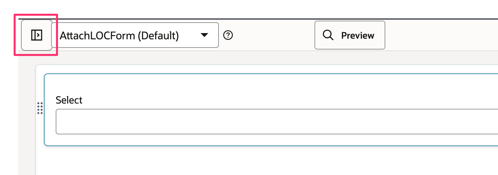
4. Change the field name to **SelectOrderNumber** and the label to **Select Order Number** . See the automatic binding.
   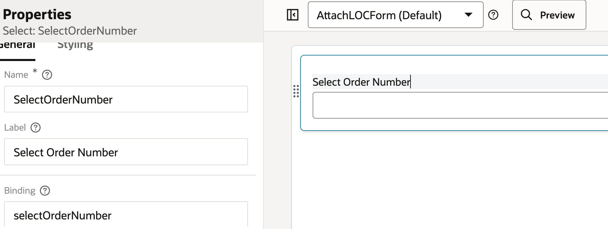
5. Scroll down in the Properties Pane. Select *Connector* as an **Options Source**
6. Select the *Connector*, *Resource* and *Operation* with the proper values of the REST connector you have created.
   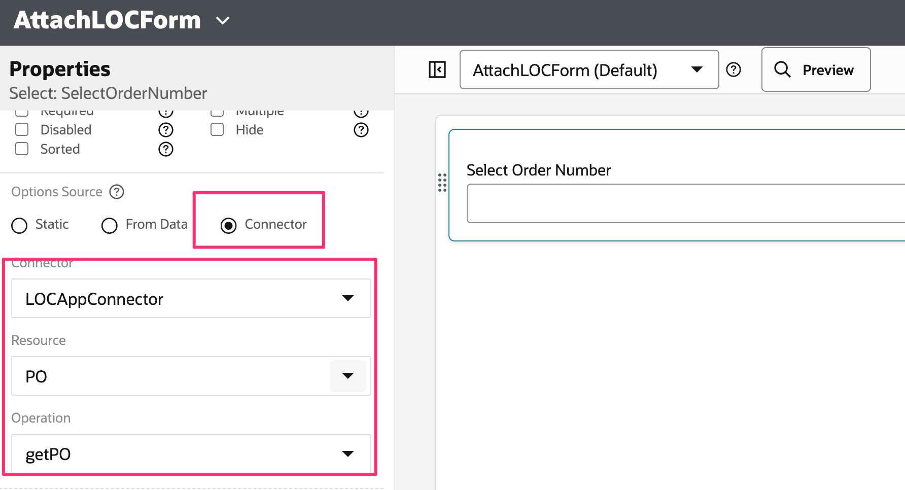

7.	Fill in the Option List as indicated here below, with the value *response.items*. For the **Label** Binding and
		**Value** Binding, choose the *orderNumber* and *id* fields accordingly.
    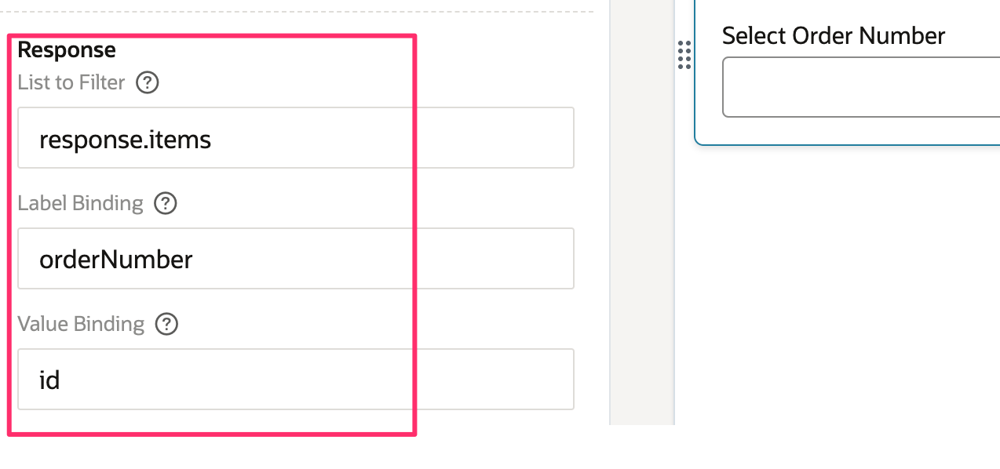

8. Drag-and-Drop *Divider* component which is available under Advanced section from the right palette
9. Click on *Load more..* on the components palette, can find it on right bottom of the page under components palette.
10. Drag-and-Drop *POType* component after the *Divider*. If you don't find, search for *POType*
11. select **POType** on the designer and change the label to **PO Header Details** in the properties palette. Check *Hide* option
   
12. Put all the elements in the order given below as per the screenshot if possible. OR Put two elements per row so that you will have a better view.
   
13. Select an element **id** under *PO Header Details* section, scroll down in the Properties palette, check **Read Only** option
   
14. Remove **LOCId** from the *PO Header Details* section.
15. Drag-and-Drop *Select* from the components palette and change the name to **locId**, label as **Letter of credit Id**

> **Note:** Steps 16 is not required if *locId* element is created in the *Data* section already.

16. Click on **Add** in the *Data* section, enter name as **locId** and click on **Create**
   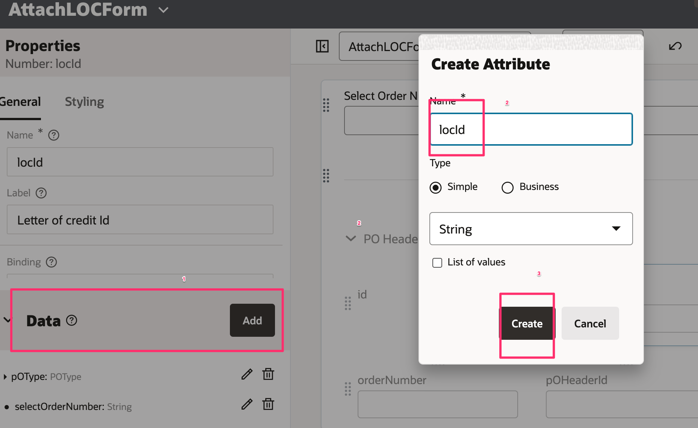
17. Select an element **Letter of credit Id**, go to Properties, enter or select binding as **locId**
18. Scroll down further for the same element, remove the default values and enter the below values.

| Option Names | Option Values |
| --- | --- |
| Big Bankers | 1 |
| High Yielders | 2 |
| Brain Trust Capital | 3 |
| Awesome Banking | 4 |
{: title="LOC Ids"}
19. Select an element **orderNumber** under *PO Header Details* section, scroll down in the Properties palette, check **Read Only** option

20. Select each and every element except *Letter of credit Id* and mark it as **Read Only** under the *PO Header Details* section

## Task 8: Add dynamic controls to fields via Events

Use events to introduce dynamic behaviours into your web forms, and combine them with actions, conditions, functions, and REST connector calls.

For example, you can introduce the following behaviours into your forms:

-	Populate data in a control field based on another control field in the form. For example, a *Select Order Number*  field will impact the *PO Header Details* section.
-	Make a REST call on demand, store the call’s response, and use response data in an event action or condition.

1. Select an element *SelectOrderNumber*, go to Properties section and scroll down until you see the *Events* section. Click on **Add**
   
2. Enter **OnChange** as an event Name and select **OnChange** as an event.
   
3. Click on **Edit Pencil Icon** link
   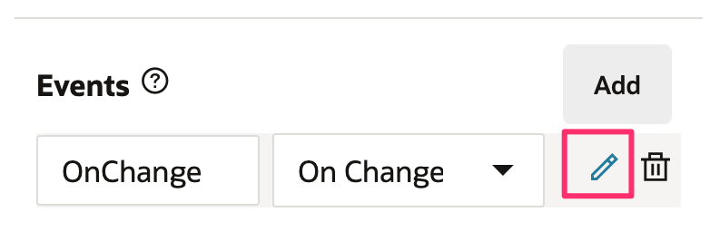
4. Click on **Connector** and select or enter the values as per the screenshot given below and click on **OK** which is at the bottom right corner.
   
5. Again, Click on **Edit Pencil Icon** link
6. Click on **Action** and define the values as per the screenshot given below for the element **id**.
   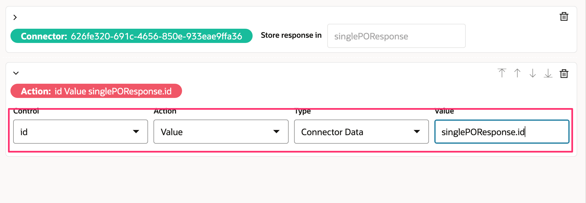
7. Repeat the step 6 for all the elements given below, except *Letter of credit id* element for which pre defined data is populated and click on **OK** after completing actions for all the elements.

- orderNumber
- pOHeaderId
- orderAmount
- soldToLegalEntity
- procurementBUId
- procurementBusinessUnit
- supplier
- supplierId
- createdDate
- createdBy
- lastUpdateDate
- lastUpdateBy

   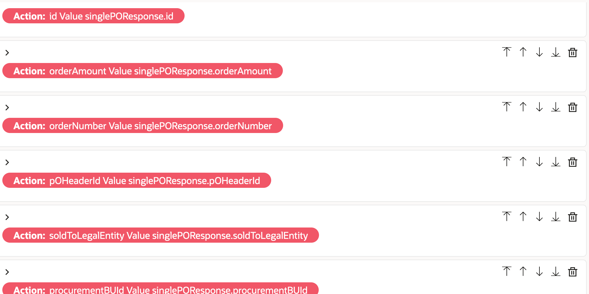
8. Again, Click on **Edit Pencil Icon** link
9. Click on **Action** and define the values as per the screenshot given below and click on **OK**
   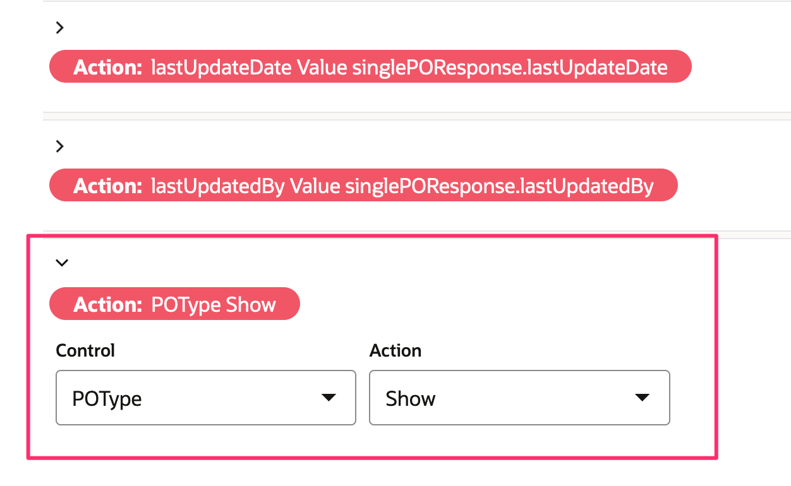
10. Please click on **Attach LOC Application 1.0** to go back to the process application and again open the form and make sure that all the actions are stored.

## Task 9: Create a Structured Process

1.	Click the **Attach LOC Application 1.0** breadcrumb to go to your application’s main page.

2.	From the top of the page, click *Add*.

3.	In the Add component pane, expand **Processes**, and click *Structured*.
		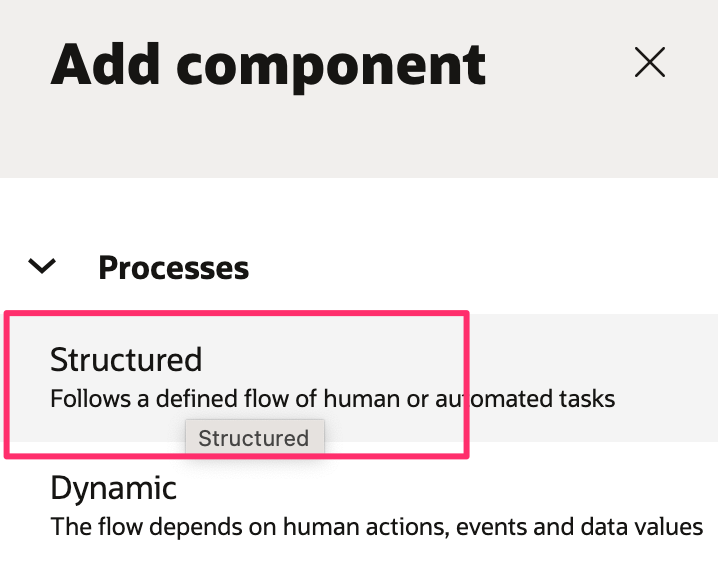

4.	Enter *Initiate PO LOC Update Process* in the **Title** field.

5.	Click *Create*. A confirmation message shows that the process was created.

Notice how the process is listed on the page and the Processes tab shows 1.

6.	Select the process to open it.

The structured process editor opens. Start and end elements are already positioned on the flow for you. There are two swimlanes and the BPMN elements palette is on the right side.

7. Select the *Start* element activity and rename it to **Update PO**

   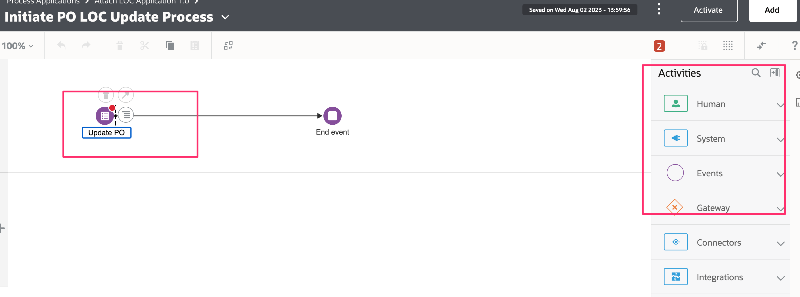

8.	Select the *End event* activity and rename it to **Completed**

9.	Select the first swimlane containing the start and end element by clicking the bar on the left of the canvas. Click the *edit* icon to open the **Properties** pane. In the Properties pane, select *Process User* in the **Role** drop-down field.

   
> **Note:**  Note that the swimlane’s name changes to *Process User*.

10.	Similarly, edit the second swimlane and select *Process Approver*

11.	In the BPMN elements palette, expand the **Human** category and drag an *Approve* task to the second swimlane. Adjust the process flow so that the **Approve** task is the second element in the flow. Rename it to *Approve Change Order*

12.	In the BPMN elements palette, expand the **Gateway** category and drag an *Exclusive* Gateway Activity to the second swimlane next to the **Approve Change Order**. Rename the **Gateway** activity to *Approved?*

13.	In the BPMN elements palette, expand the **Human** category and drag a *Submit* task to the first swimlane. Rename it to *Resubmit*.

14.	Select the *Approved?* Gateway activity. Using the connector (arrow icon) Connect one of the branches to the **Resubmit** task.
15. Delete the arrow which is connected to *Completed* activity from *Resubmit* activity.

16. Delete the arrow which is connected to *Resubmit* activity from *Update PO* and connect from *Update PO* to *Approve Change Order*

17. Select the *Resubmit* activity and connect with **Approve Change Order** activity
18. Select the *Approve Change Order* activity and connect with **Approved?** activity
19. In the BPMN elements palette, expand the **Integrations** category and drag an *Change Order ERP PO Proxy* activity to the second swimlane and put it after *Approved?* task.


20. Move *Completed* activity from first swimlane to the second swimlane after the *invoke change order* activity.
21. Select the *Approved* activity and connect with **invoke change order** activity
22. Select the *invoke change order* activity and connect with **Completed** activity

23. Click on the **Show/Hide Grid** option to show the Grid and arrange all the activities as per the screenshot given below.
    
24. Select *Change Order ERP PO Proxy* activity and rename it as *invoke change order*

25. Please click on **Attach LOC Application 1.0** to go back to the process application and again open the process and make sure that all the activities are stored.

## Task 10: Implement the process
1. Navigate to **Initiate PO LOC Update Process**

2. Select *Update PO*. Click on the *Hamburger* icon and Select *Open Properties*

   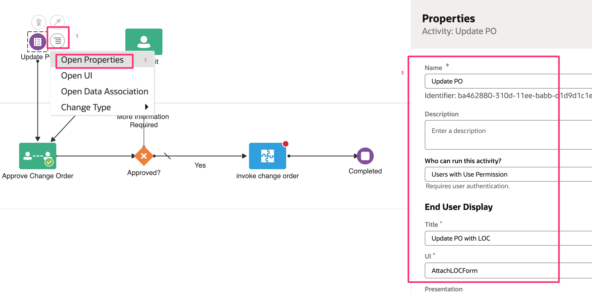

3. In the properties pane configure per below

| Property Name | Value |
| --- | --- |
| Assignee | Any user with Use Permission  |
| Title| Update PO with LOC |
| UI | AttachLOCForm |
| Presentation | Default Presentation |
{: title="Update PO Task Properties"}

4.	Open the properties of **Approve Change Order** task. Configure the Properties per below

| Property Name | Value |
| --- | --- |
| Policy | Any Single Assignee |
| Select Participants| Current Lane Participants |
| Title | Approve Change Order Request |
| UI | AttachLOCForm |
| Presentation |  AttachLOCForm  |
| Action | APPROVE,REJECT |
| Priority | Normal |
{: title="Approve Change Order Task Properties"}

5.	Open the properties of **Resubmit** task. Configure the Properties per below

| Property Name | Value |
| --- | --- |
| Select Participants| Current Lane Participants |
| Title | Resubmit Change Order |
| UI | AttachLOCForm |
| Presentation | Default Presentation |
| Action | SUBMIT |
| Priority | Normal |
{: title="Resubmit Task Properties"}

6.	Select the connector from **Approved?** to **invoke change order**. In the properties pane Configure **Name** as *Yes* and define other values as per the screenshot given below.
   
7.	Select the connector from **Approved?** to **Resubmit** which is the conditional path. In the properties pane Configure **Name** as *More Information Required*
Define the condition **taskOutcomeDataObject=="REJECT"** and mark as *Conditional Flow*
   
8. 	Open the properties of **invoke change order** task. Select *Resource* as **/PO_PROXY** and *Operation* as **POST**
   
9. Click on **Attach LOC Application 1.0** to go back to the process application and again open the process and make sure that all the activities are stored.

## Task 11: Configure Data Association

Data association refers to the flow of data within a process. Use the Data Association editor to define input and output for flow elements that need them.

A data association involves a source and a target, where the source provides a value or an expression to be assigned to the target. An approval human task, for example, needs both input and output data association.
On the input side, it needs data input into the activity (referred to as its payload).

On the output side, after the activity has just finished, it needs output from the activity to data objects, to store results for use elsewhere in the process.

1.	In the **Initiate PO LOC Update Process** Select **Approve Change Order** task , Click on *hamburger* icon and Select *Open Data Association*

  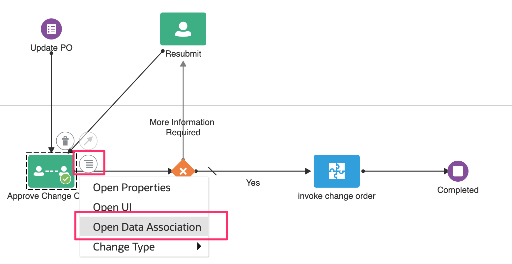

The left pane displays source objects (Data Objects) in an expandable tree. The right pane displays the payload, or entry parameters the activity needs to perform its function

2. Expand **Input > attachLOCFormArgs > pOType** from the left pane and Expand **input > attachLOCForm > pOType** from the right pane.
3. From the left pane, hold and drag **createdBy** and drop it in the input field titled **New Association**
4. From the right pane, hold and drag **createdBy** and drop it in the input field titled **New Association**
  
5. Repeat the above steps for all the elements given below. And in between, click on Apply to reflect the changes and come back to the same screen and continue with the mappings.
- creationDate, id, lastUpdateDate, lastUpdatedBy, orderAmount, orderNumber, pOHeaderId, procurementBUId, procurementBusinessUnit, soldToLegalEntity, supplier, supplierId
  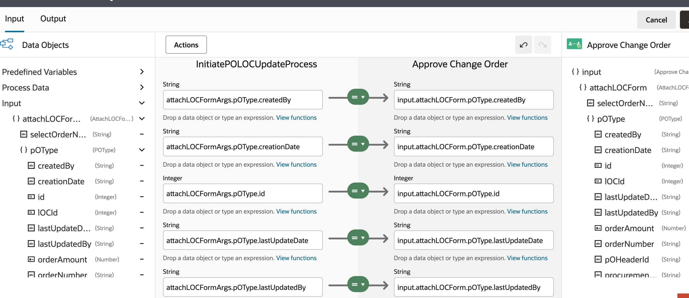
6. Click on *Apply* and again comeback to the mappings screen.
7. Expand **Input > attachLOCFormArgs** from the left pane and Expand **input > attachLOCForm** from the right pane.
8. From the left pane, hold and drag **locId** and drop it in the input field titled **New Association**
9. From the right pane, hold and drag **locId** and drop it in the input field titled **New Association**
  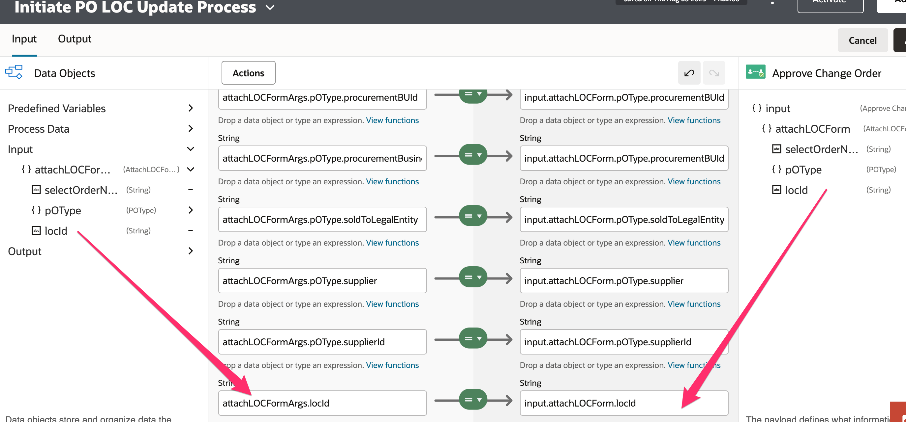
10. Click on *Apply*

11. Select **invoke change order** task and Click on *Open Data Association*.
12. Expand **Input > attachLOCFormArgs > pOType** from the left pane and Expand **input > body > pOType** from the right pane.
13. Complete mappings for all the elements given below.
- id, orderAmount, orderNumber, pOHeaderId, procurementBUId, procurementBusinessUnit, soldToLegalEntity, supplier, supplierId
  
14. Click on *Apply* and again comeback to the mappings screen.

15. Expand **Input > attachLOCFormArgs** from the left pane and Expand **input > body** from the right pane.
16. From the right pane, hold and drag **LOCId** and drop it in the input field titled **New Association**
17. From the left pane, hold and drag **locId** and drop it in the input field titled **New Association** and convert it to the number by adding int(),can refer the screenshot given below.
  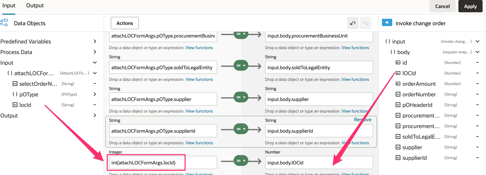
18. Click on *Apply*

## Task 12: Activate a Version of the Application
Activating an application moves its metadata from design time (Designer) to runtime (Workspace), where it can be run in production capacity.

Before you activate, note the following about Snapshots and Versions:
-	When you activate, you specify the snapshot to use. A snapshot just refers to the application’s design-time metadata at a point in time. Save as many snapshots as you want so you can return to one if needed.
-	Create an application version as often as you want.

So far your implementation artifacts should be per below

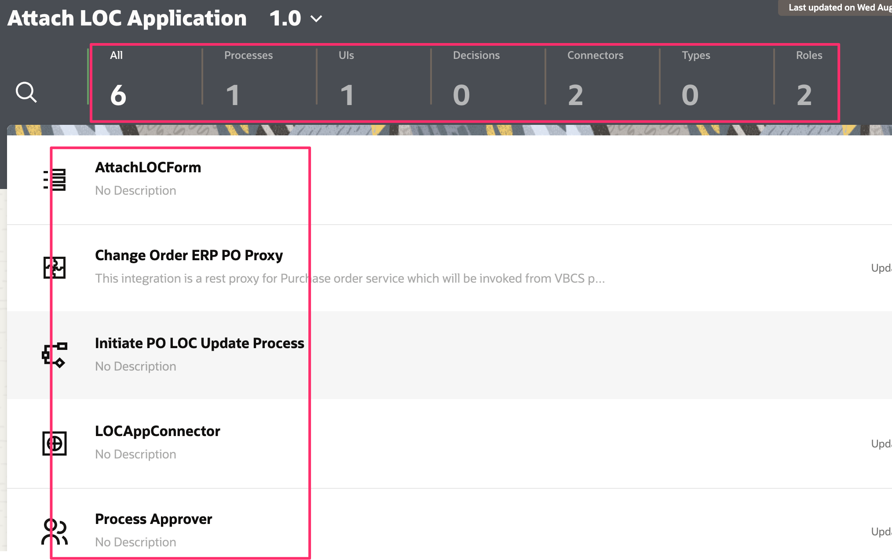

1.	Click *Activate* on the top right corner.
		The Activate version pane appears. Notice that the version tag you specified at creation is shown (1.0).

2.	Leave the **Make it default** field selected.
		An application always has a default version. In Workspace, users can choose to see all versions or the default only.		

3.	Click *Activate*.
		You’re informed that a snapshot of the application is being taken, followed by a message that the application is activated.
		
4.	Click *Test in Workspace*.

## Task 13:	Test and Run the Application in Workspace

Use the Workspace environment to run, test, monitor, troubleshoot, or administer process applications. The options you see depend on your assigned role.

Before you begin, get familiar with the options in the Workspace navigation menu.
-	**Workspace**: Returns to the runtime home page.
-	**Start Requests**: Lists applications you have permission to start.
-	**My Tasks**: Lists tasks assigned to you or a group you’re part of.
-	**Tracking**: Lists structured and dynamic processes you can track.
-	**Administration**: Lists tasks that users with administrative permissions can perform, such as 	
  managing roles, notifications, and credentials. Displays to users assigned an administrator role only.

###	Start an Application Instance
In this case, pretend you are an end user who wants to request for Travel. Each time the application is started, a process instance is created.

1. From the **Start Requests** page, select the *Attach LOC Application*.
  	The card’s banner lists the application identifier, and its process and start event titles appear below.
  	
2. The *AttachLOCForm* you created appears, with the first presentation shown and Select the Order Number from the list.
		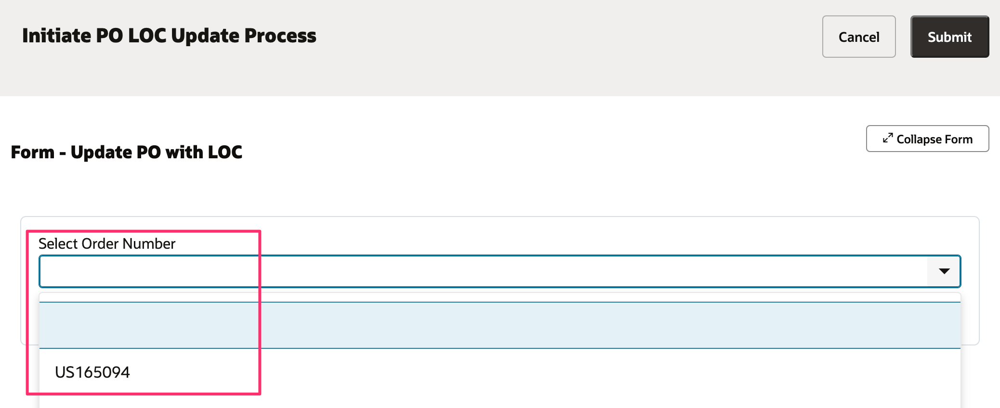

3. Upon selection of the Order Number from the list, form displays *PO Header Details* section
	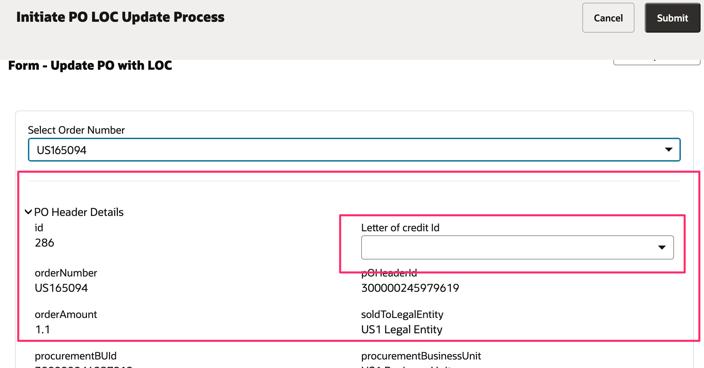
4. Select the *Letter of credit* from the list and click *Submit*.
	
  	A message confirms that an instance was created. The start event for the process is complete.
5.	Optionally, repeat these steps to select the application and create a few more instances.

###	Complete an Assigned Task

Now put yourself in the role of an approver - in this case, an *Process Approver* who gets assigned a task when a **Process User** submits the *letter of credit* for the *purchase order*.

1.	Choose *Workspace* from the options menu.
		The Workspace page lists tasks available to you and start requests below.

2.	Click the *Team Tasks* tab.
		You see tasks assigned with the title and process name you specified. Because they can be assigned to any user assigned to the role, you’ll need to claim a task to complete it.
		

3.	From the Actions column for a task, choose *Claim*. Click *Claim* in the Claim
		Task pane that appears.
		Click the *My Tasks* tab and your claimed *change order request* approval task now appears.

4.	Select the task to open it.
		The AttachLOCForm you created is displayed, with the Mangers View presentation shown this time.
		

5.	Notice that some of the fields that are removed for **Managers View** and all the fields are *ReadOnly* including *Letter of credit id*
		Expand Comments, enter a comment, and click Post.
		Click *APPROVE* or *REJECT*.

A message confirms that the task was approved or rejected. The approval human task is complete.
You return to the My Tasks page. The task you just completed is no longer listed.


You may now **proceed to the next lab**.

## Learn More

* [Design Structured Processes](https://docs.oracle.com/en/cloud/paas/process-automation/user-process-automation/design-structured-processes.html)
* [Design Forms and User Interfaces](https://docs.oracle.com/en/cloud/paas/process-automation/user-process-automation/design-forms-and-user-interfaces.html)
* [Explore Workspace](https://docs.oracle.com/en/cloud/paas/process-automation/user-process-automation/explore-workspace.html)
*	[Work with Connectors](https://docs.oracle.com/en/cloud/paas/process-automation/user-process-automation/work-connectors.html)
*	[Work with Integrations](https://docs.oracle.com/en/cloud/paas/process-automation/user-process-automation/work-integrations.html#GUID-7DCA4E96-D577-4DE1-AB82-F074361DE9B4)

## Acknowledgements
* **Author** - Kishore Katta, Product Management, Oracle Integration & Process Automation
* **Last Updated By/Date** - Kishore Katta, August 2022
