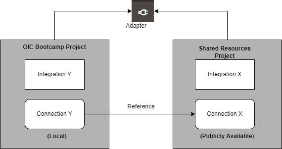

# Create and Configure Connections

## Introduction

This lab will walk you through the steps to create connections for all the services which will be used in the Integration Flow.

Estimated Time: 10 minutes

### Objectives
In this lab, you will:
- Create REST connection using REST adapter
- Create ERP Cloud External Report Service connection using SOAP adapter

### Prerequisites
This lab assumes you have:
- Completed all the previous labs

##	Task	1: Create REST Connection using REST adapter

> **Note: Ignore this section if you have a REST Interface connection created already in your Project as part of one of the previous labs.**

Create a connection with the REST Adapter.

1. In the left Navigation pane, click ***Projects***, click on the project which you have created.
    You may skip this step if you are already in the project.
2. In the **Connections** section, click ***Add*** to create a new connection.
3. In the *Create Connection* dialog, select the **REST** adapter. To find the adapter, enter *REST* in the search field. Click on the highlighted adapter.
4. In the *Create Connection* dialog, enter the following information and click on ***Create***:

    | **Field**        | **Value**          |       
    | --- | ----------- |
    | Name         | REST Interface     |
    | Role         | Trigger       |
    | Description  | REST Interface Connection for OIC LiveLabs |

    Keep all other values as default.
> **Note: If you are a Bootcamp user then execute step 5 ONLY and skip the other steps.
If you are a non Bootcamp user then skip step 5 and continue from step 6..**

5. In the *Use a shared Connection* section search for **REST Interface** and select the connection which is already created/shared in the Training instance. Exit the connection canvas by clicking the back button on the top left side of the screen.

Please note that the connection with the name **REST Interface** is already created in your training instance, which is configured and shared with other projects. Although both the connections names are similar, they exist in the different projects. You can share adapter connection resources across projects. For example, you may have two projects that need to integrate with a common system, such as Oracle ERP Cloud. The connection you created is referencing the shared connection in the instance.

6. In the *Configuration* page, enter the following information:

    | **Field**  | **Values** |
    |---|---|
    |Security Policy | OAuth 2.0 Or Basic Authentication |

7. Click on ***Test***  and wait until you receive a confirmation box that the test was successful.
8. Click ***Save*** and wait for the confirmation box. Exit the connection canvas by clicking the back button on the top left side of the screen.

## Task 2: Create ERP Cloud External Report Service Connection using SOAP Adapter

1. In the left Navigation pane, click ***Projects***, click on the project which you have created.
    You may skip this step if you are already in the project.
2. In the **Connections** section, click ***Add*** to create a new connection.
3. In the *Create Connection* dialog, select the **SOAP** adapter to use for this connection. To find the adapter, enter *SOAP* in the search field. Click on the highlighted adapter
3. From the *Create Connection* dialog, enter the following information and click on ***Create***:

    > **Note:**  If you get an error that the identifier already exists, enter unique connection name and remember this name for use later in the workshop.

    | **Field**        | **Value**          |       
    | --- | ----------- |
    | Name         | `ERP Cloud External Report Service`       |
    | Description  | `ERP Cloud External Report Service for OIC LiveLabs` |

    Keep all other values as default.

4. In the *Configuration* page, enter the following information:

    | **Field**  | **Values** |
    |---|---|
    |WSDL URL | enter ***https://<erp-cloud-host>/xmlpserver/services/ExternalReportWSSService?WSDL*** |
    |Security Policy | select ***Basic Authentication*** |
    |Username | Enter ***Enter ERP Cloud username received from the instructor*** |
    |Password | Enter ***Enter ERP Cloud password received from the instructor*** |
> **Note: If you are a Bootcamp user then execute step 5 ONLY and skip the other steps.
If you are a non Bootcamp user then skip step 5 and continue from step 6..**

5. In the *Use a shared Connection* section search for **ERP Cloud External Report Service** and select the connection which is already created/shared in the Training instance. Exit the connection canvas by clicking the back button on the top left side of the screen.

6. Confirm your Connection by clicking ***Test***, then ***Validate & Test***. You should see the *Connection ERP Cloud External Report Service was tested successfully.* confirmation message. Click ***Save*** and exit the Connection editor.

You may now **proceed to the next lab**.

## Learn More

* [Using the REST Adapter with Oracle Integration 3](https://docs.oracle.com/en/cloud/paas/application-integration/rest-adapter/index.html)
* [Using the SOAP Adapter with Oracle Integration 3](https://docs.oracle.com/en/cloud/paas/application-integration/soap-adapter/index.html)

## Acknowledgements
* **Author** - Subhani Italapuram, Product Management, Oracle Integration
* **Last Updated By/Date** - Subhani Italapuram, Sep 2025
