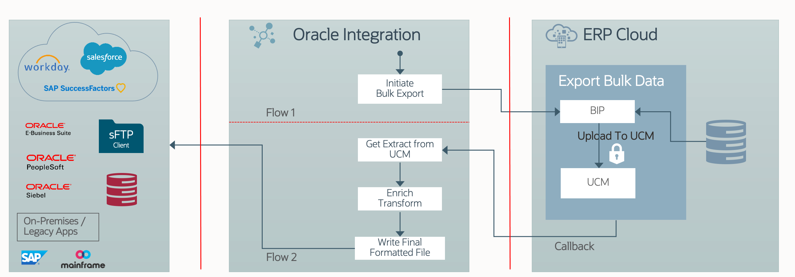

# Introduction

## About this Workshop

This workshop shows you how to design and develop a Bulk Extract Usecase in Oracle Integration 3 integrating with the ERP cloud. Out of the box, ERP Cloud adapter helps an Integration developer to quickly consume Business Events and Business Services in a secured way using various authentication schemes.

Estimated Time: 120 minutes

### Usecase

This use case explores the use of Oracle Integration to extract large data sets from Oracle in an asynchronous fashion leveraging a callback mechanism.

This use case includes the following steps:

* Initiate Payables Transactions Process
* Listen to the callback message delivered from ERP cloud
* Finally, download the extract from UCM and deliver the data set to an SFTP location

 The following diagram shows the interaction between the systems involved in this use case.
     

### Objectives

* Enable File Server.
* Configure File Server and connect with FTP client.
* Create and configure common connections which are useful for this workshop like File Server and ERP Connection
* Learn ERP Cloud Integration Design Patterns and Usecases.
* Create an Integration flow which extracts the data from ERP Cloud Oracle Business Intelligence Publisher (BIP) and write the extract to an SFTP server.

### Prerequisites

* An Oracle Free Tier or Paid Cloud Account Tenancy
* Oracle Integration Instance provisioned in OCI.

You may now **proceed to the next lab**.

## Learn More

* [Getting Started with Oracle Integration 3](https://docs.oracle.com/en/cloud/paas/integration-cloud)
* [Using the Oracle ERP Cloud Adapter with Oracle Integration 3](https://docs.oracle.com/en/cloud/paas/application-integration/erp-adapter/index.html)

## Acknowledgements

* **Author** - Kishore Katta & Subhani Italapuram, Product Management, Oracle Integration
* **Last Updated By/Date** - Subhani Italapuram, Sep 2025
