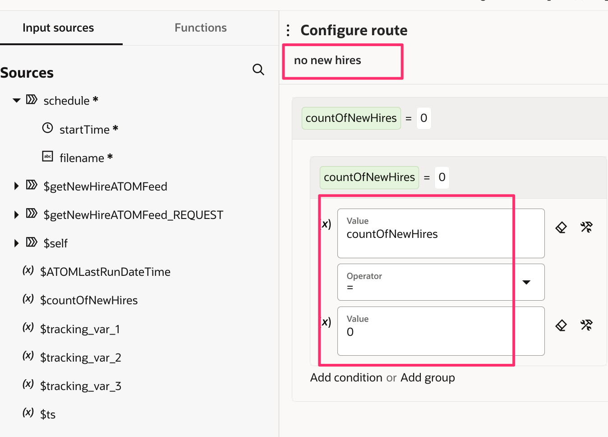
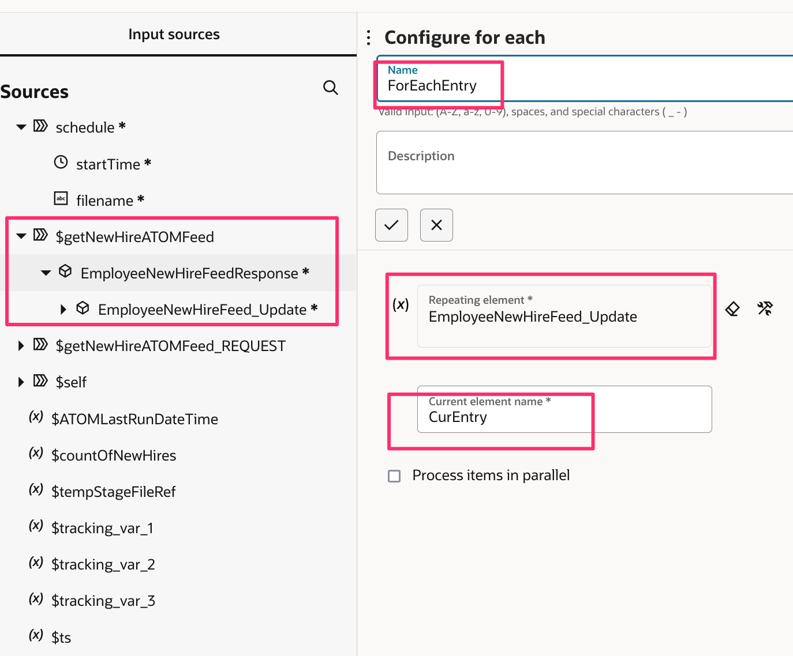
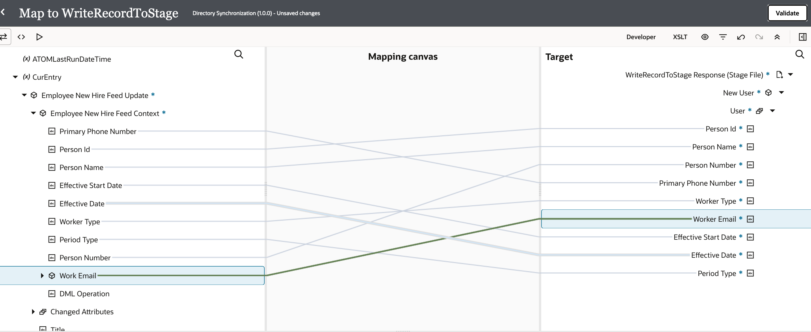
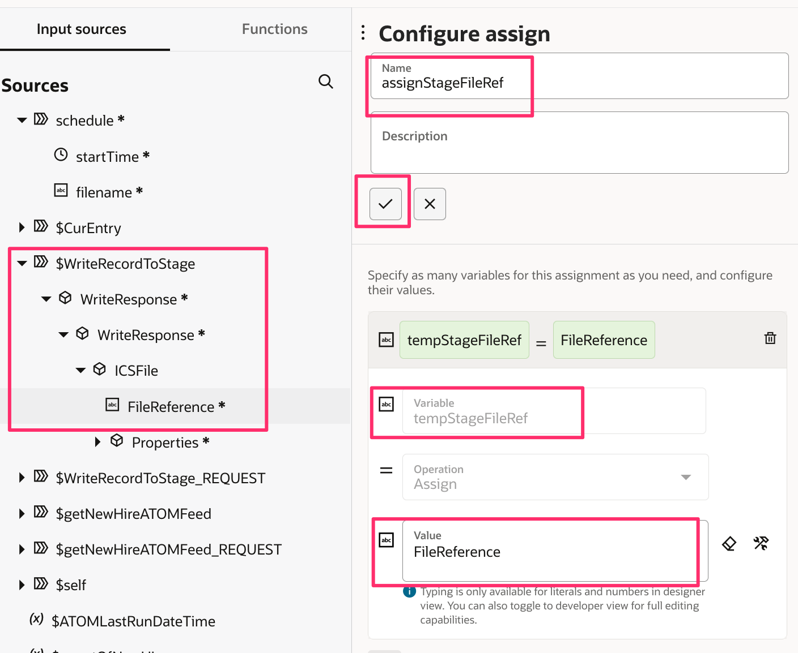
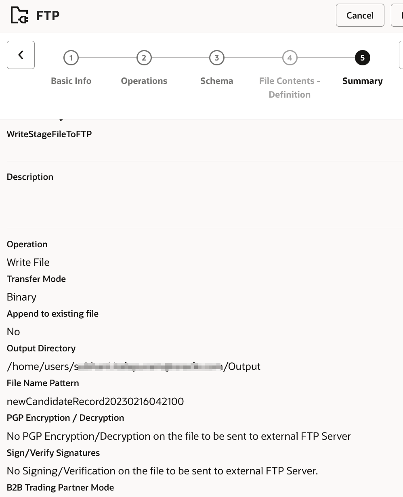

# AtomFeeds Integration Flow

## Introduction

This lab walks you through the steps to create Integration flow.

This use case explores how to use of Oracle Integration 3 with Oracle HCM REST and ATOM services to provide information to an identity management system hosted by a customer

 The following diagram shows the interaction between the systems involved in this use case.
    

Estimated Time: 50 minutes

### Objectives

In this lab, you will:

* Connect with HCM Cloud to extract new hire information and push it to the downstream application.
* You would be using HCM Cloud adapter, FTP adapter and Stage File action

### Prerequisites

This lab assumes you have:

* All previous labs successfully completed.

## Task 1: Create the Directory Synchronization Integration

1. In the left Navigation pane, click ***Design*** &gt; ***Integrations***.
2. On the **Integrations page**, click ***Create***.
3. On the **Create integration** dialog, select and click on ***Schedule***.
4. In the **Create integration** dialog, enter the following information:

    | **Element**          | **Value**          |       
    | --- | ----------- |
    |Name | Directory Synchronization |
    |Description | This integration shows you how to use the HCM Cloud adapter with the FTP adapter to generate a file for Identity Management. |

    Accept all other default values.

5. Click ***Create***.
6. Optional, Select Layout to ***Horizontal*** and Click ***Save*** to apply changes.

## Task 2: Configure the Schedule action
1. Select **Schedule** action and click on **...** and click on **Edit**
2. Click on **+** icon, enter the parameter name as ***ATOMLastRunDateTime*** and enter the default value as ***2022-02-01T00:00:00.000Z***
3. Click ***Save*** to apply changes and click on main canvas so that child window disappears.

## Task 3: Schedule the Next ATOM Polling
Schedule the current ATOM polling to the current date and time. The next time the integration runs, this will be the ATOMLastRunDateTime variable.
1. Click **Actions** icon which is there on the right side of the screen and from the **Actions** section, drag ***Assign*** to the Integration canvas, and place it after the **Schedule** activity.
    The Configure assign dialog appears
2. In the **Name** field, enter ***assignCurrentTimeStamp***, Click on **+** icon, Select **String**,
In the **Variable** field, enter ***ts***, In the **Value** field (click on **switch to developer view** icon if, required), enter expression as ***fn:concat(fn:substring-before(/ics:schedule/ics:startTime, "."), ".000Z")***

    > **Note:**  Expression given above might not work as is, you might need to build such expression and drag and drop the components from the functions pallet and variables. For this, you need to drag concat function, substring-before and then startTime from left side to Value text field which is under configuration section.

    

3.  Click ***Save*** to apply changes and click on main canvas so that child window disappears

## Task 4: Access the HCM Cloud ATOM Feed
Let's use the HCM Cloud adapter to access the HCM Cloud ATOM feed.
1. Hover over the outgoing arrow for the **assignCurrentTimeStamp** activity and click **+** icon
2. Search for **HCM Cloud** and select it.
3. On the **Basic Info** page,
    - for the **What do you want to call your endpoint?** element, enter ***getNewHireATOMFeed***
    - Click ***&gt; (Next step)***.
4. On the **Actions** page,
    - select ***Subscribe to Updates (via ATOM Feed)***
    - Click ***&gt; (Next step)***.
5. On the **Operations** page,
      - from the **Select an ATOM Feed** list, select ***Employee New Hire***
      - Scroll down, From the **Max entries to process** list, select ***250***
    > **Note:**  This ensures that most customers have all their new hires appear in the ATOM Feed response.

7. Click ***&gt; (Next step)*** and Review the summary and click ***Done***
8. Click ***Save*** to persist changes

## Task 5: Define the Data Mapping
A Map action named **Map getNewHireATOMFeed** is automatically created. We'll define this data mapping.
1. Select the **Map getNewHireATOMFeed action** and click on **...** and click on **Edit**
2. In the **Target** section, expand **Application Pull Parameter**
3. Map the **ATOMLastRunDateTime** field in the Sources section, to the **Updated Min** field in the Target section.
   To map an element, select the element from the Sources section, then while clicking your mouse move it towards the target element. When you reach the target element the line turns green and a check mark appears.
4. Click on ***Validate***
5. Click ***&lt; (Go back)***
6. Click ***Save*** to persist changes


## Task 6: Count the New Hires
The ATOM feed doesn't return the total number of new hires, so we'll configure an assign action to calculate the number of new hires.
1. Click **Actions** icon which is there on the right side of the screen and from the **Actions** section, drag ***Assign*** to the Integration canvas, and place it after the **Invoke getNewHireATOMFeed** activity

2. In the **Name** field, enter ***newHiresCount***, Click on **+** icon, Select **String**, In the **Variable** field, enter ***countOfNewHires***. In the **Value** field (click on **switch to developer view** icon if, required), drag and drop ***count*** function from the functions palette and then drag ***EmployeeNewHireFeed__Update*** inside the Count function. It should look like ***count($getNewHireATOMFeed/ns17:EmployeeNewHireFeedResponse/ns17:EmployeeNewHireFeed_Update)***

    
3. Click on ***Apply***, Click ***Save*** to apply changes and click on main canvas so that child window disappears

## Task 7: Add Switch activity to check for New Records
Let's check if the ATOM feed returned new records, and define what to do next.
1. Click **Actions** icon and from the **Logic** section, drag ***Switch*** to the Integration canvas and place it after the **newHiresCount** activity.
    Two flow branches appear in the flow:
    - Undefined: this branch checks the countOfNewHires. If the expression evaluates to true, the instance follows the flow in this branch.
    - Otherwise: the instance follows this branch when the routing expression for the initial branch resolves to false.

2. Use fit to page option for a complete view of the integration flow.
    


## Task 8: Define the IF conditional flow
1. Select Undefined, click on **...** and click on **Edit**, The Expression Builder appears.
2. Define an expression to check if the ATOM feed contains any new hires:
    - In the Expression Name field, enter **no new hires**.
    - In the Source section, select $countOfNewHires.
        The $countOfNewHires variable appears in the first part of the expression, and a green check mark appears next to the variable
    - In the New Condition box, enter ***0.0*** in the field after the equal operator.
3. Click on Apply, Click ***Save*** to apply changes and click on main canvas so that child window disappears
    
4. Click **Actions** icon and from the **End** section, drag ***Stop*** to the Integration canvas and place it after the **IF no new hires** activity.
    This lets the integration complete if there aren't any new hires.

## Task 9: Define the Otherwise Flow
1. Click **Actions** icon and from the **Actions** section, drag ***Assign*** to the Integration canvas and place it after the **Otherwise** activity.
    The Create Action dialog appears.
    This assign activity creates a temporary variable to store the file reference of a stage file activity.
2. In the **Name** field, enter ***StageFileRef***, Click on **+** icon, Select **String**, In the **Variable** field, enter ***tempStageFileRef***, In the **Value** field(click on **switch to developer view** icon if, required), enter expression as ***""***
3. Click on Apply, Click ***Save*** to apply changes and click on main canvas so that child window disappears

## Task 10: Process the Records
Let's iterate over the new hires that you got from the ATOM feed in a JSON file, and retrieve the record for each new hire using the HCM Cloud REST service.
1. Click **Actions** icon and from the **Logic** section, drag ***For Each*** to the Integration canvas and place it after the **StageFileRef** activity
    The Create Action dialog appears.
2. In the **Name** field, enter ***ForEachEntry***
3. From **Sources** section, Expand **$getNewHireATOMFeed**, expand **EmployeeNewHireFeedResponse** and Select **EmployeeNewHireFeed_Update**, drag and drop on **Repeating Element** section
4. Enter ***CurEntry*** as a **Current element name**
5. Click ***Save*** to apply changes and click on main canvas so that child window disappears
    


## Task 11: Write New Records to Stage
Let's write each new record to a stage file.
1. [Download the newEmployeeFile.csv](https://objectstorage.us-ashburn-1.oraclecloud.com/p/yjZGTqJrT6oFrcwctmagBUyk8NtlbVxvhq8Fpo-f0OlVL24IgrT-_AXF-SS8E7Vo/n/c4u04/b/livelabsfiles/o/oic-library/newEmployeeFile.csv)
2. Click the ***+*** sign which is inside the for loop.
    Search for the **Stage File** activity and click on it. This invokes Stage File Configuration Wizard.
3. On the **Basic Info** page,
    - for the **What do you want to call your endpoint?** element, enter ***WriteRecordToStage***
    - Click ***&gt; (Next step)***.
4. On the **Configure Operation** page,
    - for the **Choose Stage File Operation** element, select ***Write File***
    - for the **Specify the File Name** element, enter ***"newCandidateRecord.csv"***
    - for the **Specify the Output Directory** element, select ***"/tmp"***
    - Select **Append to Existing File**
    - Click ***&gt; (Next step)***.
5. On the **Schema Options** page,
    - Click ***&gt; (Next step)***.
6. On the **Format Definition** page,
    - click ***Drag and Drop*** and select the ***newEmployeeFile.csv*** which you have downloaded
    - for the **Enter the Record Name** field, enter ***User***
    - for the **Enter the Recordset Name** field, enter ***NewUser***
    - Click ***&gt; (Next step)***.
7. Review the summary and click ***Done***
8. Click ***Save*** to persist changes


## Task 12: Define the Data Mapping
A Map action named **Map WriteRecordToStage** is automatically created. We'll define this data mapping.
1. Select the **Map WriteRecordToStage** action, click on **...** and click on **Edit**
    The Data Mapping page appears.
2. In the Sources section, expand **CurEntry**, then **Employee New Hire Feed Update**, and then **Employee New Hire Feed Context**
3. In the Target section, expand **New User**, and then **User**.
4. Map the following fields in the Sources section to the fields with the same name in the Target section:

    - Primary Phone Number
    - PersonId
    - Person Name
    - Effective Start Date
    - Effective Date
    - Worker Type
    - Period Type
    - Person Number
    - Work Email
        - To map an element, select the element from the Sources section, then while clicking your mouse move it towards the target element. When you reach the target element the line turns green and a check mark appears.

    

5. Click ***Validate***, Click ***&lt; (Go back)*** and Click ***Save*** to persist changes

## Task 13: Assign the File Reference
1. Click **Actions** icon and from the **Actions** section, drag ***Assign*** to the Integration canvas and place it after the **Stage File WriteRecordToStage** activity.
    The Create Action dialog appears.
    This assign activity creates a temporary variable to store the file reference of a stage file activity.
2. In the **Name** field, enter ***assignStageFileRef***, Click on **+** icon, Select **String**, In the **Variable** field, select ***tempStageFileRef*** from the drop down.
3. In the Source section, expend **$WriteRecordToStage**, expand **WriteResponse**, expand **WriteResponse**, expand **ICSFile** drag and drop **FileReference** in the **Value** field
    
4. Click on Apply, Click ***Save*** to apply changes and click on main canvas so that child window disappears


## Task 14: Upload the File to the FTP Server

1. Hover over the outgoing arrow after the **ForEachEntry** activity and click **+** icon.
2. In the Search field, begin typing **File Server** to find your connection
3. Select the connection named **File Server**.
The Configure Oracle Adapter Endpoint Configuration Wizard appears.
4. On the **Basic Info** page,
     - for the **What do you want to call your endpoint?** element, enter ***WriteStageFileToFTP***
     - Click ***&gt; (Next Step)***.
5. From the **Operations** page,
    - select ***Write File*** from the **Select Operation** list
    - select ***ASCII*** for the **Select A Transfer Mode**
    - Enter ***/upload/users/```<<your oic usernumber>>```*** in the **Output Directory** field
    - Enter ***newCandidateRecord%yyyyMMddHHmmss%.csv*** in the **File Name Pattern** field
        - This pattern will append the year, month, date, and time to the prefix newCandidateRecord. For example, if you wrote the file on Feb 16th 2023 at 04:21:00 P.M., the file name would be newCandidateRecord20230216042100.csv
    - Click ***&gt; (Next Step)***.  
6. From the **Schema** page,
    - select ***No*** to the **Do you want to specify the structure for the contents of the file?**
    - Click ***&gt; (Next Step)***.
7. Review the summary and click ***Done***.
8. Click ***Save*** to persist changes.
    


## Task 15: Define the Data Mapping
A Map action named Map WriteStageFileToFTP is automatically created. We'll define this data mapping.
1. Select the **Map WriteStageFileToFTP** action, click on **...** and click on **Edit**
2. In the Target section, expand **ICSFile**.
3. Map the **tempStageFileRef** field in the Sources section, to the **File Reference** field in the Target section.
4. Click ***Validate***, Click ***&lt; (Go back)*** and Click ***Save*** to persist changes

## Task 16: Save the Last Run Date
The last step in the integration is to store the date and time you polled the ATOM feed. The next time this integration runs, it will use this date and time to avoid retrieving duplicated results.
1. Click **Actions** icon and from the **Actions** section, drag ***Assign*** to the Integration canvas and outside of the **Switch** activity, before the **Stop** activity.
2. In the **Name** field, enter ***assignATOMLRD***, Click on **+** icon, Select **String**, In the **Variable** field, select ***ATOMLastRunDateTime*** from the drop down, In the **Value** column, select **ts** from the drop down.
3. Click on Apply, Click ***Save*** to apply changes and click on main canvas so that child window disappears

## Task 17: Define Tracking Fields

Manage business identifiers that enable you to track fields in messages during runtime.

1. Click on the ***(I) Business Identifiers*** menu on the top right.
2. From the **Source** section, expand ***execute***. Drag the ***startTime*** field to the right side section:
3. Click on the ***(I) Business Identifiers*** menu on the top right again to close Business Identifier section
4. Click ***Save***.
5. Click on ***&lt; (Go back)*** button.

    

## Task 18: Activate the Integration
1. On the **Integrations** page, click on the ***Activate*** icon of **Directory Synchronization** Integration.
2. On the **Activate Integration** dialog, select **a tracing level** to ***Audit***
3. Click ***Activate***.

    The activation will be complete in a few seconds. If activation is successful, a status message is displayed in the banner at the top of the page, and the status of the integration changes to **Active**.

## Task 19: Run the Integration
Refresh your page after few seconds.
1. Refresh the page.
2. Select **Directory Synchronization**,  Click on **...(Actions)** menu and Click on ***Run***
3. Click ***Run*** (in the upper right of the page).
4. Click the link which appears on top to track the instance.
The track instance page appears. The Integration state should be processing or successful. Alternatively, you can track the instance by clicking on ***Home***, ***Observability*** and ***Instances***
5. Verify the csv file created in the File Server which contains new hire records.
6. Run the Integration once again and notice the Scheduled Parameter Current Value which contains the last run date. This time you should see no records fetched.

## Task 20: Congratulations
Congratulations! You have used HCM Cloud adapter to get the new hire ATOM feeds and created a csv file in File server with all new hire entries.

You may now **proceed to the next lab**.

## Learn More

* [Getting Started with Oracle Integration 3](https://docs.oracle.com/en/cloud/paas/application-integration/index.html)
* [Using the Oracle HCM Cloud Adapter with Oracle Integration 3](https://docs.oracle.com/en/cloud/paas/application-integration/hcm-adapter/index.html)

## Acknowledgements

* **Author** - Subhani Italapuram, Director Product Management, Oracle Integration
* **Contributors** - Kishore Katta, Director Product Management, Oracle Integration
* **Last Updated By/Date** - Kishore Katta, March 2023
