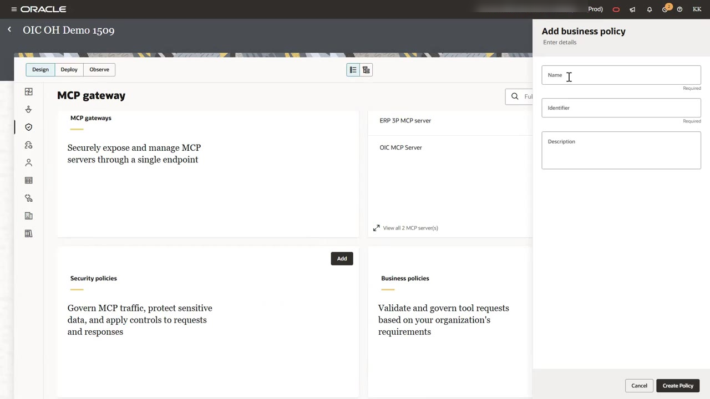
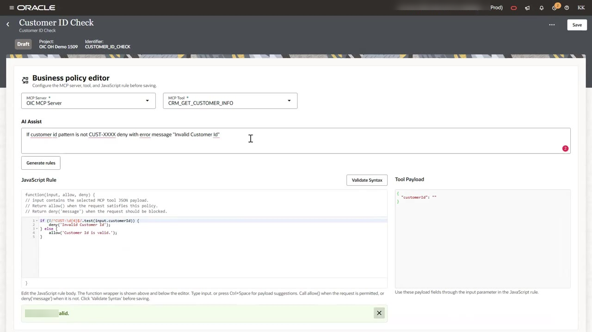
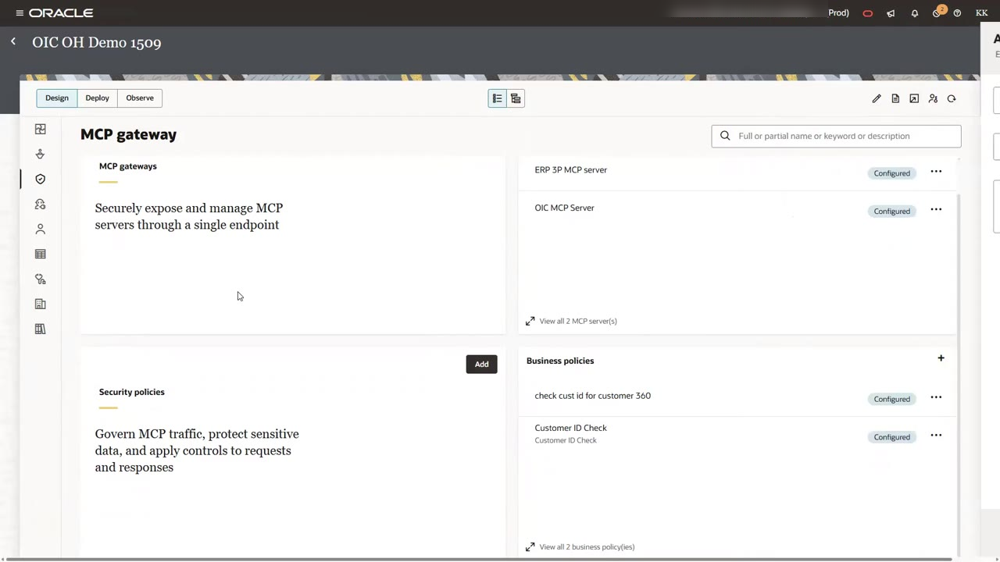

# Validate Tool Requests with Business Policies

## Introduction

Language models sometimes send malformed, incomplete, or invented arguments. A business policy runs a JavaScript rule against the JSON payload of a tool call before the gateway forwards it. The rule either allows the call or denies it with a message. You can write the rule yourself, or describe it in plain language and let AI Assist generate it.

In this lab, you create two policies that deny any customer lookup whose ID does not match the `CUST-XXXX` format.

Estimated Time: 10 minutes

### Objectives

In this lab, you will:

- Generate a JavaScript business rule with AI Assist.
- Validate the rule syntax.
- Attach one rule to each customer-lookup tool.

### Prerequisites

This lab assumes you have:

- Completed Lab 1.

## Task 1: Create the Customer ID Check Policy

1. On the **MCP gateway** page, under **Business policies**, click **Add**.

2. In the **Add business policy** panel, enter the name `Customer ID Check`. Oracle Integration fills in the identifier. Click **Create Policy**.

    

3. In the **Business policy editor**, select these values:

    - **MCP Server**: `OIC MCP Server`
    - **MCP Tool**: `CRM_GET_CUSTOMER_INFO`

    The **Tool Payload** pane shows the input fields of the tool. This tool takes one field, `customerId`.

4. In **AI Assist**, enter the rule in plain language:

    ```
    <copy>If customer id pattern is not CUST-XXXX deny with error message "Invalid Customer Id"</copy>
    ```

5. Click **Generate rules**. The **JavaScript Rule** editor fills in a rule similar to this:

    ```
    <copy>if (!/^CUST-\d{4}$/.test(input.customerId)) {
        deny('Invalid Customer Id');
    } else {
        allow('Customer Id is valid.');
    }</copy>
    ```

    The editor wraps your rule in `function(input, allow, deny)`. The `input` object holds the JSON payload of the tool call. Call `allow()` to permit the request, or `deny('message')` to block it.

6. Click **Validate Syntax**. Confirm that the message **Syntax is valid** appears, then click **Save**.

    

## Task 2: Create the Customer 360 Policy

1. Return to the **MCP gateway** page. Under **Business policies**, click **+** and name the new policy `check cust id for customer 360`. Click **Create Policy**.

2. Select these values:

    - **MCP Server**: `OIC MCP Server`
    - **MCP Tool**: `CRM_GETCUSTOME_360`

3. Enter the same **AI Assist** prompt as in Task 1, click **Generate rules**, then **Validate Syntax**, and click **Save**.

## Task 3: Confirm the Policies

1. Return to the **MCP gateway** page. Confirm that both business policies show **Configured**.

    

    > **Note:** A policy has no effect until you attach it to a gateway. You do that in Lab 4.

You may now **proceed to the next lab**.

## Acknowledgements

* **Author** - Kishore Katta, Technical Director, Oracle Integration
* **Last Updated By/Date** - Kishore Katta, September 2026
