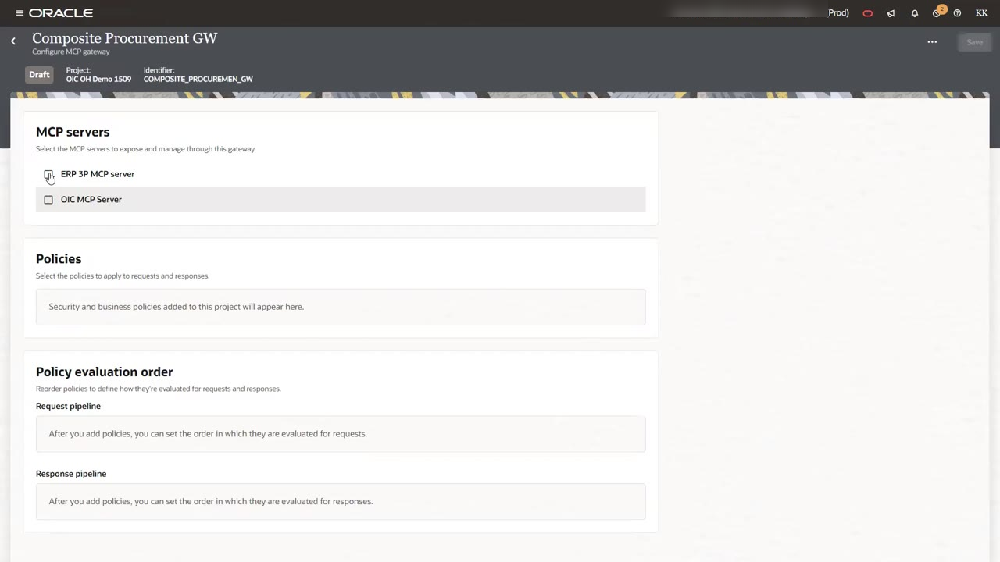
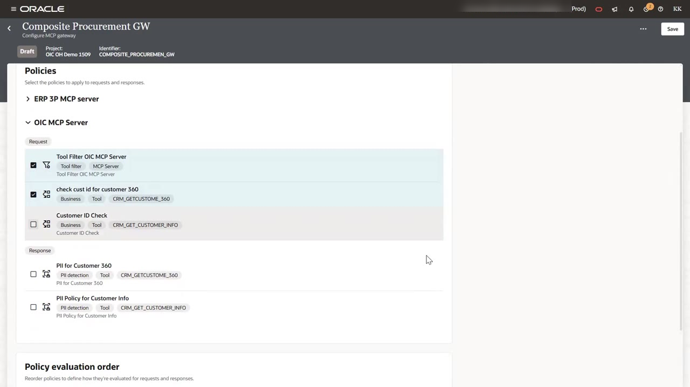
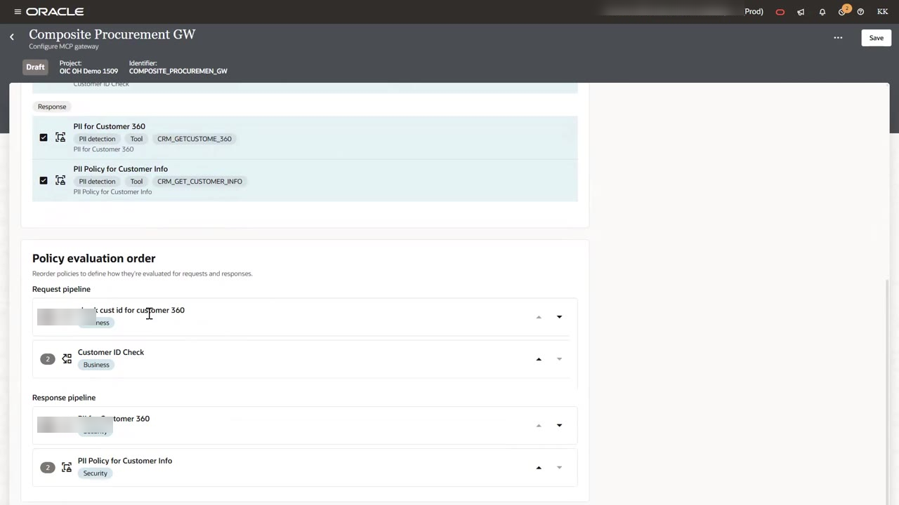
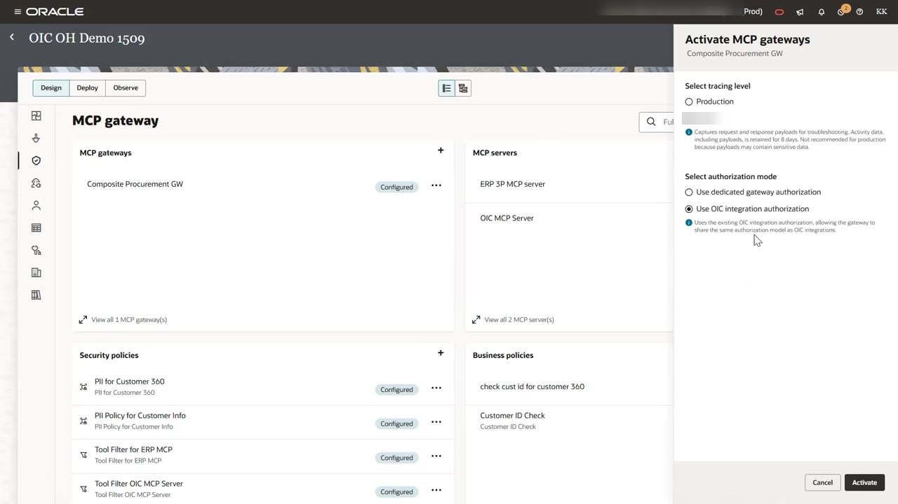
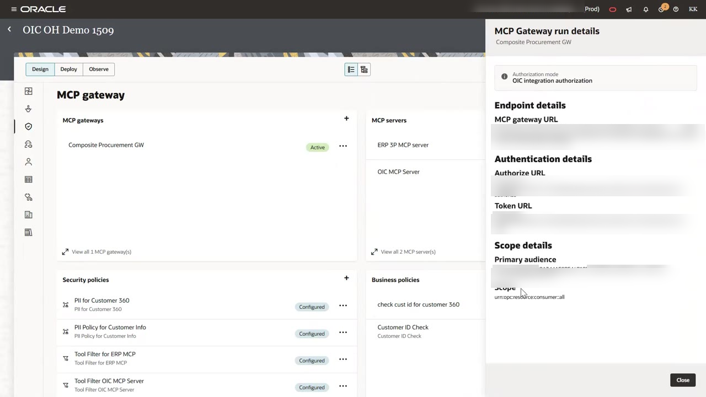

# Create and Activate the MCP Gateway

## Introduction

The gateway ties your servers and policies together. You choose the MCP servers it fronts and attach policies to each request and response path. You also set the order in which policies run. When you activate the gateway, it gets a single endpoint that MCP clients use in place of the individual servers.

In this lab, you create the `Composite Procurement GW` gateway and attach the six policies from Labs 2 and 3. Then you activate it with audit tracing.

Estimated Time: 10 minutes

### Objectives

In this lab, you will:

- Add both MCP servers to a new gateway.
- Attach policies to the request and response pipelines and order them.
- Activate the gateway and record its endpoint and authorization details.

### Prerequisites

This lab assumes you have:

- Completed Lab 3.

## Task 1: Create the Gateway and Select MCP Servers

1. On the **MCP gateway** page, under **MCP gateways**, click **Add**. Enter the name `Composite Procurement GW` and create the gateway. The gateway editor opens.

2. Under **MCP servers**, select **ERP 3P MCP server** and **OIC MCP Server**.

    

## Task 2: Attach Policies

1. Under **Policies**, expand **OIC MCP Server**. Under **Request**, select these policies:

    - **Tool Filter OIC MCP Server**
    - **check cust id for customer 360**
    - **Customer ID Check**

2. Under **Response**, select these policies:

    - **PII for Customer 360**
    - **PII Policy for Customer Info**

    Each policy shows its type and target. For example, **check cust id for customer 360** shows **Business**, **Tool**, and `CRM_GETCUSTOME_360`.

    

3. Expand **ERP 3P MCP server**. Under **Request**, select **Tool Filter for ERP MCP**.

## Task 3: Set the Policy Evaluation Order

1. Scroll to **Policy evaluation order**. Use the arrows to arrange each pipeline:

    - **Request pipeline**: 1. **check cust id for customer 360**, 2. **Customer ID Check**
    - **Response pipeline**: 1. **PII for Customer 360**, 2. **PII Policy for Customer Info**

    

    > **Note:** Put cheap, high-rejection checks first. A malformed request then fails fast and never reaches later policies or the back-end server.

2. Click **Save**. On the **MCP gateway** page, the gateway shows **Configured**.

## Task 4: Activate the Gateway

1. On the gateway row, click the **Actions** (three dots) menu and select **Activate**.

2. In the **Activate MCP gateways** panel, set these values:

    - **Select tracing level**: **Audit**. Audit captures request and response payloads for troubleshooting and keeps activity data for 8 days. Use **Production** for live workloads, because payloads can contain sensitive data.
    - **Select authorization mode**: **Use OIC integration authorization**. The gateway then shares the same authorization model as your Oracle Integration integrations. **Use dedicated gateway authorization** creates a gateway-specific audience and scopes instead.

    

3. Click **Activate**. The gateway status changes to **Active**.

## Task 5: Record the Gateway Connection Details

1. On the gateway row, open the **Actions** menu and view the run details.

2. Copy these values into a text file for Lab 5:

    - **MCP gateway URL**, which follows this pattern:

        ```
        <copy>https://<oic-host>/mcpgw/v1/projects/<PROJECT_IDENTIFIER>/gateways/<GATEWAY_IDENTIFIER>/mcp</copy>
        ```

    - **Token URL**
    - **Primary audience**
    - **Scope**, for example `urn:opc:resource:consumer::all`

    

You may now **proceed to the next lab**.

## Acknowledgements

* **Author** - Kishore Katta, Technical Director, Oracle Integration
* **Last Updated By/Date** - Kishore Katta, September 2026
