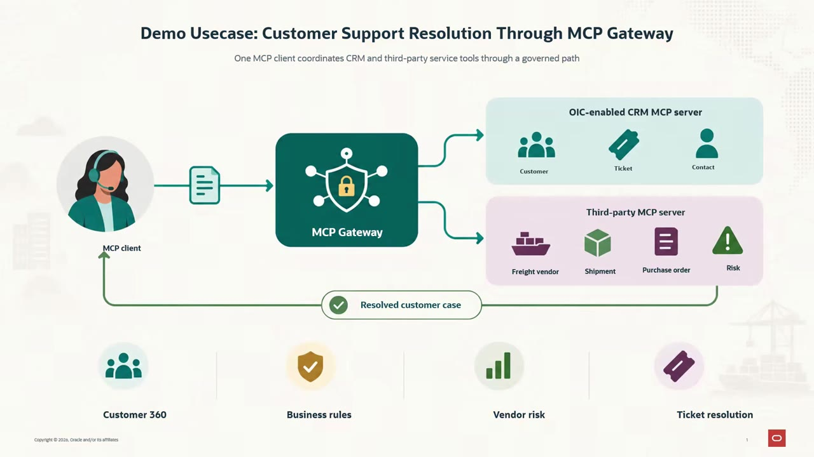
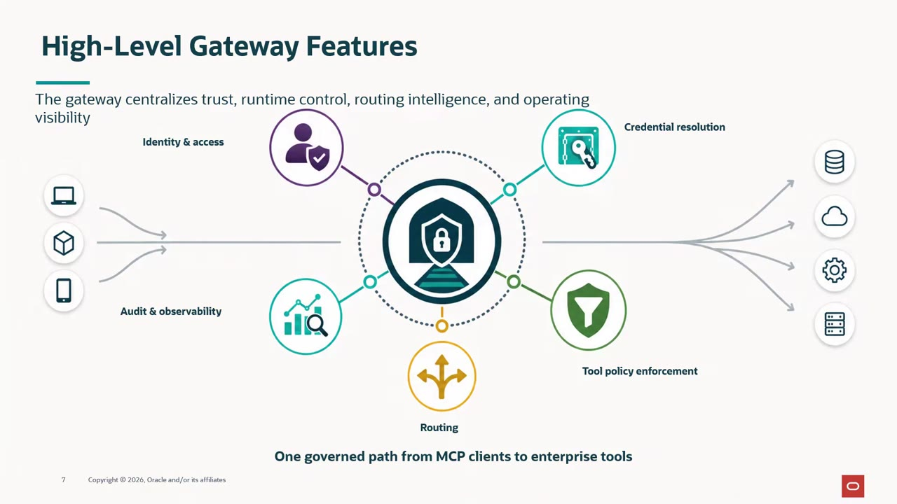

# Introduction

## Introduction

AI agents become useful when they can act on enterprise systems, not only answer questions. But as organizations connect more agents to more MCP servers, each connection can bring its own identity setup, credentials, policies, and audit trail. That fragmentation creates extra work for security, integration, and operations teams, and it makes a simple question -- who used which tool, and what happened as a result -- hard to answer. Without a common control point, you cannot see or limit what an agent does.

Oracle Integration MCP Gateway solves this by giving MCP clients one governed endpoint in front of Oracle Integration and third-party MCP servers, instead of a growing set of point-to-point connections. The gateway checks identity, exposes only approved tools, applies security and business policies, and resolves downstream credentials. It then routes each request to an approved Oracle Integration or third-party MCP server and records the activity for audit -- centralizing trust, policy, routing, and visibility in one consistent place.

In this workshop, you play an integration administrator supporting a customer-service team. One MCP client must resolve a customer case. It uses two back-end MCP servers:

- **OIC MCP Server** exposes five CRM integrations: customer 360, customer info, ticket lookup, ticket status update, and interaction logging.
- **ERP 3P MCP server** is a third-party procurement server with 14 vendor, purchase order, and invoice tools.

You place both servers behind a single gateway, protect them with policies, connect an MCP client, and trace the results.

Estimated Workshop Time: 1 hour

### Objectives

In this workshop, you will:

- Expose Oracle Integration integrations as MCP tools and register Oracle Integration and third-party MCP servers.
- Validate tool inputs with AI-assisted business policies.
- Restrict tool access with tool filters and redact PII with detection policies.
- Create, configure, and activate an MCP gateway.
- Call the gateway from an MCP client and trace allowed and denied requests.

### Video Overview

Before you begin the hands-on labs, watch this short overview of the Oracle Integration MCP Gateway architecture and the business scenario used throughout the workshop. It shows how an MCP client connects through one governed gateway to approved Oracle Integration and third-party MCP servers.

[Oracle Integration MCP Gateway architecture and demo scenario](videohub:1_h3jcrw1q:medium)

### High-Level Gateway Features

The gateway brings five capabilities together for every request:

- **Identity and access** - Verifies who is calling (agent, user, or service) and whether the request is allowed before any enterprise tool is reached, establishing a zero-trust entry point for MCP traffic.
- **Credential resolution** - Brokers downstream credentials from a protected store and resolves the right one at invocation time, so agents never see or store secrets themselves.
- **Tool policy enforcement** - Filters which tools a caller can discover, then evaluates security and business policies before an allowed tool executes, applying least privilege to every invocation.
- **Routing** - Directs each approved request to the right Oracle Integration or third-party MCP server, replacing many direct point-to-point connections with one governed path.
- **Audit and observability** - Captures activity, outcomes, and operational health for every request and response, so teams can see who did what, with which tool, and with what result.

These capabilities work together on the same request. The gateway can authenticate a caller, limit tool access, resolve the right credential, and capture the outcome, all without asking the agent to coordinate any of it. You will configure and see each of these in action across the labs that follow.

### Prerequisites

This lab assumes you have:

- An Oracle Integration instance on release 26.10 or later, where MCP Gateway features are available.
- The Service Administrator or Service Developer role in that instance.
- An Oracle Integration project containing activated integrations for the CRM operations listed above. Any REST-backed integrations work; tool names in this workshop follow the ones shown in the screenshots.
- An OCI IAM confidential application with the client credentials grant and access to Oracle Integration. You need its client ID and client secret.
- An OCI compartment OCID for the PII detection policies.
- The connection details for the ERP 3P MCP server, supplied by your instructor.
- A web browser that can reach [app.mcpjam.com](https://app.mcpjam.com), or a local install of MCPJam Inspector.

## Task 1: Review the Workshop Flow

1. Work through the labs in order. Each lab builds on objects created in the previous one.

    | Lab | What you build | Time |
    | --- | --- | --- |
    | Lab 1 | MCP tools from integrations, plus two registered MCP servers | 10 minutes |
    | Lab 2 | Two business policies that validate customer IDs | 10 minutes |
    | Lab 3 | Two tool filters and two PII detection policies | 15 minutes |
    | Lab 4 | The Composite Procurement MCP gateway, activated | 10 minutes |
    | Lab 5 | An MCP client connection, three test prompts, and an activity trace | 15 minutes |

## Learn More

- [Introducing Oracle Integration MCP Gateway: Governed Access for Enterprise AI Agents](https://blogs.oracle.com/integration/introducing-oracle-integration-mcp-gateway-governed-access-for-enterprise-ai-agents)
- [Oracle Integration documentation](https://docs.oracle.com/en/cloud/paas/application-integration/index.html)
- [Model Context Protocol specification](https://modelcontextprotocol.io)

## Acknowledgements

* **Author** - Kishore Katta, Technical Director, Oracle Integration
* **Last Updated By/Date** - Kishore Katta, September 2026
