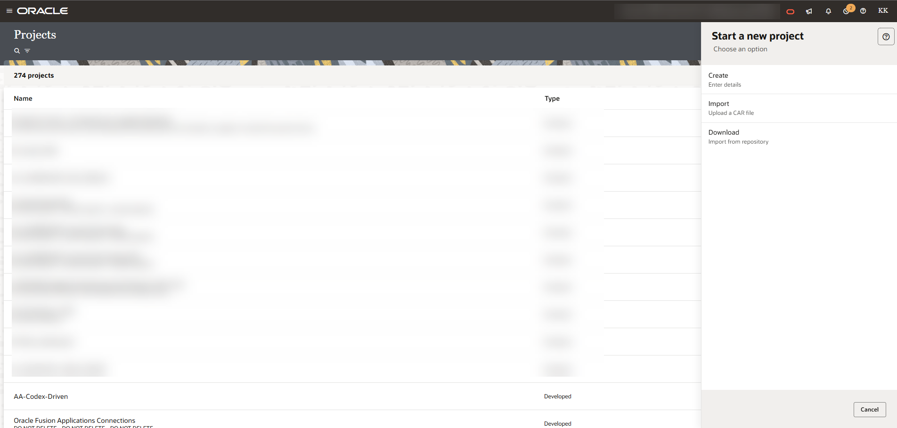
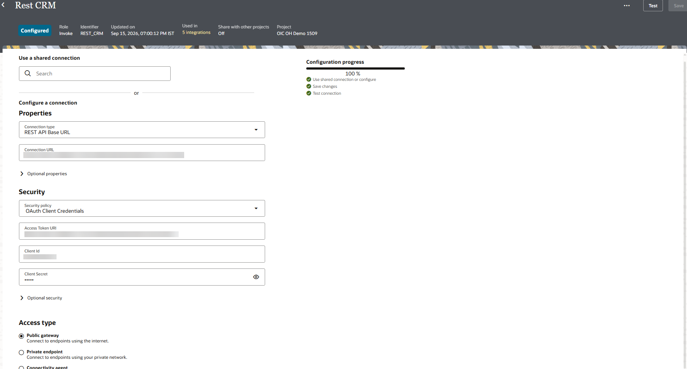
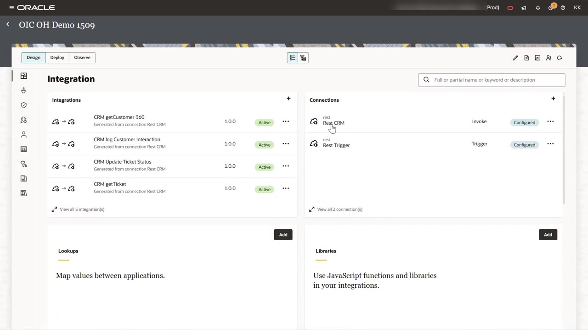
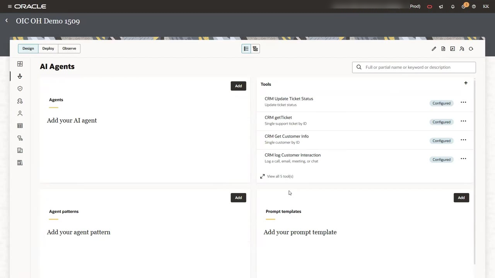
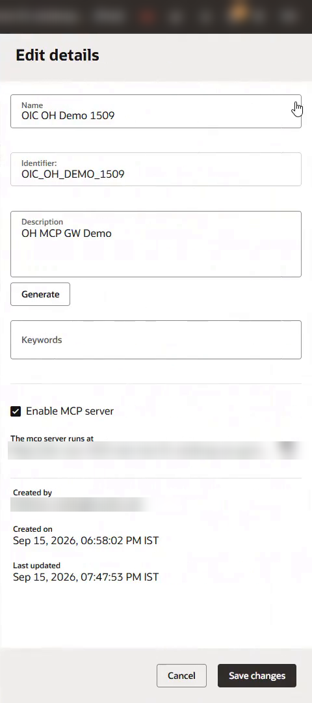
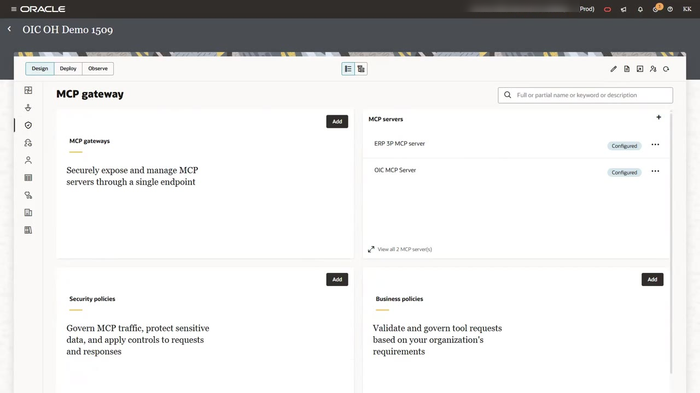
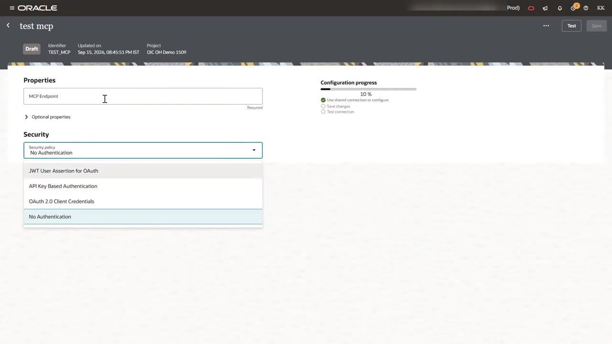
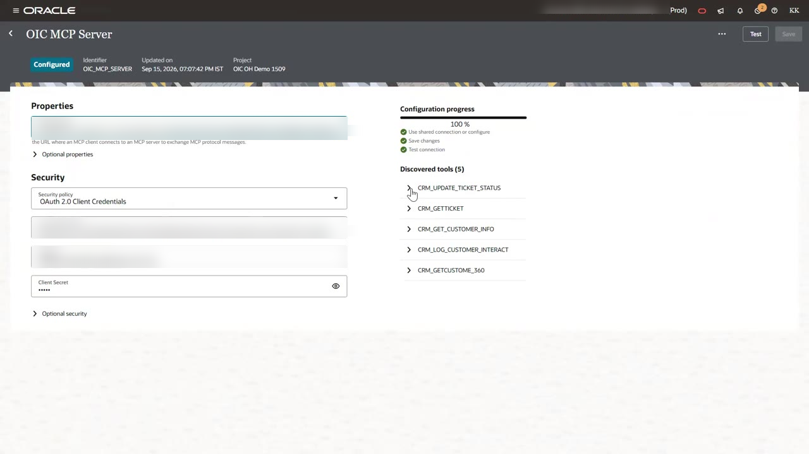
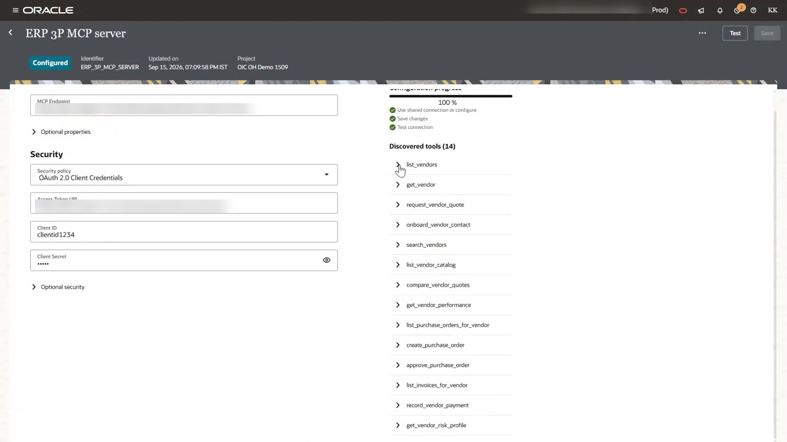

# Expose Integrations as MCP Tools and Register MCP Servers

## Introduction

A gateway can only govern MCP servers it knows about. In this lab, you turn CRM integrations into MCP tools, then register two MCP servers with the project. One is the MCP server built into your project. The other is a third-party ERP procurement server. When you finish, the project lists both servers and all 19 of their tools.

Estimated Time: 10 minutes

### Objectives

In this lab, you will:

- Import the workshop project, configure the REST CRM connection, and activate the CRM integrations.
- Expose project integrations as AI agent tools.
- Enable the project built-in MCP server.
- Register the OIC MCP server and the ERP 3P MCP server, and confirm tool discovery.

### Prerequisites

This lab assumes you have:

- Completed the prerequisites in the Introduction.

## Task 1: Set Up Your Workshop Project

1. Download the workshop project export file from [Download link: Workshop project export](https://objectstorage.us-phoenix-1.oraclecloud.com/p/mQYcQshdftak9USbvK5Q6iNlwpm5RbN1tQbUckZ7uB9MzBi6KIl8QMPAAH6P9GWc/n/oicpm/b/Partner-Enablement/o/Get-Started-MCP-Gateway/OIC_MCP_GW_DEMO_LL.car).

2. Sign in to Oracle Integration, open **Projects**, click **Add**,  click **Import** and select the downloaded file. Open the imported project when it appears in your project list.

    

3. In the left navigation of the project, select **Integrations**, then select the **REST CRM** connection to open the connection editor.

4. Download the connection credentials from [Download link: Connection credentials](https://objectstorage.us-phoenix-1.oraclecloud.com/p/7aAPaNjEApP6gMBPmdTThaakC8Yt7hpm8gekqBC33-aqCr5Asjzbih0J98daJDdH/n/oicpm/b/Partner-Enablement/o/Get-Started-MCP-Gateway/mcp-gw-ll-artifacts.txt).

5. Under **Security**, set the security policy to **OAuth Client Credentials**, then enter the values from the downloaded credentials:

    - **Connection URL**: `https://158-101-35-71.sslip.io/api/public/erp-crm/v2/api`
    - **Access Token URI**: `https://158-101-35-71.sslip.io/api/public/oauth/token`
    - **Client ID**: Refer downloaded credentials
    - **Client Secret**: Refer downloaded credentials

    

6. Click **Test** to confirm the connection succeeds, then click **Save**.

7. Still in **Integrations**, select each CRM integration and click **Activate**. Repeat until all five CRM integrations (customer 360, customer info, get ticket, update ticket status, log interaction) show **Active**.

8. Perform a quick test by Selecting **Run** Action on one of the Integrations -> CRM Get Customer Info by providing customer id: CUST-1001. You should a response with some sample data.

## Task 2: Expose Integrations as Tools

1. In the left navigation of the project, select **Integrations**, and confirm the CRM integrations are **Active**.

    

2. In the left navigation of the project, select **AI Agents**. Under **Tools**, click **+** and create a tool from each CRM integration. Give each tool a clear description, because the language model in the MCP client reads it when choosing a tool.

    | Tool | Description |
    | --- | --- |
    | CRM getCustomer 360 | Gets customer profile, tickets, opportunities, contracts, and activity |
    | CRM Get Customer Info | Single customer by ID |
    | CRM getTicket | Single support ticket by ID |
    | CRM Update Ticket Status | Update ticket status |
    | CRM log Customer Interaction | Log a call, email, meeting, or chat |

    

## Task 3: Enable the Project MCP Server

1. Click the **Edit** (pencil) icon at the top right of the project page.

2. In the **Edit details** panel, select **Enable MCP server**, then click **Save changes**.

3. Copy the URL shown under **The mcp server runs at**. It follows this pattern:

    ```
    <copy>https://<oic-host>/mcp-server/v1/projects/<PROJECT_IDENTIFIER>/mcp</copy>
    ```

    

## Task 4: Register the OIC MCP Server

1. In the left navigation of the project, select **MCP gateway**. The page has four areas: **MCP gateways**, **MCP servers**, **Security policies**, and **Business policies**.

    

2. Under **MCP servers**, click **+**. Enter the name `OIC MCP Server` and click **Create**. The MCP server editor opens.

3. In **MCP Endpoint**, paste the URL you copied in [Task 3](?lab=register-mcp-servers#Task3:EnabletheProjectMCPServer).

4. Open the **Security policy** list. The editor supports four options: **JWT User Assertion for OAuth**, **API Key Based Authentication**, **OAuth 2.0 Client Credentials**, and **No Authentication**. Select **OAuth 2.0 Client Credentials**.

    

5. Enter the credentials from your confidential application:

Note: Refer the documentation on [how to create a confidential application in IAM](https://docs.oracle.com/en/cloud/paas/application-integration/aiagents/complete-prerequisites-create-activate-confidential-client-application.html)

- **MCP Endpoint**: your OIC MCP Server Endpoint copied from [Task 3](?lab=register-mcp-servers#Task3:EnabletheProjectMCPServer)
- **Access Token URI**: `https://<identity-domain-host>/oauth2/v1/token`
- **Client ID**: your client ID
- **Client Secret**: your client secret
- **Client Secret**: your client app scope
6. Click **Save**, then click **Test**. When the configuration progress reaches 100%, the editor lists five discovered tools.

    

## Task 5: Register the ERP 3rd Party MCP Server

1. Return to the **MCP gateway** page. Under **MCP servers**, click **+** and name the server `ERP 3P MCP server`.

2. Enter the endpoint and credentials your instructor supplied. Refer the downloaded credentials:

    - **MCP Endpoint**: `https://158-101-35-71.sslip.io/api/public/erp-vendor/v2/mcp`
    - **Security policy**: **OAuth 2.0 Client Credentials**
    - **Access Token URI**: `https://158-101-35-71.sslip.io/api/public/oauth/token`
    - **Client ID** and **Client Secret**: supplied by your instructor

3. Click **Save**, then **Test**. The editor discovers 14 tools, including `list_vendors`, `get_vendor_performance`, `create_purchase_order`, `approve_purchase_order`, and `get_vendor_risk_profile`.

    

## Task 6: Confirm the Registration

1. Return to the **MCP gateway** page. Confirm that **ERP 3P MCP server** and **OIC MCP Server** both show **Configured**.

    > **Note:** Registering a server does not expose it to any client. Clients reach tools only through a gateway, which you create in Lab 4.

You may now **proceed to the next lab**.

## Acknowledgements

* **Author** - Kishore Katta, Technical Director, Oracle Integration
* **Last Updated By/Date** - Kishore Katta, September 2026
