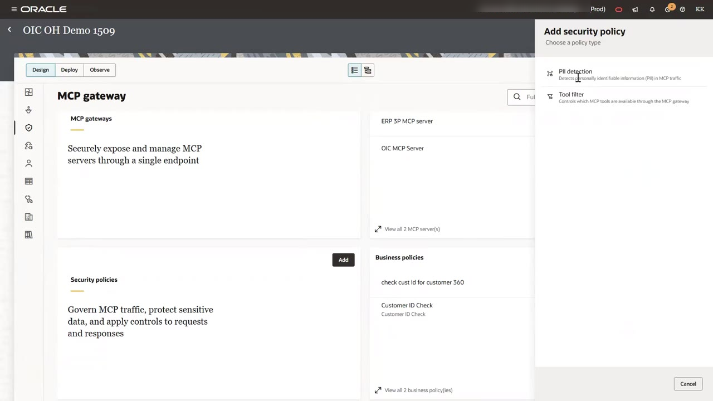
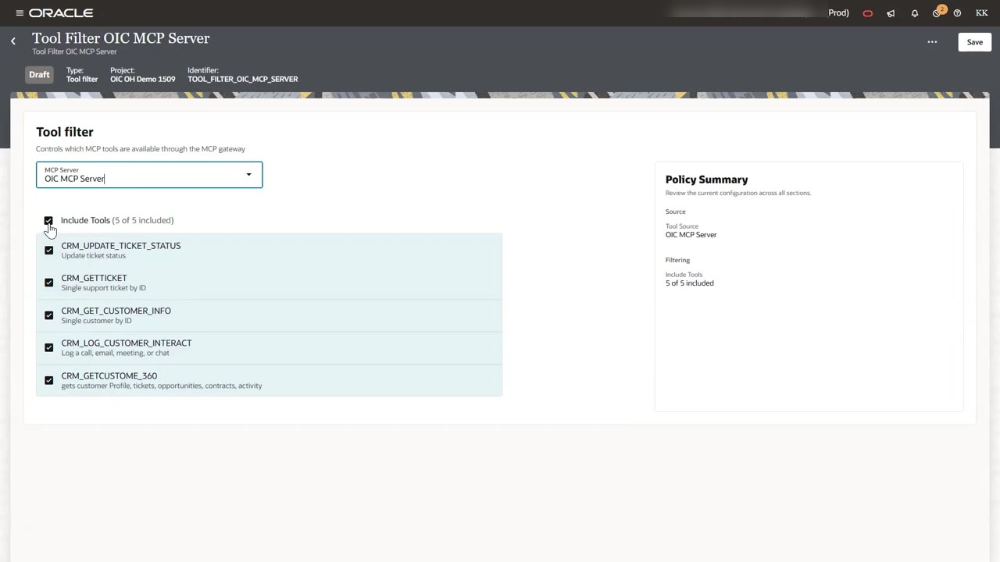
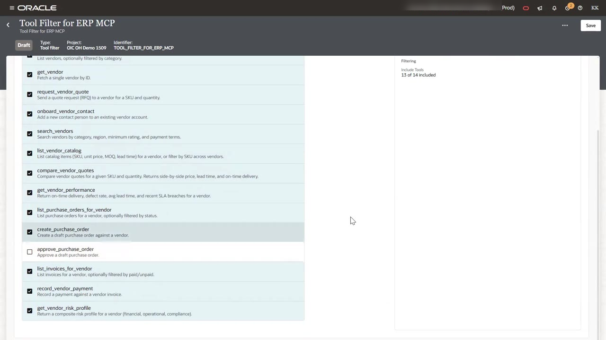
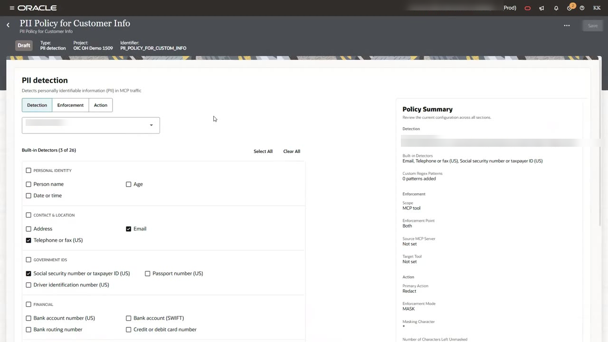
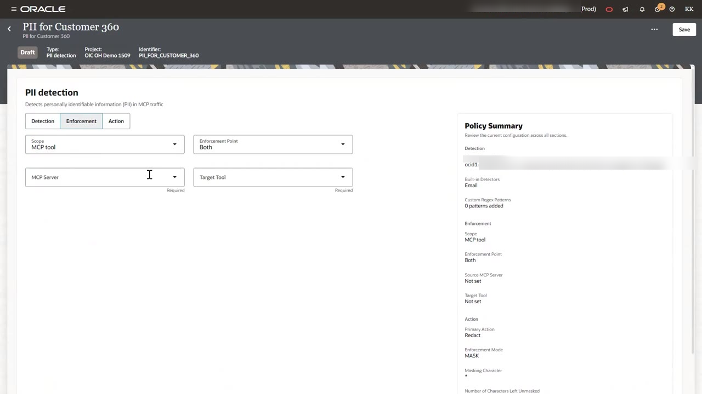
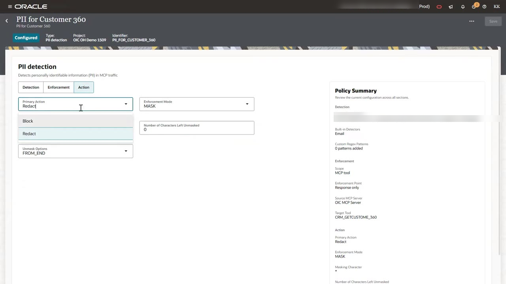
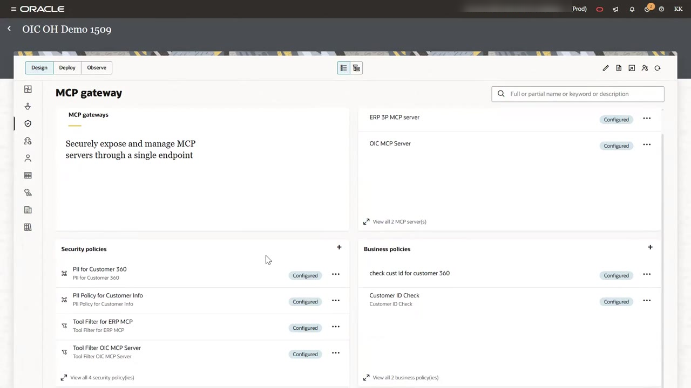

# Restrict Tools and Protect PII with Security Policies

## Introduction

Security policies govern MCP traffic itself. Oracle Integration offers two types:

- A **tool filter** decides which tools on a server a client can discover and call. Tools you leave out stay invisible to the agent.
- A **PII detection** policy finds personally identifiable information in requests or responses. It then blocks the call or redacts the matching values.

In this lab, you follow least privilege. A customer-support agent can read vendor data but cannot approve purchase orders. Customer contact details are also masked before they reach the model.

Estimated Time: 15 minutes

### Objectives

In this lab, you will:

- Create a tool filter for each MCP server.
- Exclude a high-risk tool from the ERP server.
- Create two PII detection policies that mask email, phone, and taxpayer ID values in CRM responses.

### Prerequisites

This lab assumes you have:

- Completed Lab 2.
- The OCID of an OCI compartment for PII detection.

## Task 1: Create a Tool Filter for the OIC MCP Server

1. On the **MCP gateway** page, under **Security policies**, click **Add**. The panel lists two policy types, **PII detection** and **Tool filter**.

    

2. Select **Tool filter**. Enter the name `Tool Filter OIC MCP Server`, then click **Add**.

3. In **MCP Server**, select `OIC MCP Server`. Select **Include Tools** to include all five CRM tools, then click **Save**.

    

## Task 2: Create a Tool Filter for the ERP Server

1. Under **Security policies**, click **+**, select **Tool filter**, and name the policy `Tool Filter for ERP MCP`.

2. In **MCP Server**, select `ERP 3P MCP server`, then select **Include Tools**.

3. Clear the `approve_purchase_order` check box. The **Policy Summary** shows **13 of 14 included**. Click **Save**.

    

    Agents behind the gateway can now draft purchase orders but cannot approve them. Approval stays with a person.

## Task 3: Create a PII Policy for Customer Info

*Note:* MCP Gateway PII Policy uses OCI Language Service. Complete the [pre-requisites](https://docs.oracle.com/en/cloud/paas/application-integration/integrations-user/prerequisites.html) navigating to OCI console before proceeding further. Configure the Policy specific to OCI Language Service. You can ignore rest of the Policy statements.

1. Under **Security policies**, click **+** and select **PII detection**. Name the policy `PII Policy for Customer Info` and click **Add**.

2. On the **Detection** tab, enter your **Compartment Name**. Then select these built-in detectors:

    - **Email**
    - **Telephone or fax (US)**
    - **Social security number or taxpayer ID (US)**

    The detector list has 26 types across personal identity, contact, government ID, financial, healthcare, vehicle, and network categories. Use **Custom Regex Patterns** to add your own.

    

3. On the **Enforcement** tab, set these values:

    - **Scope**: **MCP tool**. The other scopes are **MCP gateway** and **MCP server**.
    - **Enforcement Point**: **Response only**
    - **MCP Server**: `OIC MCP Server`
    - **Target Tool**: `CRM_GET_CUSTOMER_INFO`

    

4. On the **Action** tab, set these values:

    - **Primary Action**: **Redact**. Use **Block** instead to reject the whole response.
    - **Enforcement Mode**: **MASK**
    - **Number of Characters Left Unmasked**: `0`
    - **Unmask Options**: **FROM_END**

    

5. Click **Save**.

## Task 4: Create a PII Policy for Customer 360

1. Create another **PII detection** policy named `PII for Customer 360`.

2. Configure it the same way as Task 3, with these differences:

    - **Detection**: select **Email** only.
    - **Target Tool**: `CRM_GETCUSTOME_360`

3. Click **Save**.

## Task 5: Confirm the Security Policies

1. Return to the **MCP gateway** page. Confirm that all four security policies show **Configured**.

    

You may now **proceed to the next lab**.

## Acknowledgements

* **Author** - Kishore Katta, Technical Director, Oracle Integration
* **Last Updated By/Date** - Kishore Katta, September 2026
