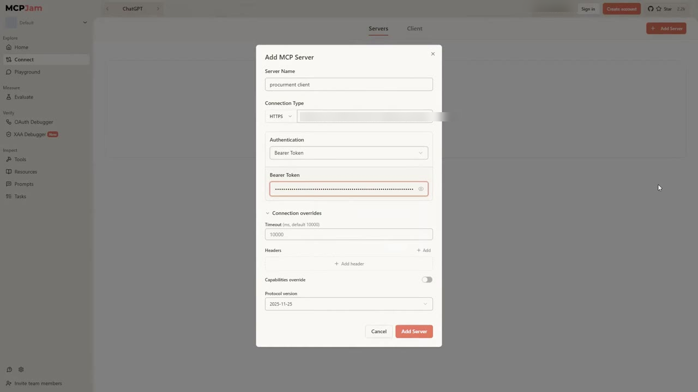
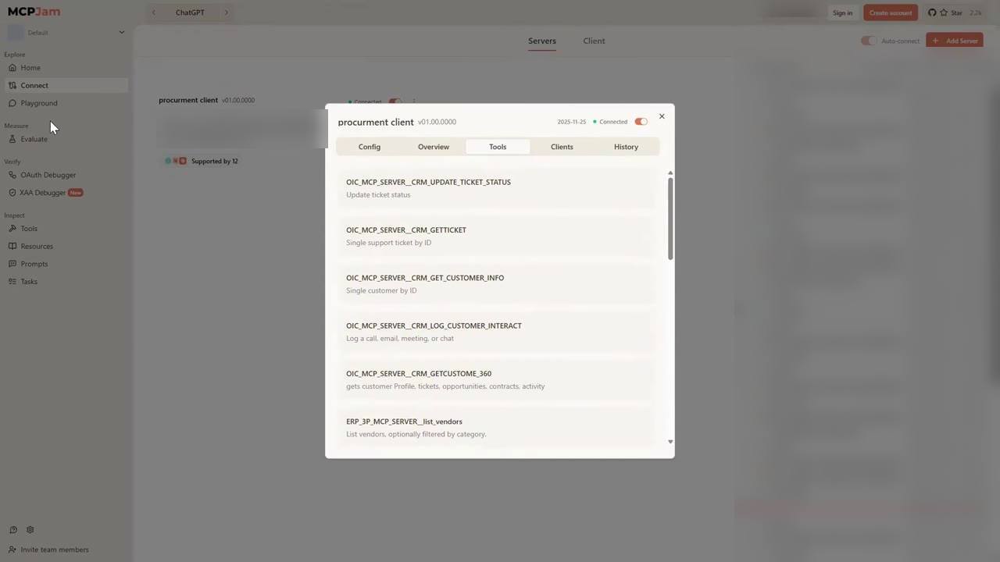
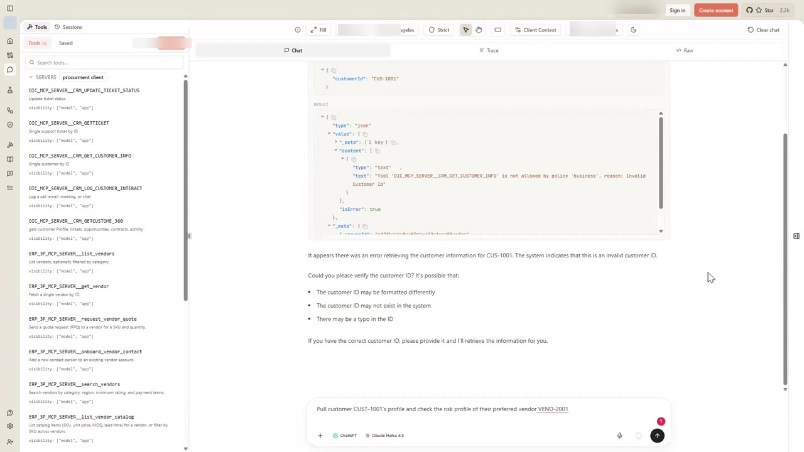
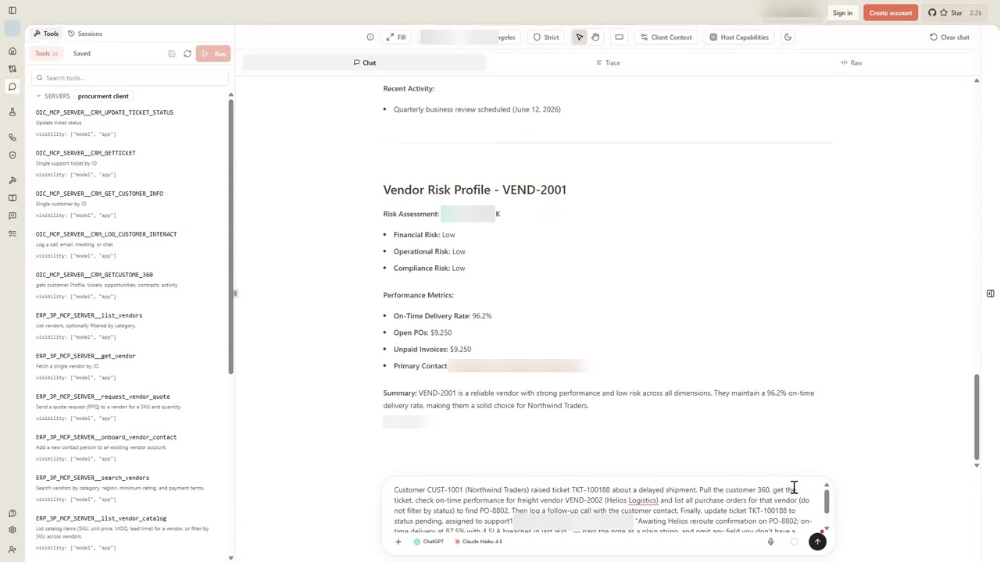
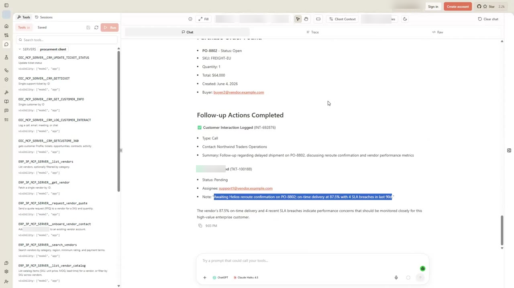
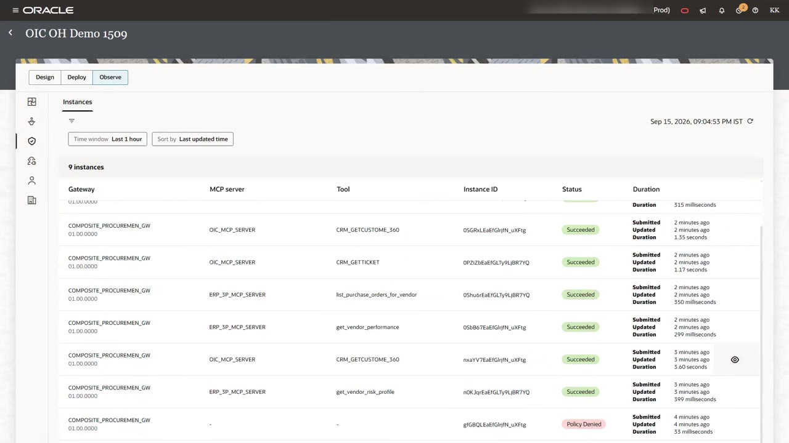
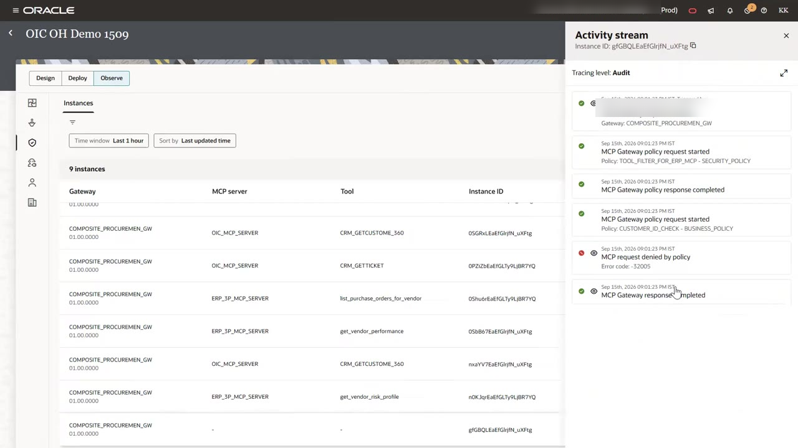

# Test the Gateway from an MCP Client and Monitor Activity

## Introduction

In this lab, you act as the agent developer. You connect MCPJam Inspector, an MCP client with a built-in LLM playground, to the gateway endpoint. Then you send three prompts:

- One that a business policy should reject.
- One that spans both MCP servers.
- One multi-step case that reads and writes across CRM and ERP tools.

Finally, you trace each call in Oracle Integration to see which policies ran and why the gateway denied a request.

Estimated Time: 15 minutes

### Objectives

In this lab, you will:

- Get an access token and connect an MCP client to the gateway.
- Confirm that the client sees only approved tools.
- Watch a business policy block a malformed request and a PII policy mask response data.
- Trace gateway activity in the Observe view.

### Prerequisites

This lab assumes you have:

- Completed Lab 4 and recorded the gateway connection details.
- The client ID and client secret of your confidential application.

## Task 1: Get an Access Token

1. Request a token from the **Token URL** you recorded in Lab 4. For the scope, join the **Primary audience** and the **Scope** values with no separator.

    ```
    <copy>curl -s -X POST "<token-url>" \
      -u "<client-id>:<client-secret>" \
      -H "Content-Type: application/x-www-form-urlencoded" \
      -d "grant_type=client_credentials&scope=<primary-audience>urn:opc:resource:consumer::all"</copy>
    ```

2. Copy the `access_token` value from the response. The token expires, so request a new one if later calls fail with an authorization error.

## Task 2: Connect MCPJam Inspector to the Gateway

1. Open [app.mcpjam.com](https://app.mcpjam.com) in your browser. Alternatively, run the inspector locally:

    ```
    <copy>npx @mcpjam/inspector@latest</copy>
    ```

2. Select **Connect**, then click **Add Server**.

3. In the **Add MCP Server** dialog, set these values:

    - **Server Name**: `procurement client`
    - **Connection Type**: **HTTPS**, followed by your **MCP gateway URL**
    - **Authentication**: **Bearer Token**, followed by the access token from Task 1

    

4. Click **Add Server**. The server card shows **Connected**.

5. Open the server card and select the **Tools** tab. Tool names carry a server prefix, such as `OIC_MCP_SERVER__CRM_GETTICKET` and `ERP_3P_MCP_SERVER__list_vendors`.

    

6. Scroll through the list. The client sees 18 tools: 5 from the OIC server and 13 from the ERP server. `approve_purchase_order` does not appear, because the tool filter hides it.

## Task 3: Send a Request That Violates a Business Policy

1. Select **Playground** and pick a model. Confirm that the toggle for the **procurement client** server is on.

2. Enter this prompt:

    ```
    <copy>Get the customer information for customer CUS-1001.</copy>
    ```

3. Expand the tool call in the response. The result has `"isError": true` and this message:

    ```
    Tool 'OIC_MCP_SERVER__CRM_GET_CUSTOMER_INFO' is not allowed by policy 'business', reason: Invalid Customer Id
    ```

    `CUS-1001` does not match `CUST-XXXX`. The gateway stopped the request before it reached the CRM integration. The model then asks you to check the ID.

    

## Task 4: Send a Request That Spans Both Servers

1. Enter this prompt:

    ```
    <copy>Pull customer CUST-1001's profile and check the risk profile of their preferred vendor VEND-2001</copy>
    ```

2. Expand the tool calls. The model calls `OIC_MCP_SERVER__CRM_GETCUSTOME_360`, then `ERP_3P_MCP_SERVER__get_vendor_risk_profile`. The customer ID passes the business policy.

3. Inspect the raw customer 360 result. Email values appear as asterisks, because the **PII for Customer 360** policy masked them on the response path.

4. Review the answer. It combines the customer profile for Northwind Traders with a vendor risk assessment and performance metrics for VEND-2001.

    

## Task 5: Resolve a Customer Case End to End

1. Enter this prompt:

    ```
    <copy>Customer CUST-1001 (Northwind Traders) raised ticket TKT-100188 about a delayed shipment. Pull the customer 360, get the ticket, check on-time performance for freight vendor VEND-2002 (Helios Logistics) and list all purchase orders for that vendor (do not filter by status) to find PO-8802. Then log a follow-up call with the customer contact. Finally, update ticket TKT-100188 to status pending, assigned to support1@vendor.example.com, with the note "Awaiting Helios reroute confirmation on PO-8802: on-time delivery at 87.5% with 4 SLA breaches in last 90d" - pass the note as a plain string, and omit any field you don't have a string value for.</copy>
    ```

2. Watch the model chain six tools across both servers. It calls customer 360, get ticket, vendor performance, and purchase orders for vendor. Then it logs the interaction and updates the ticket status.

3. Confirm that the answer ends with **Follow-up Actions Completed**. It should list a logged customer interaction and ticket TKT-100188 updated to **Pending** with the requested assignee and note.

    

## Task 6: Trace Gateway Activity

1. In Oracle Integration, open your project and select the **Observe** tab. The **Instances** list shows one row per gateway request, with **Gateway**, **MCP server**, **Tool**, **Instance ID**, **Status**, and **Duration**.

    

2. Find the row with the status **Policy Denied**. Its **MCP server** and **Tool** columns are empty, because the request never reached a back-end server.

3. Click the **View** (eye) icon on that row. The **Activity stream** records each step at the **Audit** tracing level:

    - The gateway receives the request.
    - The tool filter policy starts and completes.
    - The business policy starts.
    - The gateway denies the request with error code `-32005`.
    - The gateway sends its response.

    

4. Optional: in the Playground, ask the model to approve a draft purchase order. The model cannot, because the tool filter never exposes `approve_purchase_order`.

## Summary

Congratulations! You placed two MCP servers behind one gateway endpoint. The gateway limited which tools the client could see and rejected invalid input early. It also masked PII in responses and recorded every call for audit. The agent developer needed only one URL and one token.

Across the five labs, this workshop exercised every core capability of the Oracle Integration MCP Gateway:

- **Identity and access** - Lab 1 registered both MCP servers with OAuth 2.0 Client Credentials, and Lab 5 required a single access token to reach the gateway itself.
- **Credential resolution** - the gateway held the downstream credentials for both servers, so the MCP client only ever needed the gateway's own token, never the servers' individual secrets.
- **Tool policy enforcement** - Lab 3's tool filters kept `approve_purchase_order` out of tool discovery entirely, while Lab 2's business policies rejected a malformed customer ID before it reached the CRM integration.
- **Routing** - one gateway endpoint fronted two independent MCP servers, and a single conversation in this lab chained six tool calls across both of them to resolve a customer case end to end.
- **Audit and observability** - the Observe view's Instances list and Activity stream traced every request, including the exact policy and error code behind a denied call.

The workshop mirrors a real rollout: register your MCP servers, encode your governance rules as policies, attach and order them on a gateway, then give agent developers one endpoint and one token. Use the Observe view as your first stop when investigating a denied or unexpected request in your own environment.

## Learn More

- [Introducing Oracle Integration MCP Gateway: Governed Access for Enterprise AI Agents](https://blogs.oracle.com/integration/introducing-oracle-integration-mcp-gateway-governed-access-for-enterprise-ai-agents)

- [Oracle Integration MCP Gateway](https://docs.oracle.com/en/cloud/paas/application-integration/aiagents/secure-mcp-servers-mcp-gateway.html)

## Acknowledgements

* **Author** - Kishore Katta, Technical Director, Oracle Integration
* **Last Updated By/Date** - Kishore Katta, September 2026
