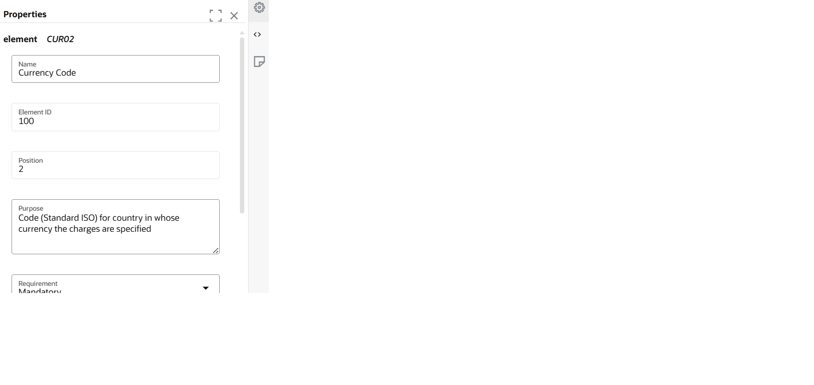
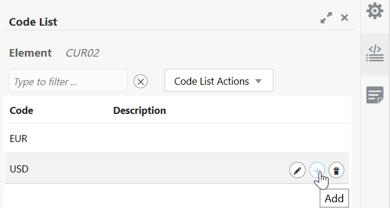
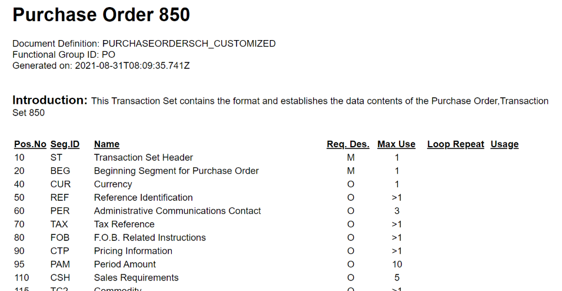

# B2B Schemas and Documents

## Introduction

This lab walks you through the steps to create a B2B Purchase Order Document based on a Schema.

Estimated Time: 15 minutes

### Objectives

In this lab, you will:

* Create a new B2B Schema.
* Create a new B2B Document.
* Customize B2B Schema.
* Generate Implementation Guide.

### Prerequisites

This lab assumes you have:

* All previous labs successfully completed.
* Completed [B2B Concepts](../workshops/tenancy/?lab=gettingStartedB2B) Lab which explains B2B concepts at a high level.

## Task 1: Create a new B2B Schema

You can create a new B2B Schema based on a standard Document type.

1. In the left Navigation pane, click ***Projects***, click on the project which you have created, Click on ***B2B*** Tab, Click on **Add** on *Schemas* section
2. On the **Add schema** window, click ***Create***.
4. Enter the following details on *Create schema* page:  
  | Element           | Description                                           |
  | ----------------- | ----------------------------------------------------- |
  | Name              | PurchaseOrderSchema                                   |
  | Identifier        | This field is automatically populated with a unique Schema identifier. |
  | Description       | Purchase Order Schema                                 |
  | Document Standard | X12 (Select the document standard X12. The document standard identifies the business protocol to follow when exchanging business documents between partners. Supported document standards are EDIFACT and X12) |
  | Document Version  | 4010                                                  |
  | Document Type     | 850 (Purchase Order)                                  |

5. Click ***Create***, then ***Save***, then exit the PurchaseOrderSchema page.  
  
  The following diagram shows a schematic structure of X12 envelopes.
    

    Refer to the [EDI X12 Documentation](https://docs.oracle.com/en/cloud/paas/application-integration/integration-b2b/edi-x12.html) to understand more details about the X12 structure.

## Task 2: Create a new B2B Document

You can create a new B2B Document based on a standard document type.

1. On the Documents section, click ***Add***.
2. On the **Add document** window, click ***Create***.
3. Enter the following details:  
  | Element           | Description               |
  | ------------------| ------------------------- |
  | Name              | PurchaseOrder4010Document |
  | Identifier        | This field is automatically populated with a unique Document identifier. |
  | Description       | Purchase Order Schema     |
  | Document standard | X12 (Select the document standard X12. The document standard identifies the business protocol to follow when exchanging business documents between partners. Supported document standards are EDIFACT and X12 ) |
  | Document versioN  | 4010                      |
  | Document type     | 850 (Purchase Order)      |
  | Document schema     | PurchaseOrderSchema      |
  
4. Click ***Create***.  
5. Click ***Save*** and Click on **Go back**

## Task 3: Customize a B2B Schema

You can create customized document definitions to use in your B2B integrations. Custom document definitions are useful for scenarios in which your trading partner requires specific customizations to meet certain business requirements.

1. Select ***PurchaseOrderSchema*** which you have created, clone it
2. Change the name to ***PurchaseOrderSchema_Customized***
3. Click ***Clone***.
4. Click ***Edit*** on the **PurchaseOrderSchema_Customized** Schema.
5. On the Schema page, find the element you want to customize, and select ***Edit Details***. As an example, select the ***CUR02*** currency code element (part of the ***CUR*** segment) to edit it. You can also add new constructs to the schema.  
    
  The Details pane is displayed with the Properties tab selected.
      
  The three tabs on the Details pane enable you to define additional customizations.  
  | Tab &nbsp;&nbsp;&nbsp;&nbsp; | Description                                                           |
  | --- | --------------------------------------------------------------------- |
  | Properties &nbsp;&nbsp; | Displayed by default when you initially access the Details pane. You can modify the following standard EDI X12 properties for the selected segment or element:  <ul><li>Purpose of element.</li><li>Requirement (mandatory, optional, or conditional).</li><li>Usage (must use, do not use, recommended, or not recommended).</li><li>Minimum and maximum number of characters.</li><li>Number of times to repeat the element.</li></ul> |
  | Code List    | A Code List defines an enumeration of allowed values for the element. |
  | Notes        | Notes to document the Element.                                    |

6. Select ***Code list*** to add a new code List.
7. Click ***Add a New Code List*** (if the element does not already have a code list defined).
8. An empty Code line is created. For this example we will add codes for Euro and US Dollar currencies. Hover the empty Code line and click ***Edit***.
9. Set **Code** to ***EUR*** and **Description** to ***Euro Dollar***. Click ***X*** to close the Code editor.
10. Hover over the **EUR** Code, click ***+*** to add a new Code line, then click ***Edit*** on the empty Code line.
11. Set **Code** to ***USD*** and **Description** to ***US Dollar***. Click ***X*** to close the Code editor.  
  
12. Click ***Save*** to close the Code List editor and save your Schema changes. The segment (CUR) and the element (CUR02) that you customized from the standard schema are identified by a dot.
  
13. Exit the **PurchaseOrderSchema_Customized** page.

## Task 4: Implementation Guide

  - You can generate implementation guides for standard or customized schemas to share with your trading partners.

### *About the Implementation Guide*

  - An implementation guide is a single, consolidated document with full details about a B2B schema.

  Typically, a host company shares the implementation guide for an EDI schema with their trading partners. This guide is shared especially when a schema has been customized to deviate from a standard X12 document. It points out the customizations made to the standard schema.

  In Oracle Integration B2B, you can generate implementation guides for both standard and custom B2B schemas. The guide is generated as an HTML document, which you can edit to apply branding and print as a PDF document if necessary.

1. Click ***Schemas***.
2. On the Schemas page, select the ***PurchaseOrderSchema_Customized*** Schema and select ***Generate Implementation Guide***.
  
3. From here you can View or Download the Implementation Guide. Click ***View*** to open a new browser window containing the    Implementation Guide. Search for the **EUR** or **USD** Codes you added to this customized Schema.  
The following image shows an example Implementation Guide:
  

  When done reviewing the Implementation Guide, exit the **Generate Implementation Guide** page.

You may now **proceed to the next lab**.

## Learn More

* [Generate Implementation Guide](https://docs.oracle.com/en/cloud/paas/application-integration/integration-b2b/introduction-b2b-oracle-integration.html#GUID-11EFFD48-3E63-4C60-8771-DE789FF90909)

## Acknowledgements

* **Author** - Kishore Katta, Technical Director, Oracle Integration Product Management
* **Contributors** -  Subhani Italapuram, Technical Director, Oracle Integration Product Management
* **Last Updated By/Date** - Subhani Italapuram, Oct 2025
