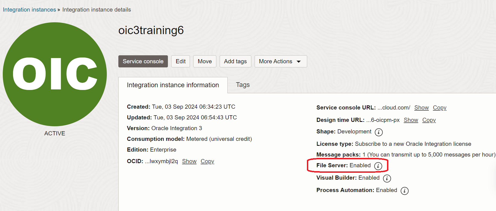
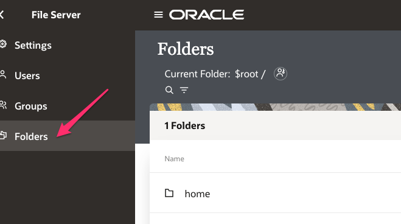

# Lab Setup

## Introduction

This lab walks you through the setup required to complete the workshop.

Estimated Time: 15 minutes

### Objectives

In this lab, you will:

- Obtain Database Connection details
- Create Database Table using a SQL script
- Enable File Server
- Configure File Server
- Connect to File Server using FTP Client

### Prerequisites

This lab assumes you have:

- Completed all the previous labs.
- Oracle Autonomous Transaction Processing Instance
- Oracle Integration Instance

## Task 1: Create a database table using a SQL script

Follow these steps to create a DB table which will be used as part of this workshop.

1. If you are not already logged in to SQL Worksheet, on your ATP Database Details page, click the **Database Actions** button.

2. A sign-in page opens for Database Actions. For this lab, simply use your database instance's default administrator account `ADMIN` and click **Next**.

3. Enter the **ADMIN** password you specified when creating the database and click **Sign in**.

4. The SQL Worksheet appears. Before you proceed with the SQL Worksheet, copy below code snippet:

    ```
    <copy>
    CREATE TABLE v_sales_orders
    (
       order_id       INTEGER NOT NULL PRIMARY KEY,
       region         VARCHAR(33),
       country        VARCHAR(21),
       item_type      VARCHAR(15),
       sales_channel  VARCHAR(7),
       order_priority VARCHAR(1),
       order_date     DATE,
       ship_date      DATE,
       units_sold     INTEGER,
       unit_price     NUMERIC(6, 2),
       unit_cost      NUMERIC(6, 2),
       total_revenue  NUMERIC(10, 2),
       total_cost     NUMERIC(10, 2),
       total_profit   NUMERIC(10, 2)
    );
    </copy>
    ```

5. Paste the script in the SQL Worksheet, then click **Run It** button. This will create the **V\_SALES\_ORDERS** table. The table is created successfully when you see the notification in the *Script Output* window.

    

Now you have an external table which will be used in the Integration flow.

## Task 2: Obtain Database Connection details

1. If you are not already logged in to Oracle Cloud Console, log in and select **Autonomous Database** from the navigation menu under Oracle Database.

2. Navigate into your demo database by clicking on the instance link.

3. On your Autonomous Database Details page, click the **Database Connection** button.

4. In the displayed *Database Connection* dialog, click **Download Wallet**.

5. Provide a Wallet password, then click **Download**. Save the wallet file (ZIP) on your local machine. This file will be used later when creating the Autonomous Database connection in Oracle Integration.

6. Under *Connection Strings*, select one of the *TNS Name* entries and write it down. This value will be used later when creating the Autonomous Database connection in Oracle Integration.

7. Click **Close**.

## Task 3: Enable File Server

- An administrator must enable File Server before an organization can start using it with their Oracle Integration instance. Enabling File Server is a one-time action in the Oracle Cloud Infrastructure Console

1. On the Oracle Cloud Get Started page, select the region in the upper right where you created your Oracle Integration 3 instance. Open the navigation menu in the upper left and click **Developer Services**. Under **Application Integration**, click **Integration**.
2. If needed, select the compartment where you created your Oracle Integration 3 instance. You should see your instance.

3. Select your instance.
   The Integration Instance Details page is displayed.
4. Click the Enable link for File Server on the Integration Instance Information tab.
5. When prompted to confirm enabling File Server, click ***Enable***. The OIC icon turns orange and its status changes to Updating. Enablement can take several minutes.

6. Once complete, the OIC icon changes back to green with an Active status, and File Server shows as Enabled. You may need to log out and log back in to Oracle Integration to access the newly activated File Server.

    

## Task 4: Configure File Server

Configure File Server settings. This is required as you are using Embedded File Serve of Oracle Integration and using File Server as a target application in your integration flow.

1. Starting at the Oracle Integration *Home* page, select **Settings**, then **File Server** from the left Navigation pane.
2. Select **Settings** from the left Navigation pane to open the File Server Settings page and review the File Server status and configurations. Make a note of IP OR Host and port number.
    > **Note:** Ensure the *Authentication Type* is set to **Password or Key**.

3. Under SFTP Server Status, monitor the server's status, and stop or restart as needed

4. Select **Users** from left Navigation pane, search for your User Name and click on Configure.
    
5. Click on **Switch to enable** and click on **Save**.
    
    
    > **Note:** If you are a Bootcamp user then you would be using /upload/users/*your oic username* and it is configured for the bootcamp otherwise, you can can configure the appropriate directory and use it in the lab.

6. Select **Folders** from left Navigation pane.
    
7. Click on **home**, click on **users**, click on your username and from the top right click **Create** and create a Folder named **Output**.
8. Click on **Permissions** on the **Output** Folder
    
    
9. Click **Add Permissions** and select your user. Click **Add**.
   
10. Select **All** and **Propagate to subfolders**. All of the permission checkboxes should be checked. Click **Save** and exit the Permissions page.
    

## Task 5: Connect to File Server with FTP Client

To access files on the File Server you will need to use an FTP Client. You will need to configure your FTP Client with the following:

- File Server Host/IP Address.
- File Server Port.
- Your Oracle Integration username.
- Your Oracle Integration password.

1. To obtain the File Server Host/IP Address and Port, select **Settings** from the left Navigation pane. The IP and Port are located in the *IP and Port Information* section of the *Settings* page.
2. Using your FTP Client choice, connect to the File Server using the SFTP - SSH File Transfer Protocol.  
    
An example configuration using FileZilla FTP Client.  
If the permissions are configured correctly, you should be able to list, read, and write files on the *Output* folder.

You may now **proceed to the next lab**.

## Acknowledgements

- **Author** - Kishore Katta, Product Management - Oracle Integration
- **Author** - Subhani Italapuram, Oracle Integration Product Management
- **Last Updated By/Date** - Subhani Italapuram - May 2025
