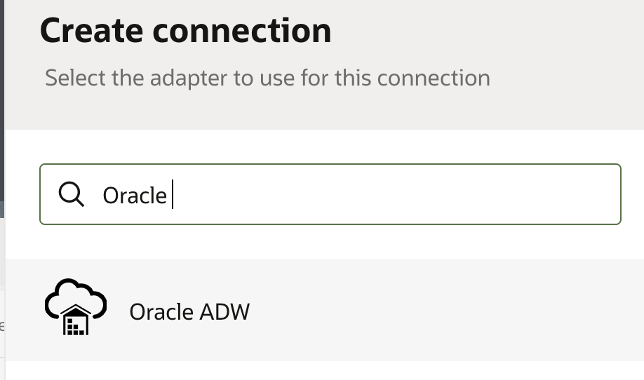

# Create Connections

## Introduction

This workshop will walk you through the steps to create an end-to-end integration of reading a file from the File Server and inserting the data set in an Oracle Autonomous Date Warehouse(ADW) Table leveraging out of the box adapters.

This lab will walk you through the steps to create connections for all the services which will be used in the Integration Flow.

Estimated Time: 10 minutes

### Objectives
In this lab, you will:
- Create an Oracle Autonomous Data Warehouse connection
- Create an Oracle FTP Connection

### Prerequisites
This lab assumes you have:
- Completed all the previous labs.

## Task 1: Create an Oracle Autonomous Data Warehouse Connection
Create a connection with the Oracle Autonomous Data Warehouse Adapter.

1. In the left Navigation pane, click ***Design*** &gt; ***Connections*** &gt; click ***Create***

2. In the *Create Connection* dialog, select the **Oracle ADW** adapter to use for this connection. To find the adapter, enter `Oracle` in the search field. Click on the highlighted adapter and hit **Select**.
    

3. In the *Create Connection* dialog, enter the following information and click **Create**

    | **Field**        | **Value**          |       
    | --- | ----------- |
    | Name         | `LLDemo_ADW`       |
    | Description  | `ADW Connection for LiveLabs` |

    Keep all other values as default.

4. In the *Oracle ADW Connection* dialog, enter the following information:

    | **Field**  | **Value** |
    |---------------|----------------|
    |Service Name | `<your-adb-tns-name>` (Use the TNS Name obtained in **Lab Setup** &gt; **Task 3** &gt; **Step 6**) |
    |Security Policy | **JDBC With OCI Signature**|
    |Wallet | **Upload wallet file (Zip)** |
    |Wallet Password | `<wallet-password>`|
    |Database Service Username | `<db-service-username>` (Default: `ADMIN`)|
    |Database Service Password | `<db-service-password>` |
    |Object Storage Region | `<object-storage-region-identifier>` |
    |Object Storage Tenancy OCID | `<object-storage-tenancy-ocid>` |
    |Object Storage Compartment OCID | `<object-storage-compartment-ocid>` |
    |Object Storage User OCID | `<object-storage-user-ocid>` |
    |Private Key | `<*.pem file>` |
    |Finger Print | `<api-key-finger-print>` |

    > **Note:**  The information obtained from the Lab *Setup* will be used to fill in the details to create Connection.

5. Click on **Test**, followed by **Save**. Exit the connection canvas by clicking the back button on the top left side of the screen.

## Task 2: Create Connection with File Server

To access the File Server from an Integration, you will need to create an FTP Connection.  

1. In the left Navigation pane, click **Design** &gt; **Connections** &gt; click **Create**
2. Select the **FTP** Adapter and click **Select**.
3. From the *Create Connection* dialog, *Name* your connection as **File Server** and leave the rest of the configurations as default. Click **Create**
    > **Note:**  If you get an error that the identifier already exists, change the Connection Name and remember this name for use later in the workshop.

4. Enter the following configurations in the *FTP Connection* with the information you previously gathered from the File Server Settings page.  
    | Field                   | Value                                                 |
    |-------------------------|-------------------------------------------------------|
    | FTP Server Host Address | From File Server Settings - IP and Port Information   |
    | FPT Server Port         | From File Server Settings - IP and Port Information   |
    | SFTP Connection         | Yes                                                   |
    | Security                | FTP Server Access Policy                              |
    | Username                | Your Oracle Integration username                      |
    | Password                | Your Oracle Integration password                      |

5. Confirm your Connection by clicking **Test**, then **Diagnose & Test**. You should see the *Connection File Server was tested successfully* confirmation message. Click **Save** and exit the Connection editor.

You may now **proceed to the next lab**.

## Learn More

* [Oracle Integration ADW Adapter](https://docs.oracle.com/en/cloud/paas/application-integration/adw-adapter/oracle-autonomous-data-warehouse-adapter-capabilities.html)

* [Oracle Integration FTP Adatper](https://docs.oracle.com/en/cloud/paas/application-integration/ftp-adapter/ftp-adapter-capabilities.html#GUID-59194DED-31DC-4E3D-893C-0064D7CC65A0)

## Acknowledgements
* **Author** - Kishore Katta, Product Management - Oracle Integration
* **Author** - Subhani Italapuram, Technical Director, Oracle Integration Product Management
* **Last Updated By/Date** - Subhani Italapuram, Sep 2022
