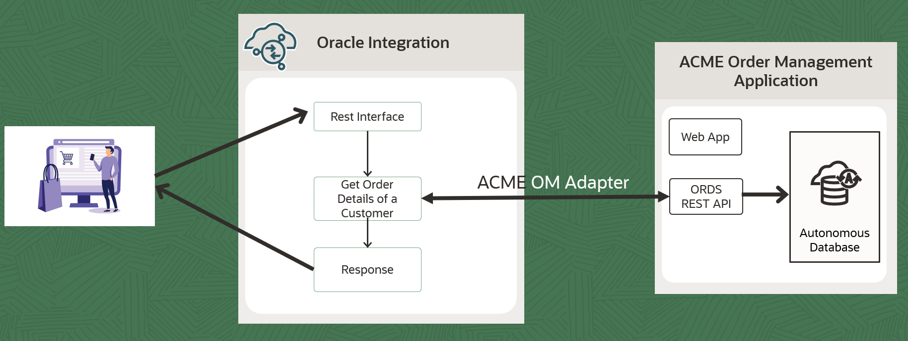
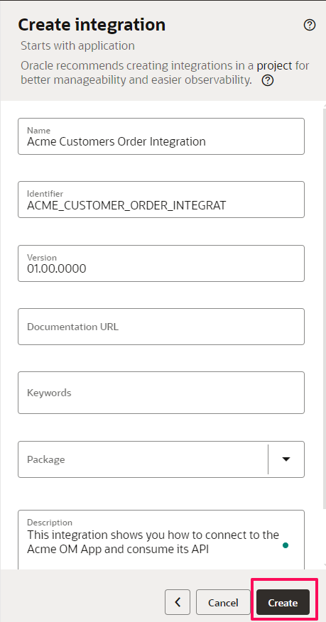
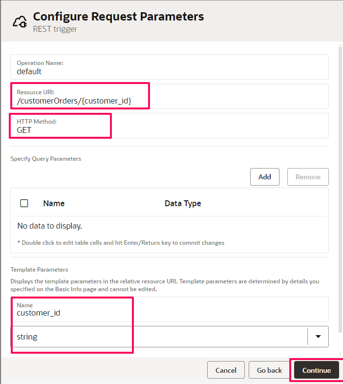
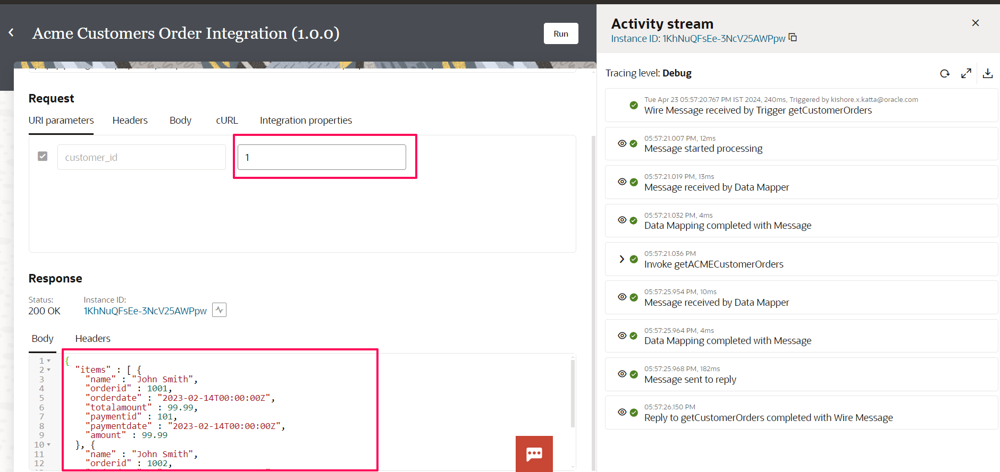
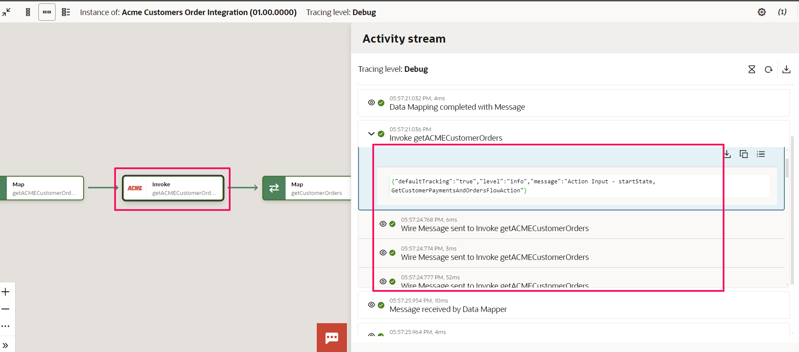

# Create Integration Flow

## Introduction

This lab walks you through the steps to create an Integration flow.

This use case describes how to use Oracle Integration to consume **Acme OM App** adapter which connects with **ACME Order Management Application**
   - ACME OM App exposes Customers and Orders API
   - OIC consumes the **Acme OM App Adapter** to get a **Customer Order** given a customer\_id.
   - OIC captures the response and sends order details to the client

 The following diagram shows the interaction between the systems involved in this use case.
    

Estimated Time: 30 minutes

### Objectives

In this lab, you will:

* Use Acme OM App adapter Connection to consume the Application API
* Activate and Monitor the Integration flow at runtime


### Prerequisites

This lab assumes you have:

* All previous labs completed.

## Task 1: Create the Integration flow

1. In the left Navigation pane, click **Design** &gt; **Integrations**.

2. On the *Integrations page*, click **Create**.

3. On the *Create integration* dialog, select and click on **Application**.

4. In the *Create integration* dialog, enter the following information:

    | **Element**          | **Value**          |       
    | --- | ----------- |
    |Name | Acme Customers Order Integration |
    |Description | This integration shows you how to connect to the Acme OM App and consume its API |
    {: title="Create Integration Flow"}

    Accept all other default values.

5. Click **Create**.
   

6. Click on **Horizontal** to change the layout to Horizontal

## Task 2: Define the REST Trigger and Response Interface

1. Search for the *REST Interface* connection which was created in the previous Lab and click on it. This invokes the REST  Adapter Configuration Wizard.

2. On the *Basic Info* page,
     - for the *What do you want to call your endpoint?* element, enter **getCustomerOrders**
     - for the *What does this endpoint do?* element, enter *This endpoint defines the REST interface to get customer orders.*
     - Click **Continue**.

3. In the *Resource Configuration** page,
    - for the *What does this operation do?* element, enter **get orders for customers.**
    - for the *What is the endpoint's relative resource URI?*, enter **/customerOrders/{customer_id}**
    - for the *What action do you want to perform on the endpoint?*, select **GET**
    - Select *Add and review parameters for this endpoint* checkbox
    - Select *Configure this endpoint to receive the response* checkbox
    - Click **Continue**.

4. From the *Request Parameters* page, in the *Template Parameter section*
    - For the **customer_id** parameter provide the datatype as **string**
    - Click **Continue**.
    

5. On the **Response** Page
    - Select the *response payload format* to **JSON Sample**
    - Click the **&lt&lt&ltinline&gt&gt&gt** link.
    - Provide the below JSON and Click **Continue**

        ```
        <copy>
              {
                "items": [
                    {
                        "name": "John Smith",
                        "orderid": 1001,
                        "orderdate": "2023-02-14T00:00:00Z",
                        "totalamount": 99.99,
                        "paymentid": 101,
                        "paymentdate": "2023-02-14T00:00:00Z",
                        "amount": 99.99
                    },
                    {
                        "name": "John Smith",
                        "orderid": 1002,
                        "orderdate": "2023-02-18T00:00:00Z",
                        "totalamount": 149.99,
                        "paymentid": 201,
                        "paymentdate": "2023-02-16T00:00:00Z",
                        "amount": 199.99
                    }
                ]
              }
        </copy>
        ```
    - In the **What is the media-type of Response Body?** Select **JSON**

6. Click **Continue***

7. Review the summary and click **Finish**.

8. Click **Save** to persist changes.


## Task 3: Invoke Get Customer Details

1.  Delete the Map activity created after the Trigger activity and **Save** the Integration Flow

2. Hover over the outgoing arrow for the *getCustomerOrders* activity (after first activity) and Click the **+** sign in the integration canvas.
Search for the *Acme OM Connection* connection which was created in the previous Lab and click on it. This invokes the Acme OM Application Adapter Configuration Wizard.

3. On the **Basic Info** page,
    - for the *What do you want to call your endpoint?* element, enter **getACMECustomerOrders**
    - for the **Enter module name to filter**, select *payments*
    - select the Action as *Get Customer Payments and Orders*
    - Click **Continue**.

    

4. Review the summary and click **Finish**

6. Click **Save** to persist changes

7. Integration flow designed so far
    

## Task 4: Define the Data Mapping for Get Customer Orders

A map action named getACMECustomerOrders is automatically created. We will define this data mapping.

1. Select the action **Map getACMECustomerOrders** and click on **...** and click on **Edit**

2. In the Source section, expand **getCustomerOrders Request** and then expand **Template Parameters**

3. In the Target section, expand the **getACMECustomersOrders Request &gt; Parameters**.
    - Map the *Customer Id* field from the source section to the *P Customer Id* field in the target section.

4. Select **Validate** and Navigate back to Integration Flow.


## Task 5: Define the Data Mapping for Composite Response

1. Add a **Map** activity after *Invoke getACMECustomerOrders* action. In the Add Map dialog select the endpoint as **getCustomerOrders** and click *Create*.
We will create a transformation to reply back with Customer Details and All the orders for the given customer id

2. Select the action **Map getCustomerOrders** and click on **...** and click on **Edit**

3. In the Source section, expand **getACMECustomerOrders Response** &gt; **GET Response** &gt; **Response Wrapper** &gt; **Body** &gt; **Items**

4. In the Target section, expand the **getCustomerOrders Response** &gt; **Response Wrapper** &gt; **Items**
   - Map the following fields from the Sources section to the fields in the Target section
  | **Field**        | **Value**|       
  | --- | ----------- |
  | Items         | Items|
  | Amount         | Amount|
  | Orderdate         | Orderdate|
  | Orderid         | Orderid|
  | Paymentdate         | Paymentdate |
  | Paymentid         | Paymentid |
  | Totalamount         | Totalamount |
  {: title="Customer Order Details mapping."}

  

  - Click on **Validate**.
     - A confirmation message appears.

  - Click **&lt; (Go back)**

  - Click **Save** to persist changes.

  Your final Integration Flow design should be similar to the below
  

## Task 6: Define Tracking Fields

Manage business identifiers that enable you to track fields in messages during runtime.

1. Click on the **(I) Business Identifiers** menu on the top right.

2. From the **Source** section, expand **execute** &gt; **TemplateParameters**. Drag the *customer\_id* field to the right side section:

3. Click on the **(I) Business Identifiers** menu on the top right again to close Business Identifier section

4. Click **Save**.

5. Click on **&lt; (Go back)** button.


## Task 7: Activate the Integration

1. On the *Integrations* page, click on the **Activate** icon of *Acme Customers Order Integration*.

2. On the *Activate Integration* dialog, select *a tracing level* to **Debug**

3. Click **Activate**.

  The activation will be complete in a few seconds. If activation is successful, a status message is displayed in the banner at the top of the page, and the status of the integration changes to **Active**.

## Task 8: Run the Integration
Refresh your page after a few seconds.

1. Select *Acme Customers Order Integration*,  Click on **...(Actions)** menu and Click on **Run**

2. Configure the URI parameters:
  - for *customer_id*, enter **1**

3. Click **Run** (in the upper right of the page).

4. Look at the Response section to verify the Customer details and all the orders for the Customer. The response status is 200 OK



5. Click the link which appears on top to track the instance.

The track instance page appears. The Integration state should be processing or successful.
OR you can also track by Selecting on **Home &gt;**, **Observability &gt;** and **Instances**

6.  In the Activity Stream Select *Invoke getACMECustomerOrders* and view the sequence of Wire Messages. It shows the sequence steps the adapter executed at runtime for flow action configured for the invoke operation.



## Task 9: Congratulations 🎉

Congratulations on successfully completing the **Get Started with Rapid Adapter Builder** Live Lab! You've taken an important step in expanding your Oracle Integration skills by learning how to build custom adapters for applications exposing RESTful APIs.

Through this hands-on workshop, you gained valuable experience with the Rapid Adapter Builder and its Visual Studio Code extension. Here are the key learnings you can takeaway:

- Initializing a structured workspace for adapter development projects
- Configuring publisher profiles to authenticate with Oracle Integration instances
- Importing and testing API collections/specifications in preparation for adapter generation
- Understanding the anatomy of an Adapter Definition Document (ADD) and its sections
- Generating initial ADDs from Postman collections or OpenAPI specifications
- Customizing the adapter definition metadata to tailor the adapter's behavior
- Validating ADDs to ensure they are error-free before publishing
- Registering and publishing custom adapters to Oracle Integration instances
- Verifying the successful deployment of published custom adapters

With this knowledge, you are now equipped to efficiently create adapters that allow Oracle Integration to connect to a wider range of applications and services based on their REST APIs. This enhances OIC's integration capabilities, simplifying connectivity while reducing development overheads.

Well done on completing this tutorial, and keep exploring the powerful features of the Rapid Adapter Builder as you embark on more complex integration projects!


## Learn More

* [Get Started with Oracle Integration 3](https://docs.oracle.com/en/cloud/paas/application-integration/index.html)

* [Activate Integration](https://docs.oracle.com/en/cloud/paas/application-integration/integrations-user/activate-and-deactivate-integrations.html)

* [Monitor Integration](https://docs.oracle.com/en/cloud/paas/application-integration/integrations-user/track-integration-instances.html)

* [Work with Adapter Definition Document](https://docs.oracle.com/en/cloud/paas/application-integration/adapter-builder/work-adapter-definition-document.html)

## Acknowledgements
* **Author** - Kishore Katta, Director Product Management, OIC & OPA
* **Last Updated By/Date** - Subhani Italapuram, Sep 2025
