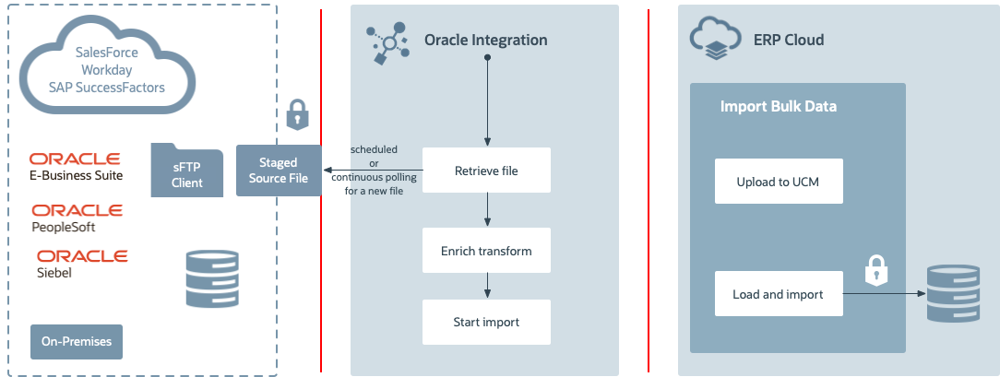

# File Based Data Import (FBDI) Import

## Introduction

This lab walks you through the steps to create Integration flow.

This use case uses Oracle Integration and ERP Cloud Import bulk data services with File Based Data Import (FBDI) complaint files.
The goal is to import ERP data such as account payable invoices using processes in ERP Cloud.

The typical flow of this use case is:

1. The user uploads an FBDI based account payable invoice file to an FTP Server.
2. Oracle Integration imports the account payable invoice file into the ERP Cloud.

This labs will explore the ERP Cloud adapter and File Adapter features and lets you know how to perform the following tasks:
 1. Read files from an SFTP Server
 2. Synchronize account payable invoices into the ERP Cloud

  The following diagram shows the runtime interaction between the systems involved in this use case:
  

Estimated Time: 30 minutes

### Objectives

In this lab, you will:

* Understand how to subscribe to business events in Oracle ERP cloud leveraging out of the box ERP cloud
  adapter capabilities
* Connect to file server to write data records

### Prerequisites

This lab assumes you have:

* All previous labs successfully completed.


## Task 1: Create FBDI file

1. [Download the Invoice Import Template Spreadsheet](files/GSEPayablesStandardInvoiceImportTemplate.xlsm)
2. [Download the APTEST.PROPERTIES file](files/APTEST.PROPERTIES)
3. Open GSEPayablesStandardInvoiceImportTemplate.xlsm (You can not open and edit this template if you are using Mac)
    This spreadsheet contains macros and you might get a security warning. Select the option to enable the content.
4. Open the ```AP_INVOICES_INTERFACE``` sheet and update the following fields with unique random numbers:
* Invoice ID
* Invoice Number

For example, you can use your user number concatenated with the current date.
Enter the data in each cell, do not copy and paste it. This is to preserve the data type of each column. If you change the data type, this lab will fail.
5. Save the file.
You might get a warning message about the macros used in this spreadsheet. Accept the message.
6. Open the ```AP_INVOICE_LINE_INTERFACE``` sheet.
7. Enter the same invoice IDs that you used in the ```AP_INVOICES_INTERFACE``` sheet.
8. Save the file, Open the Instructions and CSV Generation Sheet and click Generate CSV file.
A file browser dialog appears.
9. Name the zip file as ```apinvoiceimport.zip```, save the ```AP_INVOICES_INTERFACE``` file as ApInvoiceInterface.csv
10. Save the ```AP_INVOICE_LINE_INTERFACE``` file as APInvoiceLinesInterface.csv
11. Close the GSEPayablesStandardInvoiceImportTemplate.xlsm file
12. From File Explorer, copy the APTEST.PROPERTIES file to the apinvoiceimport.zip file.

Please note that zip file should contain three files:ApInvoiceInterface.csv, ApInvoiceLinesInterface.csv and APTEST.PROPERTIES and all of them in under root folder only, no sub folders.

Note: Failing to copy the APTEST.PROPERTIES file will prevent the import payables job from running.

Note: For the purpose of this lab we won't change the values for the Business Unit, Supplier Name, Supplier Number, and Supplier Site fields in the AP_INVOICES_INTERFACE sheet. If you want to change them in the future, make sure that the values you provide match the values in the ERP instance. If you change the business unit or the source, you must also update the properties file

You may now **proceed to the next lab**.

## Learn More

* [Getting Started with Oracle Integration 3](https://docs.oracle.com/en/cloud/paas/integration-cloud)
* [Using the Oracle ERP Cloud Adapter with Oracle Integration 3](https://docs.oracle.com/en/cloud/paas/integration-cloud/erp-adapter)

## Acknowledgements

* **Author** - Subhani Italapuram, Director Product Management, Oracle Integration
* **Contributors** - Kishore Katta, Director Product Management, Oracle Integration
* **Last Updated By/Date** -
