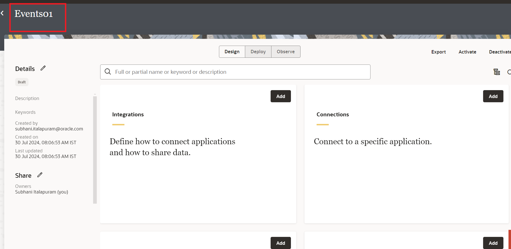
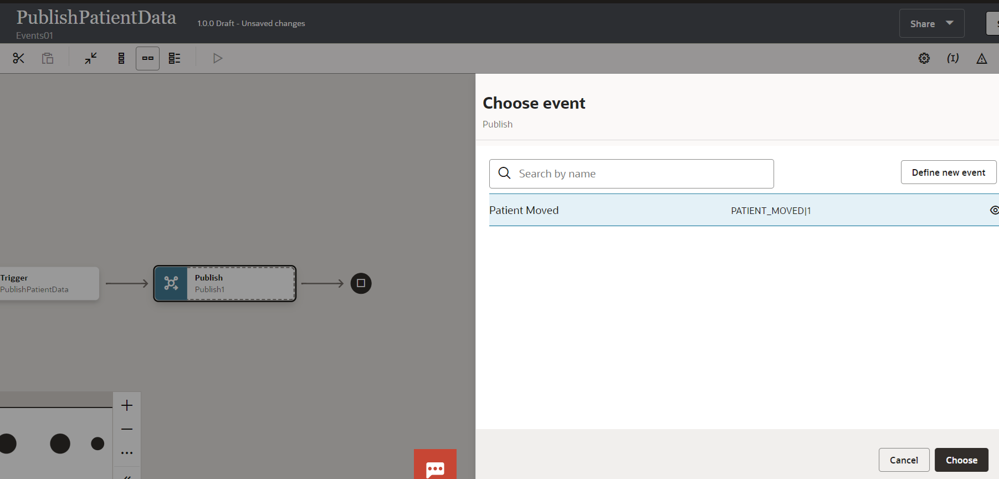
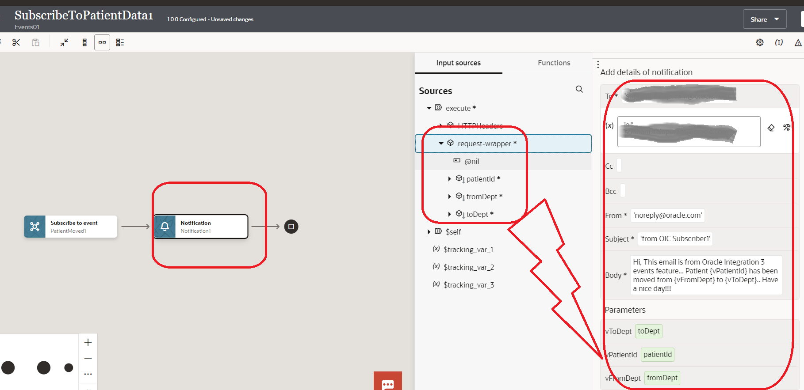
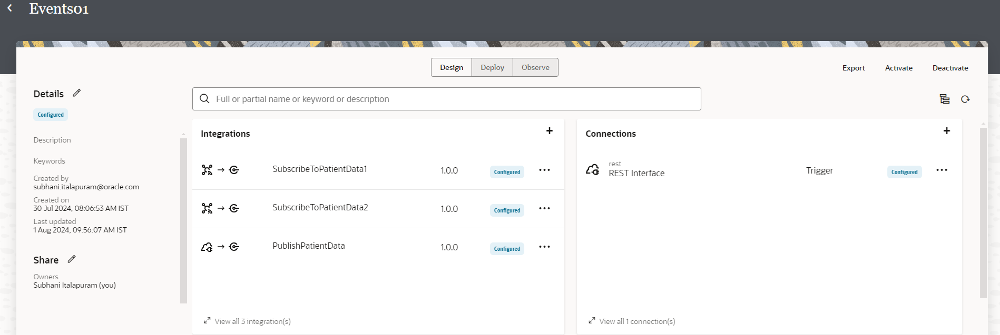

# Design Integration Flows

## Introduction

You can create and select events for publishing and subscribing to in integrations in a project in Oracle Integration. You define the events in JSON-formatted or XML schema files. This section provides an overview of the event design life cycle and describes event restrictions.

The process you follow to create, publish, and subscribe to an event in a project is the same as outside of a project. The only difference is that the events and integrations are only available within that specific project.

Estimated Time: 30 minutes

### Objectives

In this lab, you will:

* Create a project
* Create a REST connection
* Create an event
* Create an event publishing integration
* Create an event subscription integration

### Prerequisites

This lab assumes you have:

* All previous labs successfully completed.

### Restrictions

* A maximum of 50 integrations can subscribe to events per service instance.

## Task 1: Create a Project

1. In the left Navigation pane, click ***Projects***, Click ***Add***, Click ***Create***.
2. Enter the following information and Click ***Create***.

    | **Field**          | **Description**          |
    | --- | ----------- |
    | Name | **Events** + ***Append with OIC User Name or some unique number*** |
    | Description | Provide a meaningful description so that others can understand the project.|
    | Anyone can edit, view, and monitor |1. Select this option to allow anyone to edit, view, and monitor resources in the project. You can always restrict access at a later time.2.Don't select this option if you want to restrict access to editing, viewing, and monitoring resources in this project.After project creation, you can select the specific groups and users to which to provide access|

Your new project page is displayed. You can now add integrations, connections, lookups, and JavaScript
libraries to the project.
    

## Task 2: Create REST Connection using REST adapter

Create a connection with the REST Adapter.

1. In the left Navigation pane, click ***Projects***, click the project name or click 
2. In the **Connections** section, click **Add** to create a new connection.
3. In the *Create Connection* dialog, select the **REST** adapter. To find the adapter, enter *REST* in the search field. Click on the highlighted adapter.
4. In the *Create Connection* dialog, enter the following information and click on ***Create***:

    | **Field**        | **Value**          |
    | --- | ----------- |
    | Name         | REST Interface     |
    | Role         | Trigger       |
    | Description  | REST Interface Connection for OIC LiveLabs |
    | Share with other projects | You can enable this option if you want to share this connection with other projects |

    Keep all other values as default.

5. In the *Configuration* page, enter the following information:

    | **Field**  | **Values** |
    |---|---|
    |Security Policy | OAuth 2.0 Or Basic Authentication |

6. OR You can also use shared connection if connection was create in some other project and shared with other projects.
7. Click on ***Test***  and wait until you receive a confirmation box that the test was successful.
8. Click ***Save*** and wait for the confirmation box. Exit the connection canvas by clicking the back button on the top left side of the screen.

## Task 3: Create an Event

You can create events that you publish in an integration and subscribe to in another integration. The contents of the event must be in JSON or XML schema format.

1. In the left Navigation pane, click ***Projects***, click the project name or click 
2. Scroll down to the **Events** section at the bottom, In the **Events** section, click **Add** to create an event.
The Define new event panel opens.
3. Enter a name ***Patient Moved**** and optional description, then click ***Continue***.
The Define event structure panel opens.
4. From the **Structure type** list, select an option:
    * Select JSON Sample to upload a JSON file or drag and drop a JSON file into the box, then click Create. You can also manually edit the JSON sample provided below to create your file contents.
    Provide the below JSON and Click ***Create***
    * OR Select XML Schema to upload an XML schema file or drag and drop an XML schema file into the box, then click Create.

    ```
    <copy>
    {
        "patientId": "value1",
        "fromDept": "value1",
        "toDept": "value1"
    }
    </copy>
    ```

The event is displayed on the Events page
    
The event is available for publishing in an integration

## Task 4: Create an Integration to publish the data

You can create an integration that publishes an event. Running the publishing integration enables subscribing integrations to subscribe to this event. This section provides an example of how to create a publishing integration.

1. In the left Navigation pane, click ***Projects***, click the project name or click 
2. In the **Integrations** section, click **Add** to create an event.
The Define new event panel opens.
3. On the **Add integration** dialog, click on ***Create***.
4. On the **Create integration** dialog, click on ***Application***.
5. In the **Create integration** dialog, enter the following information

    | **Element**          | **Value**          |
    | --- | ----------- |
    |Name | **PublishPatientData** |
    |Description | This integration shows you how to publish the data to an event |

    Accept all other default values.

6. Click ***Create***.
7. Click on Horizontal to change the layout to Horizontal

## Task 5: Create the REST Trigger

1. Search for the **REST Interface** connection which you have created in the previous Task and click on it. This invokes the REST  Adapter Configuration Wizard.
2. On the **Basic Info** page,
     * for the **What do you want to call your endpoint?** element, enter ***PublishPatientData***
     * for the **What does this endpoint do?** element, enter ***This endpoint defines the REST interface.***
     * Click ***Continue***.
3. From the **Resource Configuration** page,
    * for the **What does this operation do?** element, enter ***Publish patient data.***
    * for the **What is the endpoint's relative resource URI?**, enter ***/patient***
    * for the **What action do you want to perform on the endpoint?**, enter ***POST***
    * Select ***Add and review parameters for this endpoint*** checkbox
    * Click ***Continue***.
4. From the **Request Parameters** page, in the **Specify Query Parameter section**, click ***Add***
A new row appears.
    * Enter ***patientId*** in the **Name** column and select ***string*** from the **Date Type** column
    * Click ***Add***, Enter ***fromDept*** in the **Name** column and select ***string*** from the **Date Type** column
    * Click ***Add***, Enter ***toDept*** in the **Name** column and select ***string*** from the **Date Type** column
    * Click ***Continue***.
5. Review the summary and click ***Finish***.
6. Click ***Save*** to persist changes.

## Task 6: Publish the data to an event

1. Hover over the outgoing arrow for the **PublishPatientData** activity (after first activity) and Click the ***+*** sign in the integration canvas.
Search for the **Publish event** connection which you have created in the previous Task and click on it. This invokes the Publish event configuration Wizard.
2. Select the event which you have created in the previous tasks and click on ***Choose***
    

3. Review the summary and click ***Finish***
4. Click ***Save*** to persist changes
5. If required, click on Zoom out/in to view the complete flow.

## Task 7: Define the Data Mapping

A map action named PATIENTMOVED1 is automatically created. We will define this data mapping.

1. Select the action **Map PATIENTMOVED1** and click on **...** and click on **Edit**
2. In the Source section, expand **PublishPatientData Request** and then expand **Query Parameters**
3. In the Target section, expand the **PATIENTMOVED1 Request**, expand **Request Wrapper**
    * Map the ***Patiend Id*** field from the source section to the ***Patiend Id*** of target section.
    * Map the ***From Dept*** field from the source section to the ***From Dept*** of target section.
    * Map the ***To Dept*** field from the source section to the ***To Dept*** of target section.
    * Click on ***Validate***
    A confirmation message appears.
    * Click ***&lt; (Go back)***
    * Click ***Save*** to persist changes.

    

## Task 8: Define Tracking Fields

Manage business identifiers that enable you to track fields in messages during runtime.

1. Click on the ***(I) Business Identifiers*** menu on the top right.
2. From the **Source** section, expand ***execute*** &gt; ***QueryParameters***. Drag the ***patientId*** field to the right side section:
3. Click on the ***(I) Business Identifiers*** menu on the top right again to close Business Identifier section
4. Click ***Save***.
    
5. Click on ***&lt; (Go back)*** button.

## Task 9: Activate the Integration

1. On the **Integrations** page, click on the ***...*** icon of **PublishPatientData** Integration and click on the ***Activate***
2. On the **Activate Integration** dialog, select **a tracing level** to ***Audit***
3. Click ***Activate***.

    The activation will be complete in a few seconds. If activation is successful, a status message is displayed in the banner at the top of the page, and the status of the integration changes to **Active**.

## Task 10: Run the Integration - Come back to this task again

Refresh your page after few seconds.

1. Select **PublishPatientData**,  Click on **...(Actions)** menu and Click on ***Run***
2. Configure the URI parameters:

    * for **PatientId**, enter ***123***
    * for **FromDept**, enter ***456***
    * for **ToDept**, enter ***789***

3. Click ***Run*** (in the upper right of the page).
4. Look at the Response section to verify the BIP report results and verify the Status is 200 OK
5. Click the link which appears on top to track the instance.
The track instance page appears. The Integration state should be processing or successful.
OR you can also track by clicking on ***Home***, ***Observability*** and ***Instances***

## Task 11: Subscribe to Events in an Integration : Subscriber1
You can create an integration that subscribes to published events. The subscribing integration event is triggered when the integration publishing the event is run. Multiple integrations can subscribe to the same published event. This section provides an example of how to create a subscription integration.

1. In the left Navigation pane, click ***Projects***, click the project name or click 
2. In the **Integrations** section, click **Add** to create an integration flow.
The Define new event panel opens.
3. On the **Add integration** dialog, click on ***Create***.
4. On the **Create integration** dialog, click on ***Event***.
5. In the **Create integration** dialog, enter the following information

    | **Element**          | **Value**          |
    | --- | ----------- |
    |Name | **SubscribeToPatientData1** |
    |Description | This integration shows you how to subscribe to an event |

    Accept all other default values.

6. Click ***Create***.
7. Select ***Patient Moved*** event, click on ***Choose*** and click on ***Finish***
8. Click on Horizontal to change the layout to Horizontal
9. Hover over the outgoing arrow for the **SubscribeToPatientData1** activity (after first activity) and Click the ***+*** sign in the integration canvas and search for ***Notification*** and click on it.
    | **Element**          | **Value**          |
    | --- | ----------- |
    |To | **your email id** |
    |From | **noreply@oracle.com** |
    |Subject | **from OIC Subscriber1** |
    |Body | **Hi,This email is from Oracle Integration 3 events feature...Patient {vPatientId} has been moved from {vFromDept} to {vToDept}..Have a nice day!!!** |
    |Parameter **vPatientId** | **drag and drop patiendId from Sources-->request-wrapper** |
    |Parameter **vToDept** | **drag and drop fromDept from Sources-->request-wrapper** |
    |Parameter **vFromDept** | **drag and drop toDept from Sources-->request-wrapper** |

    
    > **Note:** Please put all the strings of email parameters in the double quotes

## Task 12: Define Tracking Fields

Manage business identifiers that enable you to track fields in messages during runtime.

1. Click on the ***(I) Business Identifiers*** menu on the top right.
2. From the **Source** section, expand ***execute*** &gt; ***request-wrapper***. Drag the ***patientId*** field to the right side section:
3. Click on the ***(I) Business Identifiers*** menu on the top right again to close Business Identifier section
4. Click ***Save***.
    
5. Click on ***&lt; (Go back)*** button.

## Task 13: Subscribe to Events in an Integration : Subscriber2

You can create an integration that subscribes to published events. The subscribing integration event is triggered when the integration publishing the event is run. Multiple integrations can subscribe to the same published event. This section provides an example of how to create a subscription integration.

1. On the **Integrations** page, click on the ***...*** icon of **SubscribeToPatientData1** Integration and click on the ***Clone*** and name it as **SubscribeToPatientData2**
2. On the **Integrations** page, click on the ***...*** icon of **SubscribeToPatientData2** Integration and click on the ***Edit***
3. Select the action **Notifcation** and click on **...** and click on **Edit**
4. Modify **Subject" to ***from OIC Subscriber2***
5. Click ***Save***.
6. Click on ***&lt; (Go back)*** button.
7. Your project should look like the screenshot given below.


## Task 14: Congratulations
Congratulations! You have invoked an integration from a web client using REST. On the Oracle Integration side, you've called a service, convert the response to JSON, and sent the data back to the web client.

You may now **proceed to the next lab**.

## Learn More

* [Getting Started with Oracle Integration 3](https://docs.oracle.com/en/cloud/paas/application-integration/index.html)
* [Using the REST Adapter with Oracle Integration 3](https://docs.oracle.com/en/cloud/paas/application-integration/rest-adapter/index.html)

## Acknowledgements

* **Author** - Subhani Italapuram, Director Product Management, Oracle Integration
* **Contributors** - Kishore Katta, Director Product Management, Oracle Integration
* **Last Updated By/Date** -
