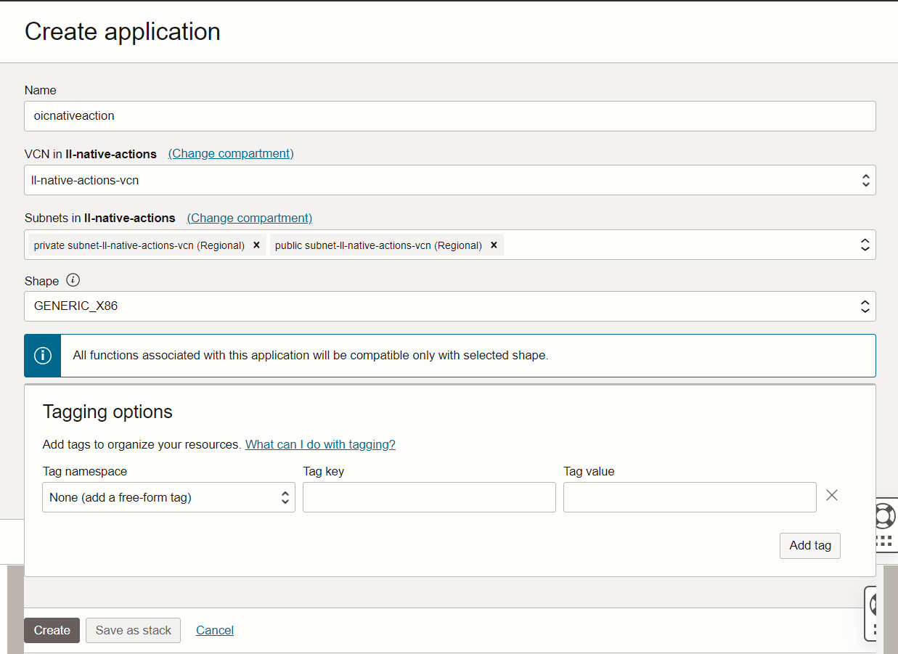
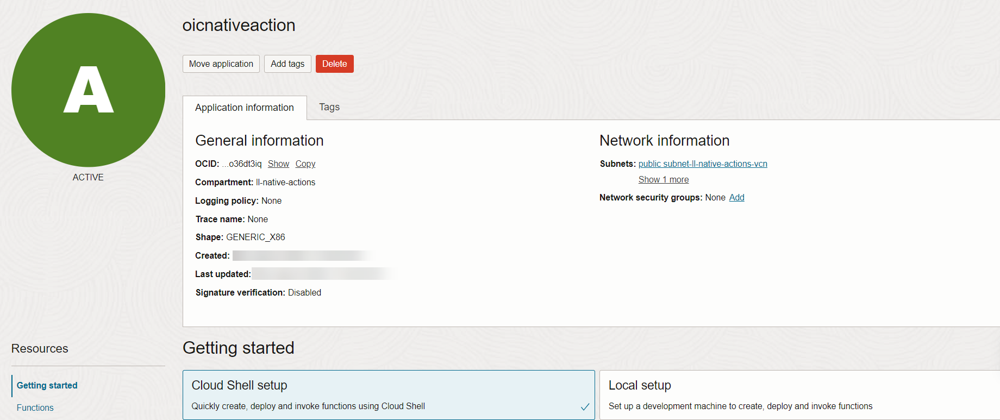

# Setup

## Introduction

This lab walks you through the pre requisite setup required to create a function application and deploy the function.

Oracle Functions is a fully managed, highly scalable, on-demand, Functions-as-a-Service platform, built on enterprise-grade Oracle Cloud Infrastructure and powered by the Fn Project open source engine. Use Oracle Functions (sometimes abbreviated to just Functions) when you want to focus on writing code to meet business needs. You don't have to worry about the underlying infrastructure because Oracle Functions will ensure your app is highly-available, scalable, secure, and monitored. With Oracle Functions, you can deploy your code, call it directly or trigger it from OIC, and get billed only for the resources consumed during the function execution.


Estimated Time: 45 minutes

### Objectives
In this lab, you will:
- Setup Function prerequisites
- Create a function application
- Modify the boilerplate code generated function application using Python.
- Deploy the function

### Prerequisites
This lab assumes you have:
- Completed all the previous labs

## Task 1: Create a function application

1.  Sign in to the OCI Console as a functions developer.

2.  Open the navigation menu, click *Developer Services*. Under **Functions**, click *Applications*

3.  Select the region you're using with OCI Functions.

4.  Select the same compartment (example: ll-native-actions) you have used to provision OIC instance in the previous lab. We will create the Function application in the same compartment.

5.  Click *Create Application*

6.  Specify:
      - **oicnativeaction** as the name for the new application. You'll deploy your first function in this application, and specify this application when deploying/invoking the function.
      - The VCN and subnet in which to run the function. Select the **public subnet** in the VCN **ll-native-actions-vcn** , and a **private subnet** in the same VCN.
      - Leave the shape with defaults



7.  Click **Create**

## Task 2: Set up your Cloud Shell dev environment

We will use OCI Cloud Shell environment to develop and deploy our function

1.  Click the **oicnativeaction** function application you just created to display the application details page.

2.  Click the *Getting Started* link, and then click *Cloud Shell Setup*. Duplicate a browser window to copy paste few commands in cloud shell as we follow through the next steps.



**Tip:** The Getting Started page now displays commands tailored specifically for you. You copy and paste these commands to configure your Cloud Shell environment for functions development.


3.  Click *Launch Cloud Shell* to display the Cloud Shell terminal window. Make sure the Network is selected as public in the green banner.

## Task 3: Set up Fn Project CLI context

Copy and paste commands from the Getting Started page into the Cloud Shell terminal window to configure your environment, as follows:

1.  Find the name of the pre-created Fn Project context for the current region in which you created the application:

    ```
    <copy>
    fn list context
    </copy>
    ```
    At least two Fn Project contexts are returned, a default context and a context for the current region (for example, named us-phoenix-1).

2.  Set the Fn Project context to use the region context. where <region-context> is the context for the current region. For example:

    ```
    <copy>
    fn use context <region-context>
    </copy>
    ```

3.  Configure the Fn Project context with the OCID of the current compartment that will own deployed functions:

    ```
    <copy>
    fn update context oracle.compartment-id <compartment-ocid>
    </copy>
    ```

    The current context should be updated.

4.  Configure the Fn Project context with the Oracle Cloud Infrastructure Registry address in the current region and tenancy that you want to use with OCI Functions. Provide a unique repository name suffix (for example: oic-native-actions-repo) to distinguish your function images

    ```
    <copy>
    fn update context registry <region-key>.ocir.io/<tenancy-namespace>/<repo-name-prefix>
    </copy>
    ```
    where <repo-name-prefix> for example: is a prefix of your choosing for the Oracle Cloud Infrastructure Registry repository in which to store images for the function

5.  Configure the Fn Project context with the OCID of the compartment for repositories to and from which you want OCI Functions to push and pull function images, by entering:

    ```
    <copy>
    fn update context oracle.image-compartment-id <compartment-ocid>
    </copy>
    ```
    If you do not specify a value for oracle.image-compartment-id, OCI Functions pushes and pulls images to and from repositories in the root compartment.

## Task 4: Generate Auth token

In continuation to the above the next step is to generate auth token to login into registry

1.  Click *Generate an Auth Token* to display the Auth Tokens page, and click **Generate Token**.

2.  Enter a meaningful description for the auth token in the Generate Token dialog, and click *Generate Token*. The new auth token is displayed (for example, 6aN...6MqX).

3.  Copy the auth token immediately to a secure location from where you can retrieve it later, because you won't see the auth token again in the Console.

4.  Close the **Generate Token** dialog.

## Task 5: Log in to Registry

In continuation to the previous task the next step is to login to docker registry with the auth token generated. This step confirms that you have access and ready to register and deploy the function code.

1.  Copy the following command. Modify the command as per your tenancy namespace, username and region key.

    ```
    <copy>
    docker login -u '<tenancy-namespace>/<user-name>' <region-key>.ocir.io
    </copy>
    ```

2.  When prompted for a password, enter the Oracle Cloud Infrastructure auth token that you created and copied earlier.
    You should see login succeeded message. You're now ready to start creating, deploying, and invoking functions.

3.  Execute the below to confirm function apps are listed

    ```
    <copy>
        fn list apps
    </copy>
    ```

    You should see function apps in the respective compartment displayed

## Task 6: Create and Deploy your function

In this section we will initialize function workspace which generates a boilerplate code in python. We will create our excel to csv function code in python. We will make some modifications as per the code in the artifact provided. [Download](https://objectstorage.us-phoenix-1.oraclecloud.com/p/AAq_5pNpZL8ly52JkSs1x2l6WCypVSEC-Zs6m3XGXG5zpcMk-SooTr4EPEBF787Z/n/oicpm/b/oiclivelabs/o/oic3_native-actions.zip) lab artifacts to your desktop and unzip the file.


1.  In the **Cloud Shell** command line execute the below commands to create a directory  and initialize the workspace.

    ```
    <copy>
      mkdir functions
      cd functions
      fn init --runtime python convert2CSV
      cd convert2CSV
      ls
    </copy>
    ```
    You should see 3 files func.py, func.yaml, requirments.txt files created.

2.  From the developer tools at the top banner, open **Cloud Editor**.


3.  Select **func.py** file. On th eright hand side code editor sample boilerplate code is available. Replace the entire code with code snippet in the downloaded artifacts (func.py file) and save.

4.  Select the **requirements.txt** file. In the boilerplate code generated, replace with the below snippet and save the code.

    ```
    <copy>
    fdk>=0.1.86
    oci
    openpyxl
    </copy>
    ```

5.  Enter the following single Fn Project command to build the function and its dependencies as a Docker image called **convert2CSV**, push the image to the specified Docker registry, and deploy the function to OCI Functions in the **oicnativeaction** application that you created earlier:

    ```
    <copy>
    fn -v deploy --app oicnativeaction
    </copy>
    ```
Note: The function image build might take a bit because of some pre req py libraries.


6.  Confirm that the function has been deployed to OCI Functions by clicking Functions (under Resources on the details page for the **oicnativeaction** application) and noting that the **convert2CSV** function now appears.


You may now **proceed to the next lab**.

## Learn More

* [Setup Your Tenancy with Functions Pre-Requisites](https://docs.oracle.com/en-us/iaas/Content/Functions/Tasks/functionsquickstartcloudshell.htm)

## Acknowledgements
* **Author** - Kishore Katta, Director Product Management - Oracle Integration & OPA
* **Last Updated By/Date** - Kishore Katta - January 2025
