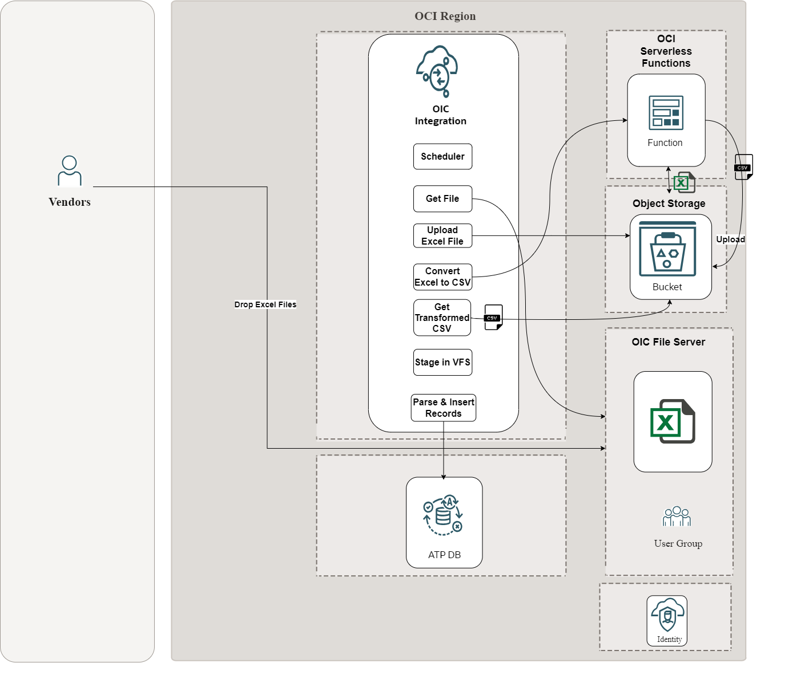

# Introduction

In today's fast-paced business environment, the ability to efficiently manage and process data is crucial for maintaining a competitive edge. For many organizations, including global retailers like GlobeShoppe Inc., data is generated and stored in various formats across different systems. To streamline operations and enable real-time decision-making, these organizations must integrate and process this data seamlessly.

This workshop will guide you through an end-to-end integration flow using Oracle Integration (OIC) to automate the transfer, conversion, and processing of Excel files stored on a File server. By leveraging native actions in OIC to invoke Oracle Cloud Infrastructure (OCI) services, you can create a robust and scalable solution for your data integration needs.

**Business Scenario:**

Imagine GlobeShoppe Inc., a global retail company with regional offices that maintain daily records of inventory, sales, and shipments in Excel files. These files are stored on a centralized File server, making manual processing time-consuming and error-prone. To overcome these challenges, GlobeShoppe Inc. aims to automate the entire process, from transferring files to converting and processing them for real-time analytics and reporting.

In this workshop, we will implement a seamless and automated integration flow using Oracle Integration Cloud (OIC) to transfer, convert, and process Excel files stored on an FTP server. Below is a detailed description of the functional flow for the integration steps:

**Listing Files on the File Server:**
  - The process begins with a scheduled orchestration in OIC that triggers at specified intervals.
  - Using OIC’s native file server action, the orchestration lists all the Excel files available on the embedded File server.

**Processing Files in Iteration:**
  - For each file listed, OIC uses the file server native action to obtain a file reference.
  - The file is then pushed to an OCI Object Storage bucket (named bucket-excel) using OIC’s native Object Storage action. This temporary storage serves as a staging area for the file conversion process.

**Invoking the Excel-to-CSV Conversion Function:**
  - Once the Excel file is stored in a bucket ex: bucket-excel, OIC invokes a serverless function hosted in Oracle Cloud Infrastructure (OCI).
  - The function is responsible for converting the Excel file to CSV format. It processes both .xlsx and .xls files.
  - After conversion, the function pushes the resulting CSV file to a target Object Storage bucket (named bucket-csv).

**Reading and Staging the CSV File in OIC:**
  - The final step involves OIC picking up the newly generated CSV file from bucket-csv.
  - The CSV file is read and staged in OIC using the stage file action, preparing it for further data processing and integration tasks, such as updating a database or generating reports.

## About this Workshop

This hands-on workshop is designed to equip you with the knowledge and skills to automate data workflows by integrating Oracle Integration (OIC) with Oracle Cloud Infrastructure (OCI) services.

In this workshop, you will learn how to:

1.  Transfer Excel Files from an FTP Server to OCI Object Storage
2.  Convert Excel Files to CSV Using an OCI Serverless Function
3.  Process CSV Files in OIC

Note: Inserting records into database is out of the scope of this workshop. However, feel free to play around with the transformed data and push it to the downstream systems.

Here is the high level architecture reference of the workshop

Estimated Time: 3 hours

### Objectives

Here are some high-level objectives for the workshop on Oracle Integration using native actions:

1.  Understand OIC Native Actions
    - Gain insights into the capabilities of OIC native actions and how they can be used to integrate with OCI services effectively
2.  Automate File Transfer
    - Learn how to configure OIC to list and download Excel files from a File server and upload them to OCI Object Storage
3.  Implement Serverless Functions
    - Deploy and use an OCI serverless function to convert Excel files to CSV format.
4.  Process CSV Files in OIC
    - Discover functions, how to pick up, stage, and finally process CSV files within OIC
5.  Hands-on activities and exercises
    - Provide hands-on exercises to practice usage of native actions to invoke file server, object storage and serverless functions.

By the end of this workshop, you will have a comprehensive understanding of how to leverage OIC's native actions to invoke OCI services, creating a seamless and automated integration design.

**High level workflow of the Workshop**

### Prerequisites

This lab assumes you have the following:
* Oracle Cloud Account with credits to provision services.
* Access to Oracle Cloud Infrastructure (OCI) with permissions to create and manage serverless functions and Object Storage buckets.

You may now **proceed to the next lab**.

## Learn More

* [Oracle Integration 3 Documentation](https://docs.oracle.com/en/cloud/paas/application-integration/index.html)
* [Oracle Integration 3 Native Actions](https://docs.oracle.com/en/cloud/paas/application-integration/integrations-user/add-actions-app-driven-orchestration-integration.html#GUID-63CCAB23-A32C-4655-9490-191A011E9EEA)

## Acknowledgements
* **Author** - Kishore Katta, Oracle Integration Product Management
* **Last Updated By/Date** - Kishore Katta, August 2024
