# Create Decision Model

## Introduction

This lab shows you how to create a Decision Model and configure in a Structured Process

In the first application, you had to:  
-	Create a travel request by entering the necessary data, and submit it for approval
-	Approve or reject the travel request.

In the modified example, in addition to the previous steps, you will also need to:
-	Create a rule that will make an automatic approval for travel requests to India or France IF the amount is  less than
	1000 USD OR if there is at least 2 weeks advance notice.
-	Activate the Decision Model
-	Add a step to the process so that it checks with the newly activated Decision Model.
-	Send some traffic to test the Rules

Estimated Time: 60 minutes

### What is a Decision Model?
In business, decisions are everywhere. Should this loan application or document change be approved? Should emergency vehicles be dispatched to this incident? How many bonus shopping points is this shopping cart worth?

Create decisions to automate the decision logic inherent in your business process. As part of creating decisions, define their input, model their logic using simple and complex types, test them, expose them as services, and use them in processes within your application.

### Objectives

In this lab, you will:
* Create a Decision Model
* Re-use the Travel Request application created in the previous lab
* Modify the Travel Approval process so that it leverages your Decision Service for ex: If a Travel is for
	a particular set of country destinations, and the amount is below a certain threshold, no management approval will be needed

### Prerequisites

This lab assumes you have:
* Successfully Completed and Executed Lab1 - Create Structured Process Application till Task 12

## Task 1: Create a Version

> **Note:** Ignore this section if you have successfully completed all the tasks of the Lab1 including the Optional Tasks

Before starting of with the new changes it is a good practice to version your application.

You can create a new version of an application at any time. The new version retains the same application name (although you can change it later) but has a different version tag, such as 1.1 versus 1.0. Once activated, application versions become different applications.

You can activate multiple application versions, but an application has only one default version, and that version is displayed by default in Workspace’s Start Requests. When you activate a version, you specify if it's the default version.

1.	In Designer, open the **Travel Request Application**

2.	From the breadcrumbs, display the Versions popup by clicking versions after the version indicator
		The selected version is listed at the top. The green dot displays next to the default version.

3.	Create a new version by Clicking on *New Version*.
 		In the **New Version** pane accept the default Version Tag and Click on *Create*. A new version of application (1.2) is created and now marked as default application
		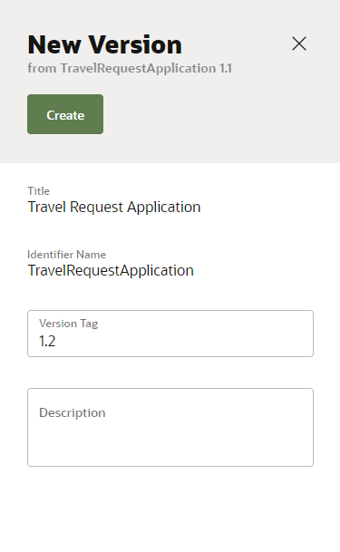

## Task 2: Modify Webform

You will modify the **Travel Request** web form to accommodate few UI changes such as **Country of Destination** in both Main form and Managers View Presentation.

> Note: Make sure you using the newly created version 1.2

1.	Select the *Travel Request Form*

2.	In the **Default** presentation view, Drag and drop a *Select* component and provide **Name** as
		*countryOfDestination*
		

		Select the **Country of Destination** in Properties pane select *Options Source* as **static** and provide
		the option Names and Values per below
		| Option Names | Option Values |
		| --- | --- |
		| Croatia | Croatia |
		| France | France |
		| India |India |
		| UK | UK |
		| US |US |

		Mark as **Required**

4.	In the **Manager View** presentation , Drag and drop an *Input Text* component from the Basic palette and
		provide **Name** as *countryOfDestination*. Select the existing binding *countryOfDestination* instead of using newly created binding. *Delete* the newly created binding from the **Data** pane below the properties. You will basically use the existing data object attribute. This is how you can manually bind fields to data attributes.
		Preview both the Presentations and make sure everything is fine.

		We don't want Approving manager to modify any specific fields hence make all the fields on the form as *Read Only*

## Task 3: Create a Decision Model

1.	In the process application page, click *Add*

2.	In the Add component pane, expand *Decisions*, and then click *Decision*. Enter a Title as **Travel Decision**. Click *Create*

3.	The Decision gets listed in the **Decisions** page

##	Task 4:	Understand the Graph View

1.	In Process Automation, decisions are created in the graph view. In the graph view, you can create decision requirement diagrams (DRD), in accordance with DMN standards, to visually represent your decisions.

2.	Process Automation currently supports one DRD per decision. The following table lists all the available DRD components, which you can use to create your decision.
		

3.	The graph view is divided into the following areas:
-	Toolbar : The decision toolbar provides quick access controls to manage the decision canvas.
-	Canvas : The decision canvas is the central area where you can create a diagram that represents your
					decision, using the elements in the diagram palette. The zoom controls at the bottom of the canvas allow you to zoom in or fit the canvas in your browser.
-	Diagram palette: From the diagram palette, drag and drop DRD components onto the canvas to use them in your
									diagram.
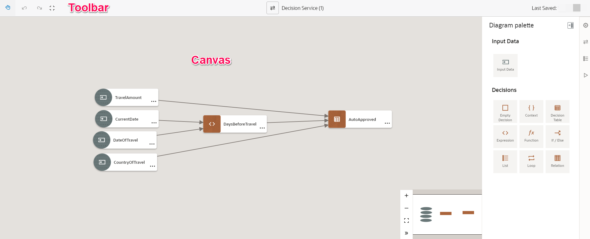

##	Task 5:	Create the Input Data Fields

Input Data fields can be of built-in or custom data types. You can leverage the fields in building decision logic

You will create all the required input data fields to be passed to decision logic.

1.	On the **Diagram palette**, select the *Input Data* element and drag it onto the canvas. Name it as
		**TravelAmount**.
		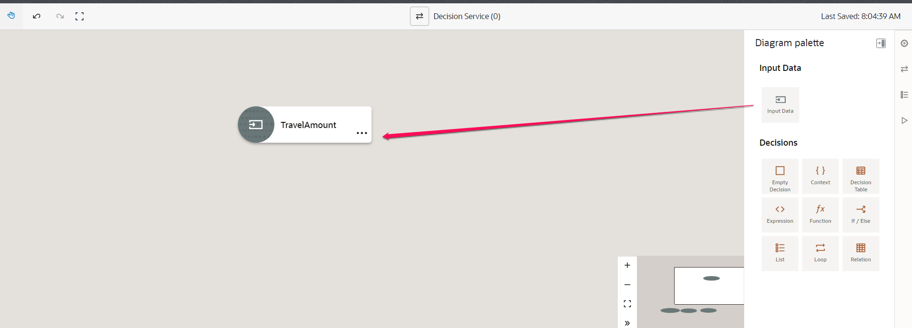
		Double click the *TravelAmount* field which brings up the **Input Properties** pane. Select the *mode* (type) as **number** and *Allowed Values* as **value**
		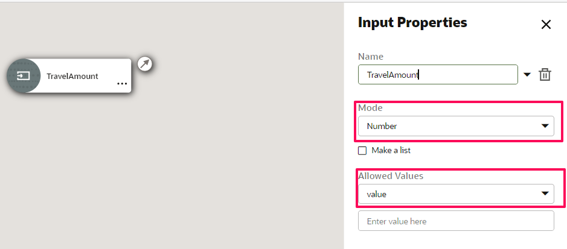

2.	Similarly, create other fields per below

| Field Name | Mode(Type) | Allowed Values |
| --- | --- | --- |
| CurrentDate | Date and Time | value|
| DateOfTravel | Date and Time | value|
| CountryOfTravel | Text | value|

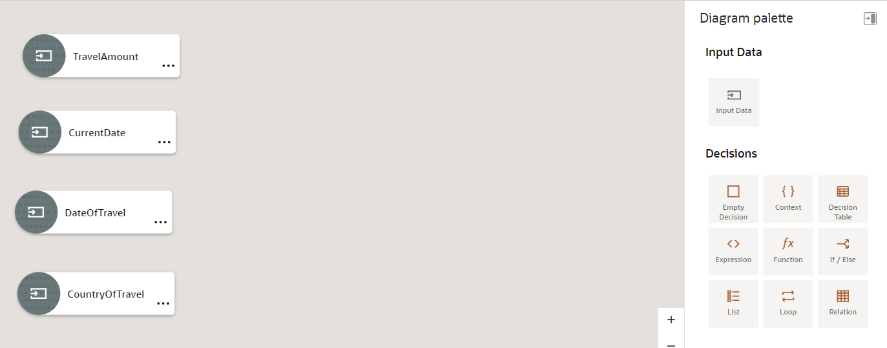

##	Task 6:	Create the Decision Logic

Model the decision logic by defining how each decision’s output is derived from its inputs. In Process Automation you have the following notations to model the logic within a decision

-	**Decision Tables**: Decision tables are the notation of choice to model complex logic. Their tabular layout helps you effectively document all the possible conditions and results of a problem.
-	**Expressions**: An expression is a logical notation, defined according to the syntax of FEEL, that evaluates to a single value. It may consist of one or more entities, such as a literal, constant, or variable, interconnected by zero or more operators. In Process Automation, you can also use outputs of other decisions or built-in functions to define an expression.
-	**If-Then-Else Statements**: An If-Then-Else expression is a logical notation that evaluates a test statement. It executes a primary expression if the test is true and a secondary expression if the test is not true. You can also introduce additional test statements using the Add Else If button.
-	**Functions**:	You can create functions to define specific operations that aren’t available through built-in functions. In Process Automation, decisions created using the Function notation return a value only when invoked from another decision.
-	**Contexts**: A context is a collection of one or more key-value pairs with an optional result field. Each pair is called a context entry. The key attribute within a context entry acts as an identifier to its corresponding value attribute.
-	**Lists**:	A list notation is a vertical list of elements, where each element is an independent logical notation. The output of a list notation contains outputs of all its elements. You can also invoke the output of a particular list element from another decision.
-	**Relations**:	A relation is a vertical list of similar contexts arranged horizontally. In other words, each row of a relation table is a context and each column consists of context entries, where the column name is the common key attribute for all cell entries under it that act as value attributes of respective contexts (rows).
-	**Loops**:	Create loops to iterate over lists or arrays. Using the loop logical notation, you can create three different types of loops, namely For, Some, and Every.

[Read more about Decision Logic Components](https://docs.oracle.com/en/cloud/paas/process-automation/user-process-automation/model-decision-logic.html)

### Create an Expression

This will allow us to define the number of days between the **current date** and the **date of Travel**

1.	Drag and drop **Expression** on to Decision Canvas. Name it **DaysBeforeTravel**

2.	Connect the **CurrentDate** input data field with the expression **DaysBeforeTravel**. Similary, connect
		**DateOfTravel** as well. It will make the input fields accessible with the expression definition.

3.	Double Click on the expression component and define expression as below
		**(DateOfTravel - CurrentDate) / duration("P1D" )**

		TIP: You can start typing few letters of the input data fields. The expression editor will list all the fields accessible and functions that can be used. Construct the expression as above.
		P1D means “in 1 day unit”. We are here calculating the number of days between today and the travel date.

### Create a Decision Table

1.	Drag and drop **Decision Table** on to Decision Canvas. Name it **AutoApproved**

2.	Connect **TravelAmount** and **CountryOfTravel** input data fields with **AutoApproved** Decision Table

3.	Connect **DaysBeforeTravel** expression component with **AutoApproved** Decision Table
		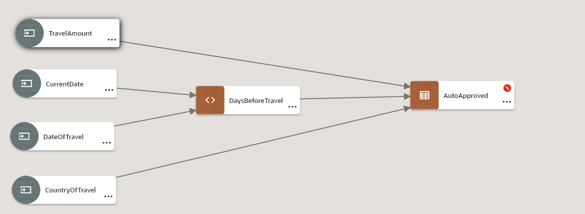

4.	Double click the **Decision Table**. You need to create a decision table with following Rules
		

5.	In the **Enter Expression** provide the **TravelAmount** input data variable

6.	Select the **TravelAmount** and add another column. In the newly added column **Enter Expression**
		provide the **Country of Travel** data variable. In the Enter Allowed Values Select the **Auto** icon which brings up the Decision Table Input dialog.
		TIP: Explore toolbar actions on the top to add/delete column/row
		

7.	In the **Decision Table Input** dialog provide **Mode** as *Text*, **Allowed Values** to be
		*list of Values*. Add values France and India. You will create rules for only 2 countries.
		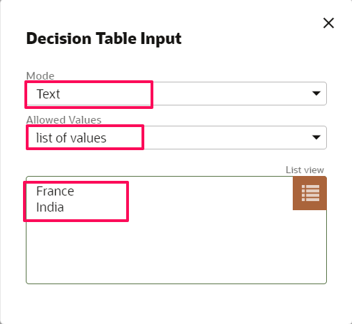

8.	Add another column next to **CountryOfTravel** and Select data Variable **DaysBeforeTravel**. Leave
		allowed values as empty.

9.	In the **Output** column name it as **AutoApproved**. In the **Enter allowed values** select the mode as
		**True or False**

10.	Click the *"U"* on the top left corner  and change the Hit policy to **First**
		

11. Create a new Rule by adding a row. Provide the values per below
		

12. Similarly, add more rows to define rules per below
		

> Note: on the last line, you see that do not need to repeat the countries, you can just type a “-“ (minus) sign. You should see no Errors in your Decision Table. If there are any Select the Error section and fix each of them

##	Task 7:	Test the Decision

After creating the decisions and supporting decisions within your decision model, you can verify that your decision model works the way you want by testing your model.

1.	Click *Test* icon in the Right hand side Task pane. In the Test Decision Model page provide test 		
		values for each of the input data fields.
		Enter values for all the required field:
	-	Dates should be entered in the form "2022-08-01" for August 1st, 2022 (without the double quotes). 	
		Enter a date interval of more than 15 days
	-	Enter an amount of 1200 USD
	-	Enter India as a country
	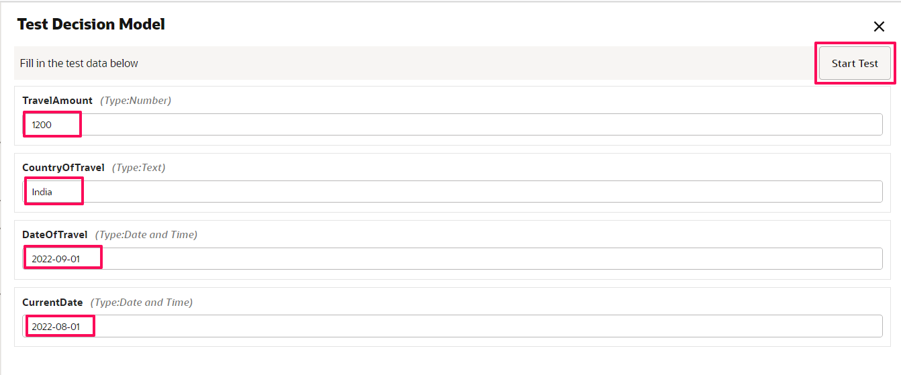

2.	Click on *Start Test* and evaluate your result. Check for a couple of conditions and make sure the
		result is as per the rules defined in the decision table

##	Task 8:	Expose Decision as Service

To use the decision you created for your application, you must add at least one decision service in the decision model before you use it. The decision service exposes one or more output decisions of your decision model as REST APIs. A decision service consists of a set of input data and a set of output decisions from the containing decision model. You can use the decision services in your process to implement a decision model.

1.	On the top of the decision editor, click *Decision Service* icon to open the Services
		pane. Optionally, you can access the Decision Service icon from the right side of the decision editor.
		Note that the number within brackets besides the Decision Service icon, indicates the number of services created for the decision.

2.	In the Services pane, click Add new service *Add new service* icon to open the Add Decision Service
		pane

3.	Enter a name for the decision service **TravelDecisionService** and click *OK*
		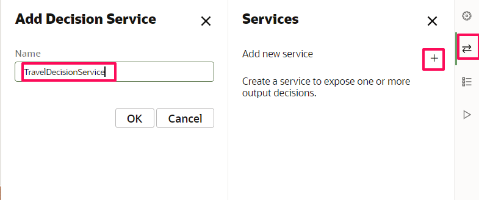
		The new service appears in the pane with two fields - Output Decisions and Input Data

4.	Click the *Output Decisions* field to select the output decision **AutoApproved** . This is the value
		we want to expose through the service

5.	Click the *Input Data* field to select the input data to expose through the service. You can add
		multiple values for the input data and the output decision.
		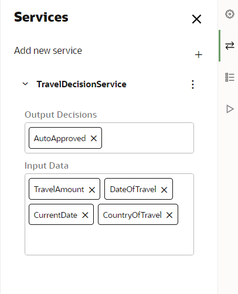

6.	Close the **Services pane**

KEY LEARNING POINT: You can create expressions and decision matrices that will allow the implementation of decision rules, based on valued passed to the engine, as well as calculated expression. This decision model is exposed as service, whose interface you have defined. Now, you need to modify your application so that your process can invoke the decision service exposed.

##	Task 9:	Add Decision Service to Process

After exposing decisions as services, you can use the decision services within your processes.

1.	Open the *Travel Request Process* where you want to add the decision service.

2.	In the BPMN palette, expand **Decision Service**. All the available decision services are listed under
		it. Note that only when you have one or more decision services created for your decision, you can see Decision Service in the BPMN palette. Otherwise, it won't be visible.
		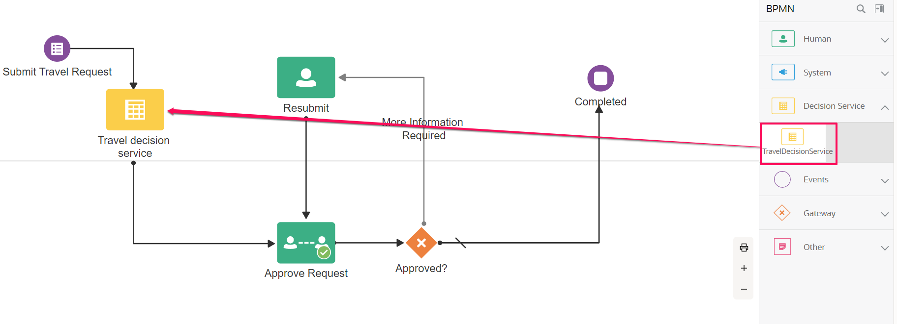

3.	Change the name of Decision model to *Auto Approve Decision* Decision

4.	Add an *Exclusive Gateway* to fork between **Auto Approved?** and management approval task
		-	Drag and drop from the right pane an **Exclusive Gateway**
		-	Add the proper  connectors so that your initial start task flows to the decision task, then to the Gateway
		-	From the gateway, the unconditional branch goes to the Management Approval  task, while the conditional
			branch goes to **Completed** event. Your process might look like this:
			

5.	Select the Decision and open **Data Association**. In the Input Mapping Map the fields from
		*Travel Request* Data Object to input field of Decision Service
| Travel Request Process | Auto Approve Decsion|
| --------- | -------- |
| travelReqDO.estimatedCostOfTravel | input.TravelDecisionServiceInput.TravelAmount |
| travelReqDO.startDateOfTravel | input.TravelDecisionServiceInput.DateOfTravel |
| travelReqDO.countryOfDestination | input.TravelDecisionServiceInput.CountryOfTravel |
| 'now' | input.TravelDecisionServiceInput.CurrentDate |

	
	Select *Apply*

6.	From the **Data Objects** Pane create a new Data object **autoApproveDO** and data Type as **boolean**
		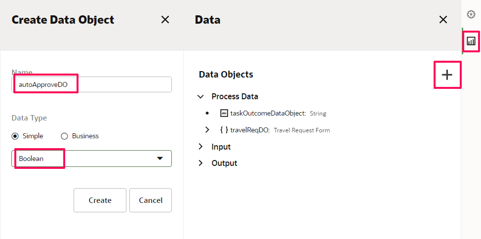

7.	Select the Decision and open **Data Association**. In the **Output** tab c.	Map the output of the
		Decision Model task (the Interpretation field)  to this newly created DataObject
		
		Select *Apply*

8.	Add the **Gateway** condition. Select the gateway branch that goes to **Completed** event, and edit
		it.	Provide the condition **autoApproveDO==true**

9.	The Green check mark at the top indicates there are no validation errors. If you notice any Errors
		select the Error pane and fix the same

##	Task 10:	Activate and Test the application

1.	Select *Activate*, Mark as **Default** and click on *Activate*

2.	After **Activation** is done you should see a snapshot created and Activation date. Select the
		**Test in Workspace** which will Navigate to the **Workspace**.

3.	From the **Start Requests** page. Launch the **Travel Request Application** and make sure the version
		is correct. Do a first test by entering the following values on your form:
		-	Enter any name  and  email.
		-	Enter a Travel amount of 1200 USD
		-	Enter a travel start date that is less than 15 days later than today
		-	Choose France as the Country.

4.	Navigate to **My Tasks**. Select **Team Tasks** from the drop down. You should see a approval request
		waiting for an action to be taken and should not be auto approved as per the decision logic. View the Travel Request information and make sure the **Managers View** is rendered as expected.

5.	Do a second test by entering the same values on your form, except the dates. This time choose a
		departure date at more than 15 days from today.
		Now, your Travel request should be auto approved, because trips for this country and with more than 15 days notice are auto-approved, regardless of the amount.

6. 	Navigate to the **Tracking** and View the Audit Information for both the request. Notice the
		difference between the execution path and view list of activities executed.

**Congratulations!** You have successfully completed this lab.

## Learn More

* [Model Decisions](https://docs.oracle.com/en/cloud/paas/process-automation/user-process-automation/model-decisions.html)

## Acknowledgements
* **Author** - Kishore Katta, Product Management, Oracle Integration & Process Automation
* **Last Updated By/Date** - Kishore Katta, August 2022
