# Create a Structured Process

## Introduction

This lab shows you how to create a Employee Uniform Request Process Workflow.

At this time, HCM Journeys is only designed to work with Structured Processes within OPA. The following steps should be taken when creating a structured process to be used with HCM Journeys.

When developing a structured process, your first step is to determine the people and roles required to complete each task that requires user interaction. You then use the various elements, such as human tasks, system activities, and other events, to design the flow of your process.

A structured process is a sequence of tasks that, after performed, results in a well-defined outcome. A process usually represents work that is performed within the context of a company or organization.

A structured process contains a start event, an end event, and possibly other flow elements. You can start your process from scratch (that is, with an empty start event), with a form, or when a message is received. Alternatively, you can select a pre-defined process pattern to begin creating a new process.

Note: BPMN is an industry standard notation for defining business processes. OPA supports BPMN 2.0.

Estimated Time: 45 minutes

### Objectives

In this lab, you will:
* Create Data Objects
* Consume Connectors
* Create Web Forms
* Add Roles
* Create Structured Process using BPMN activities
* Activate process application

## Task 1: Change Process Trigger Type

1.	On the Process Applications page Click *Add* and Select *Processes* &gt; *Structured*
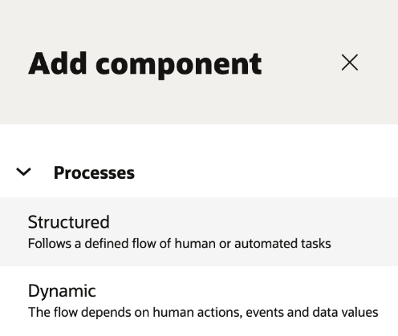

2.	Complete the following fields

| Field |	Description	|
| --- | --- |
| Title | Name of the Process e.g. UniformSelection|
| Identifier Name	 |	System generated value that can be edited. |
| Description | Process to request Employee Uniform |
{: title="Create Component Dialog Process"}

3.	Click *Create*. Open the Process.

4.  By default, a new process has a start event of type form. As the OPA process will be triggered by HCM Journeys, it is necessary to change this to message start. To do this click the *Start event* and then click the *Change type* icon from the top panel and select *Message Start*
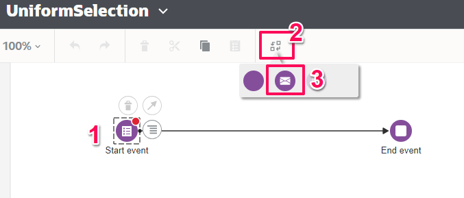
The message start event triggers a process instance when a message is received. This message can be sent from another business process or from a service, in this instance the HCM Cloud Journeys application.

## Task 2: Define Argument Definitions

Once the Message event type has been set, it is necessary to define the Argument Definitions been sent by HCM Journeys. Argument Definitions refer to the json payload fields been sent by the calling application.

1.  Click the *Start event*

2.  On the **Start event** menu, select *Open Properties*

3.  On the properties tab, under the **Argument Definitions** section select the *Plus* icon to add a new Definition
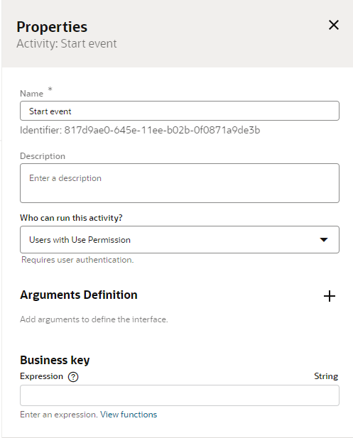

4.  For each of the values in the following table add a **Name** and **Type** corresponding **Argument Definition**
These input parameters will be sent by HCM Journeys whenever a process task is invoked and hence we need to add them as arguments.

| Argument Name |	Type	|
| --- | --- |
| workerJourneyTaskId | string|
| workerJourneyId |	string |
| personId | string |
| assignmentId |	string |
{: title="Start Event Arguments Definition"}

The final set of Arguments Definition will look like the following.

## Task 3: Create Data Objects
While flow elements are used to define the behavior of a structured process, data objects are used to define and store the information used by a process. Data Objects are variables that are defined during the modeling and implementation of a process. A process instance uses these variables to store specific information. At runtime, the process instance generates and stores specific values for these variables.

1.  Select the *Graph Icon* on the properties tab of the Process.

2.  Select *plus* icon to add a new Data Object

3.  For each for the values in the following table add a Name and Type corresponding **Data Object**.

| Data Object |	Type	|
| --- | --- |
| do_PersonId | string|
| do_userName |	string |
| do_displayName | string |
| do_emailAddress |	string |
| do_uniformGender | string|
| do_poloShirt |	string |
| do_jacket | string |
| do_sweatshirt |	string |
{: title="Data Objects"}

The final set of Arguments Definition will look like the following.
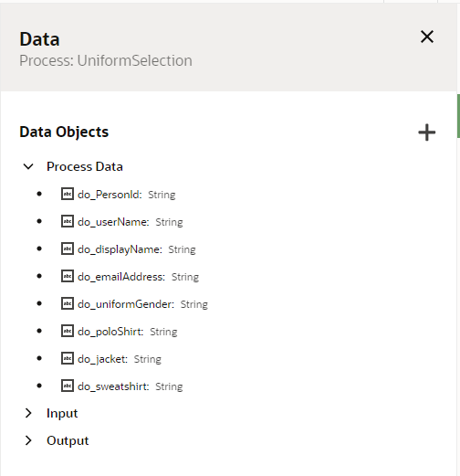

## Task 4: Map the Output of the Message Start
One of the values which is sent from HCM Journeys is the PersonId of the individual triggering the Journey task within HCM. This can be used to personalize and notify them to events within OPA as part of a process execution. To do this you need to retrieve the PersonId value from the Message start payload and map it to the do_PersonId Data Object created in the previous step.

1.  Click the *Start event*

2.  On the **Start event** menu, select *Open Data Association*
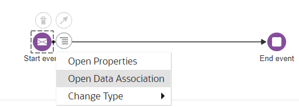

This will open the corresponding Data Mapper. The Data Mapper enables you to assign the value of a process data object, predefined variable, or literal to another data object or variable within the process.

3.  Expand the *Input* value in the left-hand panel. Select the *personId* value and drag it into the field string under **Start event**.

4.  Next expand the *Process Data* value on the right-hand panel. Select the *do_PersonId* value and drag on the field string under **UniformSelection** as shown below

The personId from HCM Journeys is now assigned to the data object do_PersonId.

Click on *Apply*

## Task 5: Add Connector (getWorkerDetails)
Next the Process will make a call back to HCM Cloud to retrieve further information on the worker using the retrieved personId value. This is done by invoking Connector defined in the earlier steps.

1.  On the Process tab, open the right hand menu to reveal the **Elements Palette**.

2.  Expand the Connectors menu item to display the previously created **HCM Cloud Connector**
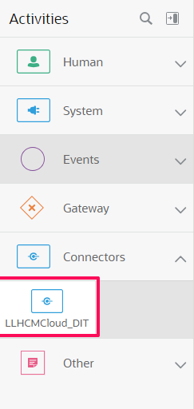

3.  Drag and drop the previously created Connector to the process behind the **Start event**.    

4.  Click the HCM Cloud element and Select *Open Properties*, change the name to **getWorkerDetails**

5.  Select the resource to be **workers**, and operation to be **getWorkers**
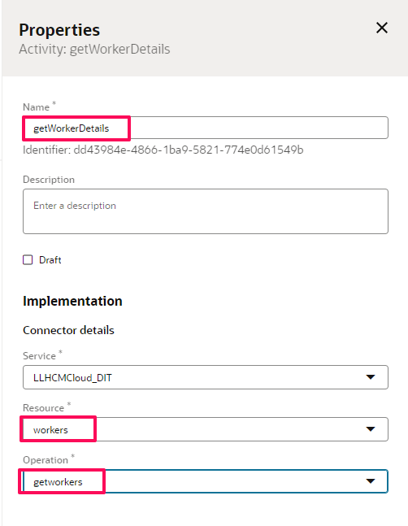

## Task 6: Complete Data Association – getWorkerDetails (request)
Next the values that need to execute the call to HCM will be mapped.

1.  Click the *getWorkerDetails* element, and select *Open Data Association*

2.  On the **Input** tab, enter the following values either by dragging and dropping or typing directly into the corresponding fields.

|  Uniform Selection |	getWorkerDetails	|
| --- | --- |
| "PersonId="+do_PersonId | input.q|
| "workRelationships.assignments,names,emails" |	input.expand |
{: title="getWorkerDetails Input Mapping"}

Next the values returned from HCM will be mapped to Data Objects.

## Task 7: Complete Data Association – getWorkerDetails (response)
Next the values returned from HCM will be mapped to Data Objects.

1.  On the **Output** tab, enter the following values either by dragging and dropping or typing directly into the corresponding fields.

|  getWorkerDetails |	Uniform Selection	|
| --- | --- |
| output.body.items[1].names[1].DisplayName	 | do_displayName |
| output.body.items[1].emails[1].EmailAddress	 |	do_emailAddress |
{: title="getWorkerDetails Output Mapping"}

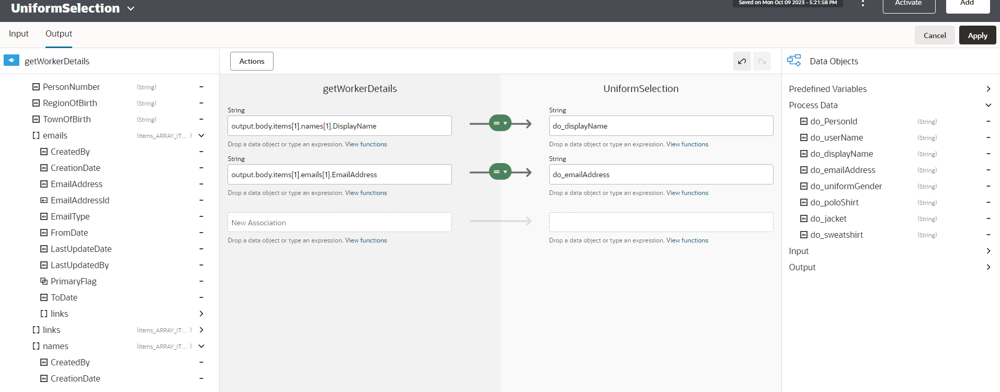
The field values for the workers name and email address are now stored as Data Objects within OPA and can be reference later in the process.

2.  Click *Apply*

## Task 8: Add Connector (getUserAccountName)
Next the Process will make a call to HCM Cloud to retrieve user account information for the worker again using the retrieved personId value. This is done by invoking Connector defined in the earlier steps.

1.  Return to the process.

2.  On the Process tab, open the right hand menu to reveal the **Elements Palette**

3.  Expand the connector menu item to display the previously create HCM Cloud Connector.

4.  Drag and drop the previously created Connector to the process behind the getWorkerDetails

5.  On the properties tab, change the name to **getUserName**

6.  Select the resource to be **userAccounts**

7.  Select the Operation to be **getUserAccounts**
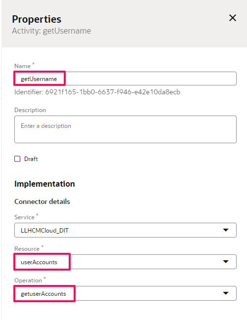

## Task 9: Complete Data Association – getUserName (Request)
As before, in order to execute the **getUserAccount** REST call, the **personId** will be used as an input as the query value in the request body.

1.  On the **Input** tab, enter the following value either by dragging and dropping or typing directly into the corresponding fields.

|  Uniform Selection |	getUserName	|
| --- | --- |
| "PersonId = " +do_PersonId	 | input.q |
{: title="getUserAccounts Input Mapping"}

## Task 10: Complete Data Association – getUserDetails (response)
Next the values returned from HCM will be mapped to Data Objects.

1.  On the output tab, enter the following values either by dragging and dropping or typing directly into the corresponding fields.

|  getUserName |	Uniform Selection	|
| --- | --- |
| output.body.items[1].Username		 | do_userName |
{: title="getUserAccounts Output Mapping"}

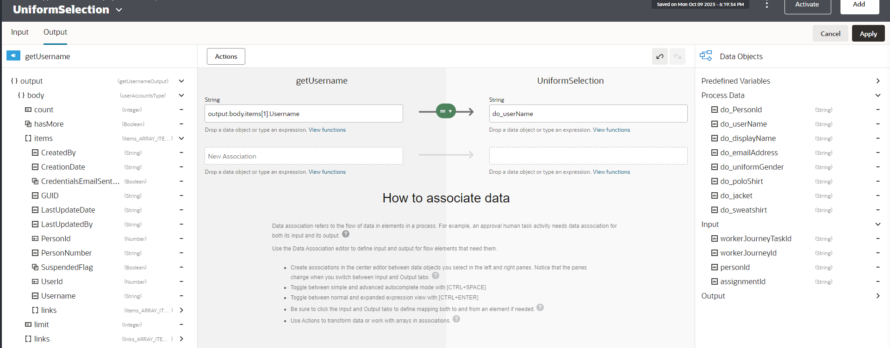

2.  Select *Apply*

## Task 11: Create a new UI Web Form (Select Uniform)
In OPA, you create web forms to interact with end users. As part of creating a web form, add its controls, configure its data, and define form behavior.

Within a web form, you bind form controls to data attributes that hold input values entered by end users. You can bind data to controls automatically or manually. You can also automatically create web forms based on business types defined for the application.

In this usecase a Web Form will be used to capture the details of the Uniform requirements for a specific worker.

1.  On the Uniform Selection **Process** page.

2.  Click *Add*

3.  Select *UIs*
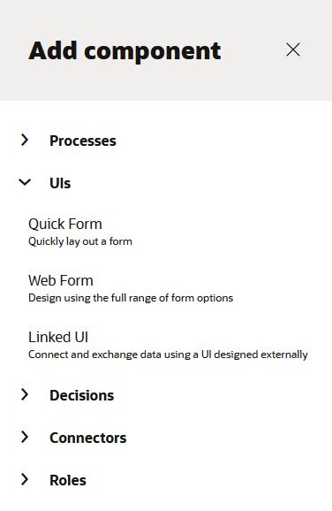

4.  Select *Web Form* and complete the following fields:

| Field |	Description|
|--|--|
| Title |	Name of the Web Form e.g. Select Uniform|
| Identifier Name |	System generated value but can be edited.|
| Description |	Meaningful description of the Web Form.|
{: title="Web Form Component"}

## Task 12: Add UI Controls in Web Form
In the editor, drag, drop, and position controls onto the form’s central canvas. Select from a wide variety of controls on the Basic and Advanced Palettes, ranging from standard text and drop-down fields to tables, list of value (LOV) fields, sections, panels, and special fields such as URLs, videos, and images. Alternatively, automatically create a form from a business type defined for the application.

After adding some controls, further develop your form by creating multiple views (presentations), reusing other forms in the form, and customizing its styling by uploading a CSS stylesheet and applying styling properties.

1.  Drag and drop the following basic and advanced elements on the main form presentation.

| UI Element |	Name | Label | Type | Data binding | Option Names |
|--|--|--|--|--|--|
| Panel |	Panel | Uniform Selection | N/A | N/A | N/A |
| Text |	Text | Vision Corp Industries Inc. provides an employee uniform. Please select your uniform size for the following items below. | N/A | N/A | N/A |
| Select |	uniformGender | Gender | string | uniformGender | <ul><li>Male</li><li> Female </li></ul>|
| Select |	poloShirt | Polo Shirt | string | poloShirt | <ul><li>S</li><li> M </li> <li> L </li></ul>|
| Select |	jacket | Jacket | string | jacket | <ul><li>S</li><li> M </li> <li> L </li></ul> |
| Select |	sweatshirt | Sweatshirt | string | sweatshirt | <ul><li>S</li><li> M </li> <li> L </li></ul> |
{: title="Web Form Controls"}

2.  Your final form should look as below
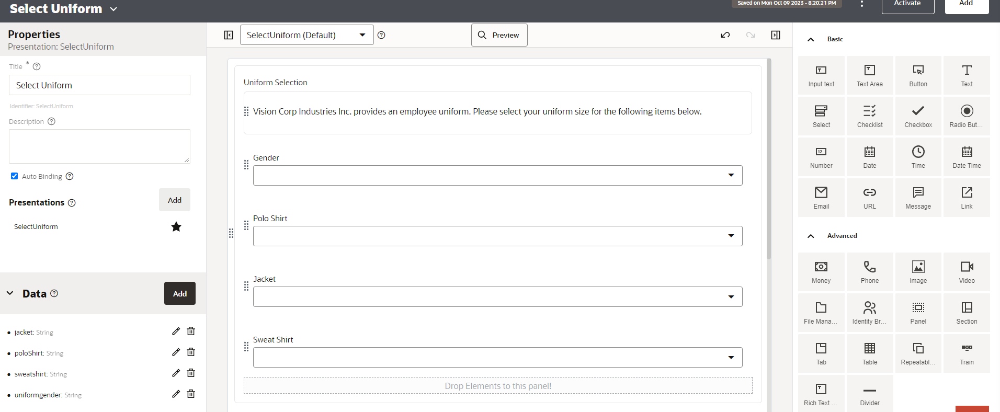

## Task 13: Add a role (Employee)
Roles are assigned to swimlanes and determine who or what in your business organization is responsible for performing the work of your process-based application. The key to designing a business process is to determine the people and roles required to complete each task that requires user interaction. Some tasks may be performed by any user or handled automatically by the system. You use swimlanes to group flow elements based on the roles defined within your business process.

1.  On the **Processes** page, Click *Add*.

2.  Select *Roles*
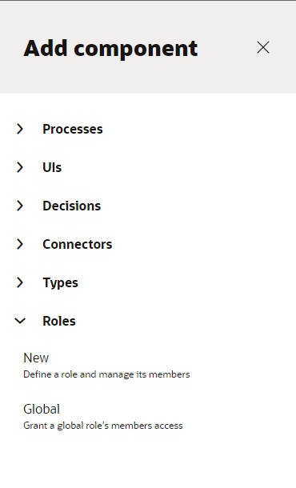

3.  Select *New* and complete the following fields:

| Field |	Description|
|--|--|
| Title |	Name of the Role e.g. employee|
| Identifier Name |	System generated value but can be edited.|
| Scope |	Application |
| Description |	Meaningful description of the Web Form.|
{: title="Role Employee"}

4.  In the **Search** by drop down, select users

5.  In the accompanying text box enter the username for the OPA administrator

6.  Select the **Application Permission Level** to **Manage**
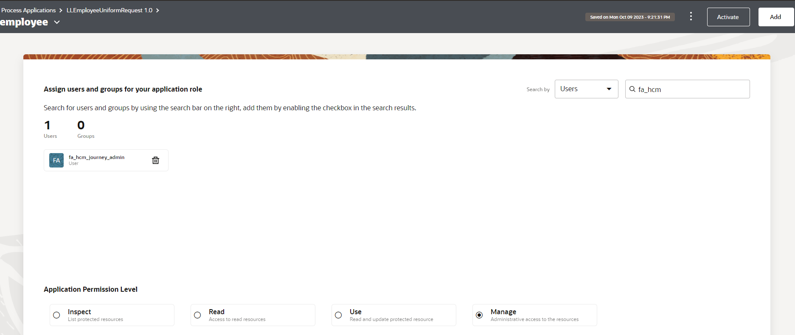

## Task 14: Add a role (Approver)

1.  On the **Processes** page, Click *Add*

2. Select *Roles* and Click *New* and complete the following fields

| Field |	Description|
|--|--|
| Title |	Name of the Role e.g. approver|
| Identifier Name |	System generated value but can be edited.|
| Scope |	Application |
| Description |	Meaningful description of the Web Form.|
{: title="Role Approver"}

3.  In the **Search** by drop down, select users

4.  In the accompanying text box enter the username of the individual who will be responsible for approval uniform requests. This individual will need to be in IDCS, though they do not necessarily have to be present in the HCM Cloud. This allows for the flexibility of assign no HCM users to be involved in the Submission and Approval tasks within OPA

5.  Select the **Application Permission Level** to **Manage**

## Task 15: Edit the Process User Role

1.  Select *Roles* and edit **Process User** role

2.  In the **Search** by drop down, select fa_hcm_journey_admin and whoever in the Fusion Applications will kickoff the proceess

## Task 16: Assign Swinlanes to the Process User Role

1.  Navigate to the Uniform Selection Process page.

2.  A default swimlane is created with no associated role. Click on the swimlane and click the *edit* icon Pencil to edit the properties of the swimlane and assign it the role of Process User.

3.  Click add Plus under the Process User on the right hand-side of the process editor canvas. This will add a new swinlane to the process.

4.  Click the newly available pencil Pencil to open the Properties for the swimlane

5.  Select the *employee* value from the drop down – assigning the employee user to the newly created swimlane.

6.  Repeat the above steps for Approver role.
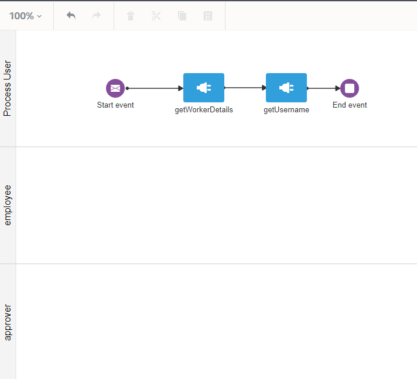

## Task 17: Add a new Human Submit task (Select Uniform Request)

You can use human tasks to model user interaction with the application. Human tasks enable you to display a form for the user to view or complete, and click an action to perform.

There are different types of human tasks that enable you to model different types of interactions:

  * Submit Tasks: Enable you to display a form that the user must submit to create a request or to provide information about a certain subject.
  * Approval Tasks: Enable you to display a form that the user must review or complete and then perform a certain action. The user might approve or reject the request. You can also define custom actions for the user to perform. Approval tasks enable you to define an approval pattern. Generally you use the outcome of the approval task to drive the rest of the process flow.

The first task to be built will be related to the submission of the employee uniform.

1.  On the Process tab, open the right hand menu to reveal the **Elements Palette**.

2.  Expand the **Human** menu item to display the previously the available tasks.
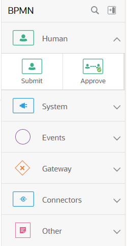

3.  Drag and drop the *Submit* task after the getUserName task

4.  Drag the newly added User task  down the canvas into the employee swimlane

5.  Open the task menu for the newly added User task and select *Open Properties*

6.  On the *Properties* tab, change the name to **Select Uniform**.

7.  Under Assignees, select the Individual Assignees value in the drop down.

8.  Select the to add an Assignee

9.  Select the Expressions tab

10. Enter in the Create Expression text box enter the following value.
    IdentityService.getUserId("do_UserName")
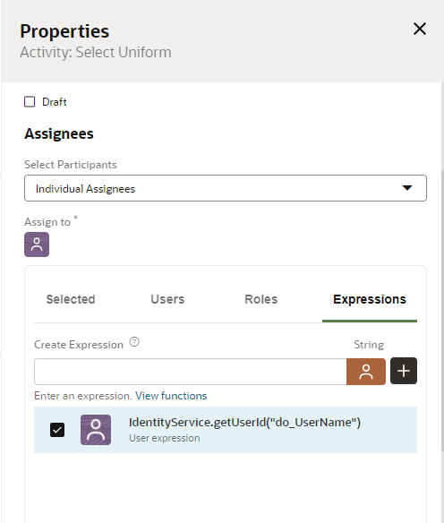

This allows the process at runtime to assign this specific task to the employee identified from the original Journeys task in HCM. This means no other employees will be able to see this specific task other than the OPA Administrator who was assigned as well to the Employee Swimlane.

11. Enter a **Title** value under End User Display e.g. Select Uniform

12. Select the UI form previously built e.g. Select Uniform

## Task 18: Notifying a user of an assign task

Keep your users informed about their task assignments and the progress of a process. You can easily configure notification emails for human tasks and create templates for those notifications.

1.  Select *bell* icon to open the Notifications tab on the Select Unform task properties.

2.  Uncheck the *Disable Notifications*
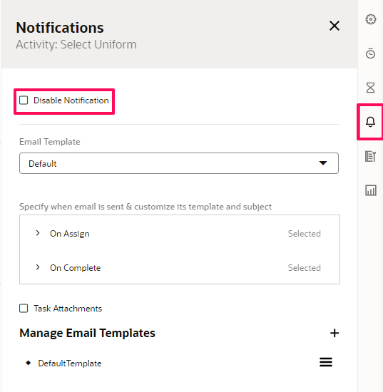

## Task 19: Complete Data Association
To capture the output of the form, the user selected values need to be mapped to the Data Objects defined earlier.

To get started:

1.  On the **Select Uniform** task, select the *Open Data Association*

2.  On the Output tab in mapping editor, enter the following value either by dragging and dropping or typing directly into the corresponding fields.

| Select Uniform | Uniform Selection |
|--|--|
|output.selectUniform.uniformGender|	do_uniformGender |
|output.selectUniform.poloShirt	| do_poloShirt|
|output.selectUniform.jacket | do_jacket|
|output.selectUniform.sweatshirt |do_sweatshirt|
{: title="Submit Task Output Mapping"}

3.  Select *Apply*

## Task 20: Create UI Web Form Approve Uniform Request

1.  On the **Process** page, Click *Add*

2. Select *UIs*

3.  Select *Web Form* and complete the following fields:

| Field |	Description|
|--|--|
| Title |	Name of the Web Form e.g. UniformApproval|
| Identifier Name |	System generated value but can be edited.|
| Description |	Meaningful description of the Web Form.|
{: title="Uniform Approval Web Form Component"}

4.  Drag and drop the following basic and advanced elements on the **UniformApproval* main form presentation.

| UI Element |	Name | Label | Type | Data binding | Option Names |
|--|--|--|--|--|--|
| Text |	Text | Please review and approve the following uniform request..| N/A | N/A | N/A |
| Input Text |	employeeName | Employee Name | string | employeeName | Read-Only|
| Input Text |	poloShirt | Polo Shirt | string | poloShirt | Read-Only|
| Input Text |	jacket | Jacket | string | jacket | Read-Only|
| Input Text |	sweatShirt | Sweat Shirt | string | sweatShirt | Read-Only|
{: title="Web Form Controls"}

The completed Web Form should look similar to the following.

## Task 21: Add a new Human Approve task (Approve Uniform Request)
Next the newly created Webform UI needs to be associated with a Human task.

1.  On the Process tab, open the right hand menu to reveal the **Elements Palette**.

2.  Expand the Human menu item to display the previously available tasks.

3.  Drag and drop the *Approve* task after the **Select Uniform** task

4.  Drag the newly added User task down the canvas into the Approver swimlane
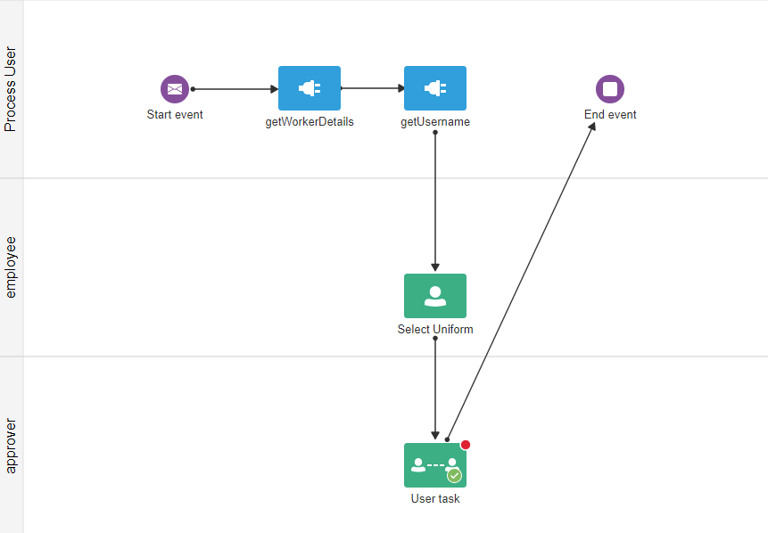

5.  Open the task menu for the newly added User task and select *Open Properties*

6.  On the **Properties** tab, change the name to **Approve Uniform Request**.

7.  Under Assignees, select the *Any Single Assignee* value in the drop down.

8.  Enter a **Title** value under End User Display e.g. Approve Uniform Request

9.  Select the **UI form** previously built e.g. UniformApproval
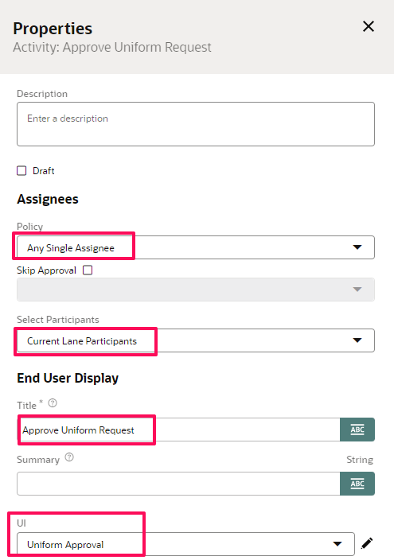

## Task 22: Notifying a user of an assign task
Keep your users informed about their task assignments and the progress of a process. You can easily configure notification emails for human tasks and create templates for those notifications.

1.  Select *bell* icon to open the Notifications tab on the *Approve Unform Request* task properties.

2.  Uncheck the Disable Notifications

## Task 23: Complete Data Association
To capture the output of the form, the user selected values need to be mapped to the Data Objects defined earlier.

1.  On the **Approve Uniform Request** task, select the *Open Data Association*

2.  On the **Input** tab in mapping editor, enter the following value either by dragging and dropping or typing directly into the corresponding fields.

| Uniform Selection | Approve Uniform Request|
|--|--|
|selectUniformDataObject.poloShirt|	input.uniformApproval.poloShirt|
|selectUniformDataObject jacket		| input.uniformApproval.jacket|
|selectUniformDataObject sweatshirt	 | input.uniformApproval.sweatshirt|
|do_displayName	 |input.uniformApproval.employeeName|
{: title="Approve Task Input Mapping"}

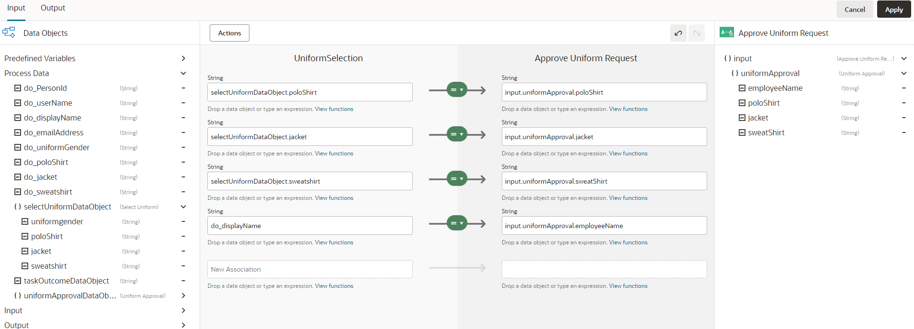

3.  Select *Apply*

## Task 24: Add a Gateway element (Approved?)

1.  On the Process tab, open the right hand menu to reveal the **Elements Palette**.

2.  Expand the **Gateway** category, drag and drop the *Exclusive* Gateway activity after the **Approve Uniform** activity

3.  Rename the **Gateway** to *Approved?*

4.  Select the **Approved?** Gateway activity. Using the connector (arrow icon) Connect one of the branches to the *Select Uniform** task. Notice a line on the branch connecting to **End event** activity. This indicates the default route and the other branch connected to **Select Uniform** activity is a conditional route.

5.  Select the connector from **Approved?** to **End event** which is the default path. In the properties pane Configure **Name** as *Yes*

6.  Select the connector from **Approved?** to **Select Uniform** which is the conditional path. In the properties pane Configure **Name** as *More Information Required*

Define the condition taskOutcomeDataObject=="REJECT" and mark as Conditional Flow
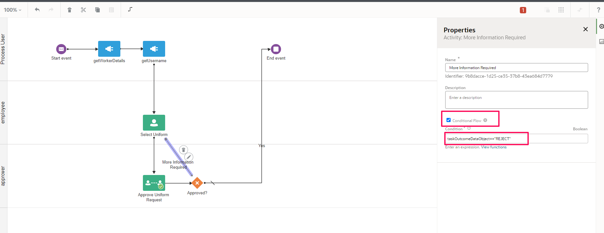

## Task 25: Add System Notification (Confirmation Email)
The final task is to add an email notification for the communication of the Approved Uniform Request to the uniform supplier. The notification task is used generate and send notifications. The notify task, which is similar to the service task, uses a predefined service to perform notifications. You use expressions to determine which users receive the notifications generated by the notify task. Currently, email is the only type of notification supported in Process. This type of notification sends an email to the users you specify.

1.  On the Process tab, open the right hand menu to reveal the **Elements Palette**.

2.  Expand the *System* menu item to display the different System elements.

3.  Select the *Notify* task

4.  Drag and drop the Notify task after the **Approve?** Gateway Element on the **Yes** connector path

5.  Drag the newly added Notify task down the canvas into the Process User swimlane

6.  On the **Properties tab**, change the name to **Confirmation Email**.

7.  Under **Send an e-email** in the **To** section , select the *Expressions* tab. Configure the expression by using **do_Username**
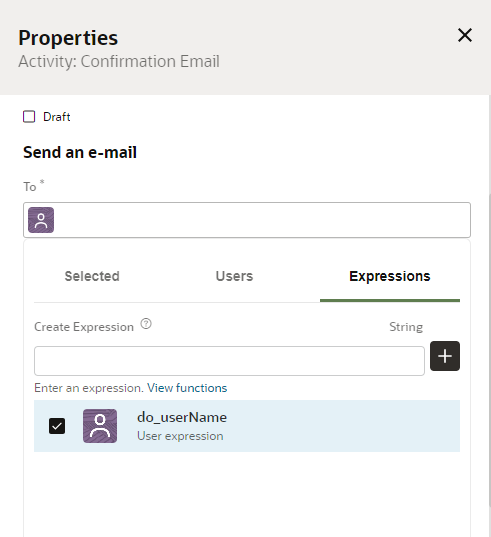

8.  Provide **Subject** as **Approval for New Employee Uniform**

9.  In the Body section provide **Congratulations!!! We are happy to notify you that your request for a uniform has been approved. It will get couriered to your mailing address.**

You final process should look similar to below without any warnings.
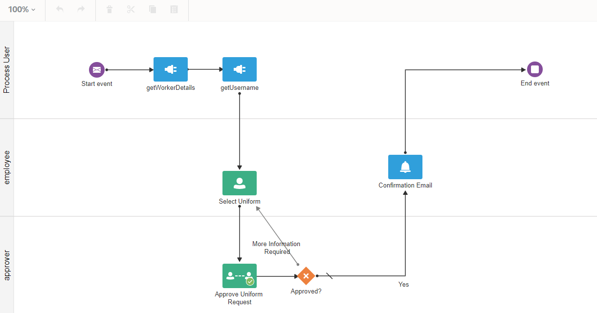

## Task 26: Activate an OPA Application
If you have administrator privileges, then you can activate applications to a production or testing environment from the Manage Active Applications page in design time.

1.  In the **Navigation** pane, click *Activate*
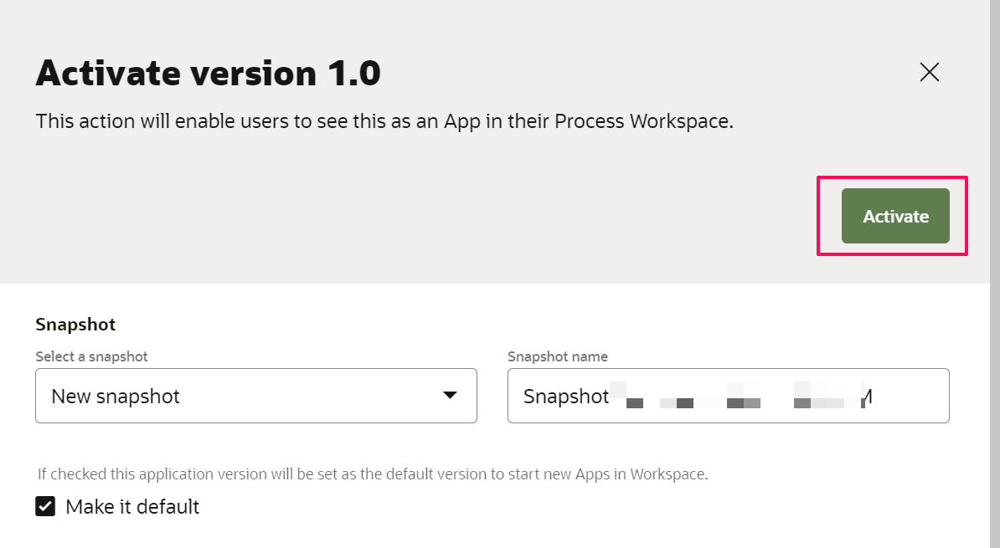

2.  Validation Success: A message indicating validation is successful displays.
The Process is now activated and can be used with the HCM Journeys.

You may now **proceed to the next lab**.

## Learn More

* [Design Structured Processes](https://docs.oracle.com/en/cloud/paas/process-automation/user-process-automation/design-structured-processes.html)
* [Design Forms and User Interfaces](https://docs.oracle.com/en/cloud/paas/process-automation/user-process-automation/design-forms-and-user-interfaces.html)
* [Explore Workspace](https://docs.oracle.com/en/cloud/paas/process-automation/user-process-automation/explore-workspace.html)
*	[Work with Connectors](https://docs.oracle.com/en/cloud/paas/process-automation/user-process-automation/work-connectors.html)

## Acknowledgements
* **Author** - Kishore Katta, Product Management, Oracle Integration & OCI Process Automation
* **Last Updated By/Date** - Kishore Katta, October 2023
